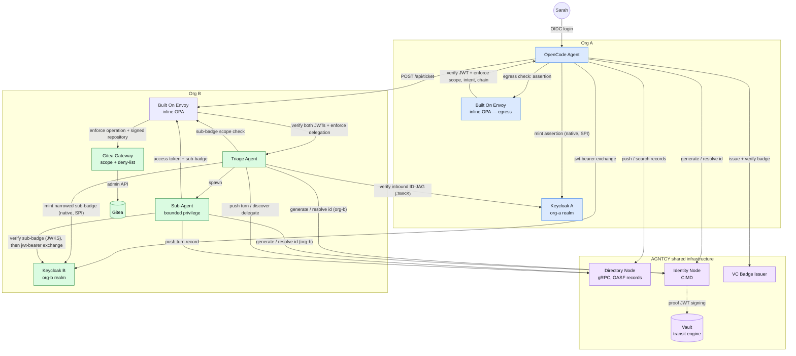

# Cross-Domain AI Agent Remediation Demo (ID-JAG + VC)

A cross-domain agent delegation scenario: **Sarah** (an engineer at **Org A**)
asks **OpenCode** (her Org A AI agent) to fix a CVE found in a repo owned by
**Org B**. Org B has its own Keycloak realm and access control, so OpenCode
can't act there directly — it asserts Sarah's delegation cross-domain using
**ID-JAG** (Identity Assertion JWT Authorization Grant), then Triage further
delegates a *narrowed* privilege to a bounded Sub-Agent that actually opens
the pull request.

OpenCode is the **real open-source OpenCode agent** ([opencode.ai](https://opencode.ai),
pinned `opencode-ai@1.18.7`) running headless in the `opencode-server`
container, driven by an **identity harness** (`opencode-agent`, port 8100)
that executes the task lifecycle Sarah delegates:

> **OAuth → register own identity (CIMD) → policy-scoped badge → work → delegate cross-domain**

Before any task work runs, the harness presents Sarah's delegated access
token to **Envoy A + inline OPA** (`/api/badge-scope-check`), which verifies
the token against Keycloak A's JWKS and answers with a **scoped-down intent**
(e.g. `scan-remediate:demo-admin/payments-service`); only then is the VC
badge minted — bound to that one task — and only then does the agent work.
The LLM behind OpenCode is the host's **Ollama** by default (free, local —
`qwen2.5-coder:7b`), with optional `ANTHROPIC_API_KEY` passthrough; without
either, runs still succeed and the plan step reports `skipped`.

It also wires in two AGNTCY components for real:

- **AGNTCY Directory Node** — every remediation turn is pushed as a
  content-addressed OASF record (immutable audit trail); agents are
  discoverable by name.
- **AGNTCY Identity Node (CIMD)** — Org A is registered as a real,
  **Vault-backed local trust authority**; agent identities are minted and
  resolved through identity-node's actual cryptographic proof-of-ownership
  flow, not a mock.

## What's real vs. mocked

| Step(s) | What | Real or mocked |
|---|---|---|
| 1 | Sarah's OIDC login at Keycloak A | **Real** |
| 2 | CVE scan | Mocked (no scanner integration) |
| — | OpenCode remediation plan (headless `opencode-server`, Ollama/Anthropic) | **Real** agent + LLM call (`skipped` without a provider) |
| — | Badge-scope PDP at Envoy A — verify Sarah's KC-A token, return task-scoped badge intent | **Real** JWT verification + inline OPA |
| 3–4 | AGNTCY Directory push + search (gRPC) | **Real** |
| 5–6 | CIMD generate/resolve id (Vault-signed proof JWT → identity-node) + VC badge issue/verify (signed `vc+jwt` → vc-issuer) | **Real** |
| 7 | RFC 8693 token exchange at Keycloak A | **Real** call; see note below on `act` claims |
| 8 | ID-JAG mint for Org B triage-agent | **Real** |
| 9–10 | Org A egress PDP — may Sarah delegate this scope to Org B? | **Real** single-token JWT verification + inline OPA policy |
| 11 | Keycloak B `jwt-bearer` redemption | **Real** |
| 12–13 | Envoy ingress, ticket creation, OPA check, plan, sub-badge mint | **Real** two-token JWT verification + inline delegation-aware OPA policy |
| — | Triage identity lifecycle: in-agent ID-JAG verification (KC-A JWKS), own CIMD identity under the **org-b** trust authority, sub-badge scope PDP at Envoy B, **native KC-B sub-badge mint** (keycloak-idjag-spi) | **Real** |
| — | Triage discovers sub-agent in the Directory by name before delegating | **Real** gRPC search |
| 14 | Sub-Agent spawned with the narrowed badge | **Real** |
| — | Sub-Agent identity lifecycle: in-agent sub-badge verification (KC-B JWKS) **before** redemption, own CIMD identity under the org-b trust authority, own Directory turn record | **Real** |
| 15–18 | Sub-Agent `jwt-bearer` exchange, Envoy resource enforcement, push file, open PR | **Real** |
| 19 | Resource-boundary OPA decision | **Real** two-token JWT verification + repository-bound policy |
| 20 | PR created, causal act-chain audit | **Real** |
| — | OpenTelemetry `trace_id` linking every hop | **Real** — see [Viewing traces](#viewing-traces) |

Milestone 1 provisioned the Built On Envoy gateway and inline OPA module.
Milestone 2 protects ticket ingress by verifying the Keycloak B access token
and the original ID-JAG actor token, then enforcing signed scope, delegation
chain, intent, and repository constraints. Milestone 3 protects the resource
path: the narrowed sub-badge is signed for one repository, Sub-Agent sends it
with its access token through listener `10001`, and inline OPA allows only the
specific push and pull-request operations. Milestone 4 protects the Org A
egress boundary: before OpenCode ever redeems the ID-JAG at Keycloak B, Envoy
A verifies the freshly-minted assertion against Keycloak A's own JWKS and
inline OPA checks its scope, intent, and delegation-chain depth — a policy
violation never leaves Org A. Milestone 5 replaces the hardcoded
VC badge mock with vc-issuer, a real signed-`vc+jwt` issuer/verifier standing
in for identity-node's (nonexistent) badge API. Milestone 6 makes the RFC
8693 exchange at Keycloak A a real network call instead of a static mock —
see the note below on what Keycloak's standard token exchange does and does
not do with the `actor_token`. Milestone 7 adds real distributed tracing:
every service exports OpenTelemetry spans via OTLP to a local Jaeger container,
and standard `httpx`/FastAPI auto-instrumentation propagates the W3C
`traceparent` header across every hop (including transparently through Envoy,
which just forwards it as an ordinary header) — so one browser-triggered run
produces one real, inspectable trace end to end. Milestone 8 replaces the
mock Org A agent with the **real OpenCode** (headless `opencode-server`,
Ollama/Anthropic provider) driven by an identity harness, reorders the task
lifecycle to *OAuth → register own identity → policy-scoped badge → work →
delegate*, and adds a second real Org A enforcement point: the
**badge-scope PDP** (`/api/badge-scope-check` on Envoy A) verifies Sarah's
Keycloak A access token and returns the narrowed, task-scoped intent the VC
badge is minted with — least privilege decided by policy before any work
runs. Milestone 9 gives the Triage agent the same identity lifecycle:
Triage independently re-verifies the inbound ID-JAG against Keycloak A's
JWKS (defense in depth — no more blind trust of gateway headers), registers
its own CIMD identity (`AGNTCY-triage-agent`) under a second, real **org-b
trust authority** (its own Vault Transit key, registered at identity-node by
the multi-issuer bootstrap), asks the new **sub-badge scope PDP**
(`/api/subbadge-scope-check` on Envoy B) how narrowly the delegation may be
re-narrowed, and only then mints the sub-badge **natively at Keycloak B**
(the same keycloak-idjag-spi, now baked into `keycloak-b/Dockerfile`) —
retiring idjag-issuer from the live delegation path entirely. Milestone 10
finishes the chain: the **Sub-Agent** — until now the only agent with no
identity of its own, blindly redeeming whatever badge it was handed — gets the
same lifecycle. It verifies the sub-badge against **Keycloak B's JWKS before
redeeming it** (is this really an ID-JAG, addressed to me, matching the
act-chain I was spawned with, bound to this repo, and — the point of the whole
exercise — granting nothing beyond `gitea:write gitea:pr`?), registers its own
CIMD identity (`AGNTCY-sub-agent`) under the org-b trust authority, and pushes
its own Directory turn record. Triage also gains the one stage it was still
missing versus OpenCode: it now **discovers** Sub-Agent in the Directory by
name before handing it authority, instead of calling a hardcoded endpoint.
Every agent in the demo, across both orgs, now holds a real cryptographic
identity and verifies its inbound credential itself.

**A note on `actor_token` and the `act` claim**: Keycloak 26.7's standard
token exchange (`standard.token.exchange.enabled`) validates `subject_token`
for real, but this was confirmed live (garbage or absent `actor_token`
produces a byte-identical response, and keycloak-a logs nothing either way)
to not itself verify `actor_token` or emit an RFC 8693 `act` claim — that is
a genuine platform behavior in this configuration, not a shortcut taken
here. Getting Keycloak to emit its own `act` claim would require a custom
protocol-mapper SPI (compiled Java, mounted into the container) — a much
larger, riskier undertaking than closing the "no HTTP call was ever made"
gap this milestone addresses. The badge (`actor_token`) is independently,
cryptographically verified against vc-issuer one step earlier, and
delegation semantics continue to be carried forward for real via the
ID-JAG's `act_chain` claim, unaffected by this limitation.

## Architecture



23 services on one Docker network (`cd-net`):

| Service | Image | Host port(s) | Purpose |
|---|---|---|---|
| `keycloak-a` | built from `./keycloak-a` (`quay.io/keycloak/keycloak:26.7` + `keycloak-idjag-spi`) | `8082` | Org A IdP (`org-a` realm), authenticates Sarah, natively mints ID-JAG assertions via a custom token-exchange SPI |
| `kc-a-init` | `quay.io/keycloak/keycloak:26.7` | _(one-shot)_ | Registers `triage:create` optional scope |
| `keycloak-b` | built from `./keycloak-b` (`quay.io/keycloak/keycloak:26.7` + `keycloak-idjag-spi`) | `8083` | Org B IdP (`org-b` realm), redeems ID-JAG assertions, natively mints Triage's narrowed sub-badge |
| `kc-b-init` | `quay.io/keycloak/keycloak:26.7` | _(one-shot)_ | Registers `triage:create`/`gitea:*` optional scopes |
| `vc-issuer` | built from `./vc-issuer` | `9003` | Issues + verifies signed VC badges (stand-in — identity-node has no badge API) |
| `idjag-issuer` | built from `../archive/single-org-id-jag-app-access/idjag-issuer` | `9002` | Legacy assertion minter — retired from the live delegation path (both mints are Keycloak-native now); kept for the webapp's older flow |
| `identity-postgres` | `postgres:16` | _(internal)_ | DB for identity-node |
| `identity-vault` | `hashicorp/vault:1.17` | _(internal)_ | Holds the org-a and org-b trust-authority signing keys (Transit engine) |
| `identity-node` | `ghcr.io/agntcy/identity/node:0.0.23` | `4005` (REST), `4006` (gRPC) | AGNTCY identity node — CIMD id generate/resolve |
| `identity-node-init` | `python:3.12-slim` | _(one-shot)_ | Bootstraps Vault Transit + registers org-a AND org-b as trust authorities |
| `dir-postgres` | `postgres:16` | _(internal)_ | Search index DB for the Directory |
| `dir-zot` | `ghcr.io/project-zot/zot:v2.1.17` | `5556` | OCI registry backing the Directory's content-addressed storage |
| `dir-apiserver` | `ghcr.io/agntcy/dir-apiserver:v1.6.0` | `8888` | AGNTCY Directory Node (gRPC only) |
| `agent-dir-init` | built from `./agent-dir-init` | _(one-shot)_ | Pushes static OASF records for all 3 demo agents |
| `gitea` | `gitea/gitea:1.22` | `3002` (HTTP), `2223` (SSH) | Protected resource (repo server) |
| `gitea-init` | `gitea/gitea:1.22` | _(one-shot)_ | Seeds the Gitea admin + demo repo |
| `gitea-gateway` | built from `../archive/single-org-id-jag-app-access/gitea-gateway` | _(internal only)_ | Requires Envoy policy metadata, then rechecks token scope before using Gitea admin credentials |
| `envoy-org-a` | built from `./envoy-org-a` (Envoy + Built On Envoy Composer) | `12000`; admin `127.0.0.1:9902` | Org A gateway; badge-scope PDP (KC-A JWT) + egress JWT + inline OPA policies |
| `envoy-org-b` | built from `./envoy` (Envoy + Built On Envoy Composer) | `10000`, `10001`; admin `127.0.0.1:9901` | Org B gateway; separate ticket-ingress and resource-access JWT + inline OPA policies |
| `opencode-server` | built from `./opencode-server` | _(internal `:4096`)_ | **Real OpenCode agent** (opencode-ai@1.18.7, headless; Ollama/Anthropic provider) |
| `opencode-agent` | built from `./opencode-agent` | `8100` | Org A identity harness driving the real OpenCode (task lifecycle steps 1-12) |
| `triage-agent` | built from `./triage-agent` | _(internal only)_ | Org B remediation agent with its own identity lifecycle (in-agent ID-JAG verification, org-b CIMD identity, sub-badge scope PDP, native KC-B mint, Directory push/search); reachable from outside `cd-net` only through Envoy |
| `sub-agent` | built from `./sub-agent` | `8300` | Org B bounded-privilege agent with its own identity lifecycle (in-agent sub-badge verification, org-b CIMD identity, push + PR, Directory push) |
| `webapp` | built from `./webapp` | `8090` | Animated sequence-diagram demo UI |
| `jaeger` | `jaegertracing/all-in-one:1.65.0` | `16686` | OpenTelemetry trace backend — collector (OTLP) + UI + storage |

## Sequence flow

Every hop below actually happens against the real services in this stack
(Keycloak, Vault, identity-node, vc-issuer, dir-apiserver, Gitea). Only the
CVE scan is mocked. All three Envoy enforcement points — egress, ticket
ingress, and resource access — are real. This is the same
flow the webapp's UI animates step by step.

```mermaid
sequenceDiagram
    autonumber
    actor Sarah
    participant OC as OpenCode (Org A)
    participant KCA as Keycloak A
    participant Dir as AGNTCY Directory
    participant IdNode as Identity Node
    participant Vault
    participant VC as VC Badge Issuer
    participant OCS as opencode-server (real OpenCode)
    participant EnvoyA as Envoy A + OPA (egress)
    participant KCB as Keycloak B
    participant Envoy as Built On Envoy + OPA
    participant Triage as Triage (Org B)
    participant Sub as Sub-Agent (Org B)
    participant GW as Gitea Gateway
    participant Gitea

    Sarah->>OC: "Fix the CVE in the Org B repo"
    OC->>KCA: OIDC password grant
    KCA-->>OC: access token

    Note over OC,IdNode: OpenCode registers its OWN identity — before any work
    OC->>Vault: sign proof JWT (transit/sign)
    Vault-->>OC: RS256 signature — private key never leaves Vault
    OC->>IdNode: generate id (proof JWT, org-a authority)
    IdNode-->>OC: id = AGNTCY-opencode-agent
    OC->>IdNode: resolve id
    IdNode-->>OC: ResolverMetadata + public key

    OC->>EnvoyA: POST /api/badge-scope-check (Sarah's access token + requested task)
    Note over EnvoyA: verify KC-A JWT; OPA scopes the task down
    EnvoyA-->>OC: ALLOW + x-agntcy-scoped-intent

    OC->>VC: POST /vc/issue (id, caps, delegating_user, policy-scoped intent, act_chain)
    VC-->>OC: signed badge (vc+jwt)
    OC->>VC: POST /vc/verify (badge)
    VC-->>OC: valid=true + claims

    Note over OC: only now, under the task-scoped badge, does work begin
    Note over OC: mock CVE scan → HIGH severity (mocked)
    OC->>OCS: remediation plan request (real agent, real LLM call)
    OCS-->>OC: remediation plan (or skipped if no model provider)

    OC->>Dir: push turn record (OASF)
    Dir-->>OC: CID
    OC->>Dir: search "triage-agent"
    Dir-->>OC: agent record

    OC->>KCA: token-exchange (subject_token=Sarah, actor_token=badge)
    Note over KCA: validates subject_token; does not process actor_token<br/>into an act claim (real Keycloak behavior, see README note)
    KCA-->>OC: exchanged access token
    OC->>KCA: mint assertion (token-exchange, native SPI; sub=Sarah, scope=triage:create, intent=create-pr-fix)
    KCA-->>OC: signed assertion (RS256)

    OC->>EnvoyA: POST /api/egress-check (assertion as Bearer)
    EnvoyA->>KCA: fetch/cached JWKS
    Note over EnvoyA: verify JWT; enforce scope, intent, act-chain depth
    EnvoyA-->>OC: ALLOW + policy decision headers

    OC->>KCB: jwt-bearer grant
    KCB-->>OC: scoped access token

    OC->>Envoy: POST /api/ticket (access token + actor token)
    Envoy->>KCB: fetch/cached JWKS
    Envoy->>KCA: fetch/cached JWKS
    Note over Envoy: verify both JWTs; enforce scope, chain, signed intent, repo
    Envoy->>Triage: ALLOW + policy decision headers

    Note over Triage,IdNode: Triage runs the same lifecycle, one org over
    Triage->>KCA: fetch JWKS — re-verify the ID-JAG in-agent (defense in depth)
    KCA-->>Triage: JWKS → signature ✓ iss ✓ aud ✓ act_chain ✓
    Triage->>Vault: sign proof JWT (org-b key)
    Vault-->>Triage: RS256 signature
    Triage->>IdNode: generate + resolve id (org-b authority)
    IdNode-->>Triage: id = AGNTCY-triage-agent
    Triage->>Envoy: POST /api/subbadge-scope-check (may this be narrowed?)
    Envoy-->>Triage: ALLOW + scoped scope/resource
    Triage->>KCB: mint sub-badge natively (token-exchange, requested_token_type=id-jag,<br/>scope/resource = the Envoy B OPA-approved narrowing)
    KCB-->>Triage: sub-badge (act_chain: Sarah→OpenCode→Triage)
    Triage->>Dir: push Triage turn record (OASF)
    Dir-->>Triage: CID
    Triage->>Dir: search "sub-agent"
    Dir-->>Triage: agent record
    Triage->>Sub: spawn with sub-badge

    Note over Sub,IdNode: the leaf of the chain has an identity too
    Sub->>KCB: fetch JWKS — verify the sub-badge BEFORE redeeming it
    KCB-->>Sub: JWKS → typ ✓ client_id ✓ act_chain ✓ scope ⊆ bound ✓ repo ✓
    Sub->>Vault: sign proof JWT (org-b key)
    Vault-->>Sub: RS256 signature
    Sub->>IdNode: generate + resolve id (org-b authority)
    IdNode-->>Sub: id = AGNTCY-sub-agent
    Sub->>KCB: jwt-bearer exchange
    KCB-->>Sub: scoped token (gitea:write, gitea:pr)
    Sub->>Envoy: push fix (access token + signed sub-badge)
    Note over Envoy: verify both JWTs; enforce chain, scope, intent, operation, repo
    Envoy->>GW: ALLOW push + policy decision headers
    GW->>Gitea: create branch + commit
    Gitea-->>GW: ok
    GW-->>Sub: branch created
    Sub->>Envoy: open PR (access token + signed sub-badge)
    Envoy->>GW: ALLOW PR + policy decision headers
    GW->>Gitea: create PR
    Gitea-->>GW: ok
    GW-->>Sub: PR created ✓

    Sub->>Envoy: open PR on demo-protected (same token, same scope)
    Envoy--xSub: 403 policy_deny — outside signed resource

    Note over Sub,Triage: resource OPA decision is real and inline
    Sub->>Dir: push Sub-Agent turn record (OASF)
    Dir-->>Sub: CID
    Sub-->>Triage: PR link + denied-attempt result
    Triage-->>OC: ticket complete
    OC-->>Sarah: PR ready — full act-chain audit trail
```

## Quick start

```bash
cd cross-domain-id-jag-vc
cp .env.example .env
# SARAH_PASSWORD / OPENCODE_CLIENT_SECRET / TRIAGE_CLIENT_SECRET /
# SUB_AGENT_CLIENT_SECRET must stay as the .env.example defaults (or be
# changed to match keycloak-a/org-a-realm.json + keycloak-b/org-b-realm.json)
# — everything else can be freely changed.

docker compose up -d --build
```

### Ollama prerequisite (optional but recommended)

The real OpenCode agent uses the **host's** Ollama as its free, local model
provider (no API key). On your machine — not inside Docker:

```bash
ollama pull qwen2.5-coder:7b   # one-time (~4.7 GB)
ollama serve                    # or keep the Ollama desktop app running
```

Containers reach it via `host.docker.internal:11434`. On Linux, Ollama must
listen beyond loopback: `OLLAMA_HOST=0.0.0.0 ollama serve`. Tool-calling
quality improves with a larger context window (Ollama's `num_ctx` ≥ 16k).
**Without any model server, every run still succeeds** — the `opencode-plan`
step reports `status=skipped` and the identity chain completes normally.

### Using your own model server (on-prem GPUs, vLLM/TGI/SGLang)

Any endpoint that speaks the **OpenAI-compatible `/v1` API** works — point
the stack at it instead of Ollama:

```bash
# .env
LLM_BASE_URL=http://gemma.internal:8000/v1     # your endpoint's /v1 base
LLM_API_KEY=                                    # optional bearer token
OPENCODE_MODEL=onprem/gemma-3-27b-it            # <label>/<served model id>
```

The provider label before the `/` is free-form (it only names the provider
block in the generated `opencode.json`); the part after it **must match the
model id your server advertises** — check with:

```bash
curl -s $LLM_BASE_URL/models | jq -r '.data[].id'
```

Then `docker compose up -d opencode-server opencode-agent` and confirm:

```bash
curl -fsS http://localhost:8100/api/config | jq '{opencode_server, llm, opencode_model}'
```

Expected: `llm.reachable=true` with your `base_url`. The endpoint must be
reachable **from the Docker host** (VPN or same network); `host.docker.internal`
is only needed for services on your laptop. Cloud providers remain available
via their built-in names (`OPENCODE_MODEL=anthropic/claude-sonnet-4-5` plus
`ANTHROPIC_API_KEY`).

Note: the demo's plan step only needs prose from OpenCode's read-only `plan`
agent, so it is undemanding. If you later let OpenCode *edit code*, the
serving stack's function-calling support becomes the limiting factor.

The first build pulls the pinned Envoy base image and Built On Envoy Composer
artifact. To deliberately refresh those pinned inputs:

```bash
docker compose build --pull envoy-org-a envoy-org-b
docker compose up -d envoy-org-a envoy-org-b
```

First boot takes ~3–5 minutes (Keycloak + identity-node + Directory cold
start). Watch it settle:

```bash
docker compose logs -f
```

Wait until these one-shot containers exit 0: `kc-a-init`, `kc-b-init`,
`gitea-init`, `identity-node-init`, `agent-dir-init`.

## Viewing traces

Every service exports OpenTelemetry spans via OTLP to a local Jaeger
all-in-one container — no external tracing backend or extra setup needed.

1. Trigger a run (`curl -X POST http://localhost:8100/api/run ...`, or via
   the webapp).
2. Open **http://localhost:16686**, select a service (e.g. `opencode-agent`)
   in the left panel, and click **Find Traces**.
3. Open the most recent trace to see the full waterfall — `opencode-agent`'s
   own spans plus every downstream call it made via `httpx` (`vc-issuer`,
   `idjag-issuer`, Keycloak A/B, Envoy, …), all under one `trace_id`, because
   standard `httpx`/FastAPI auto-instrumentation propagates the W3C
   `traceparent` header on every hop automatically — no manual wiring.

`opencode-agent`'s `/api/run` response also includes a top-level `trace_id`
field, so you can jump straight to a specific run:
`http://localhost:16686/trace/<trace_id>`.

The webapp's sequence diagram goes one step further: every step (`sarah-login`,
`resolve-badge`, `egress-check`, `open-pr`, …) is wrapped server-side in its own
named span, `step:<id>` (see `tracing.py`'s `step_span()` in `webapp`,
`triage-agent`, and `sub-agent`). Clicking any step in the diagram after a run
opens that exact span in Jaeger via
`http://localhost:16686/trace/<trace_id>?uiFind=step:<id>` — Jaeger's `uiFind`
search jumps straight to the matching span instead of leaving you to scroll
through the whole waterfall.

Note: Envoy hops (`envoy-org-b`) forward the `traceparent` header like any
other header, so the trace stays continuous through them, but Envoy itself
doesn't emit its own spans (no Envoy-side tracing filter is configured) —
the fan-out is visible per-service, just not per-Envoy-hop.

### Reverse-proxying the Jaeger UI under a subpath

If your deployment fronts everything with its own TLS/auth gate (e.g. nginx
+ OAuth) rather than exposing `16686` directly, set `JAEGER_QUERY_BASE_PATH`
(e.g. `/jaeger`) so Jaeger's UI generates asset URLs under that prefix, and
point `JAEGER_UI_URL` at the same public path. An nginx location for this,
gated behind the same auth as the rest of the site:

```nginx
location /jaeger/ {
    auth_request /oauth2/auth;
    error_page 401 = /oauth2/sign_in?rd=$scheme://$host$request_uri;
    proxy_pass http://127.0.0.1:16686;  # no trailing slash — Jaeger already
                                         # expects the /jaeger prefix itself
    proxy_set_header Host $host;
}
```

### Exposing Gitea and Keycloak A/B directly

The webapp's "Access these services" legend links straight to Gitea and both
Keycloak realms, for anyone who wants to click around instead of just
watching the animated run. Each entry is opt-in via its own `*_UI_URL` env
var (blank hides it):

- **Gitea**: set `GITEA_ROOT_URL` to the public URL (e.g.
  `https://your-domain/gitea/`) and `GITEA_UI_URL` to match. Unlike Jaeger/
  Keycloak, Gitea's own router only ever listens at `/` — `ROOT_URL` controls
  link/cookie generation only, not routing — so nginx must *strip* the
  `/gitea/` prefix before forwarding (trailing slash on `proxy_pass`, the
  opposite of the non-stripping pattern below).
- **Keycloak A/B**: set `KC_A_RELATIVE_PATH`/`KC_B_RELATIVE_PATH` (e.g.
  `/keycloak-a`, `/keycloak-b`) — Keycloak's own `--http-relative-path`
  option, so it's aware of the prefix for every link/redirect it generates —
  and `KC_A_INTERNAL_URL`/`KC_B_INTERNAL_URL` to the same path so every
  *other* service (webapp, opencode-agent, triage-agent, sub-agent) keeps
  reaching Keycloak at a URL that matches what it now actually issues as the
  token `iss`/`aud`. Set `KC_A_UI_URL`/`KC_B_UI_URL` for the legend links.

**This changes the issuer/audience baked into every token these Keycloaks
mint** — if you enable it, `envoy` and `envoy-org-a`'s hardcoded
`issuer`/`remote_jwks`/`audiences` fields (built into the image, not
env-driven) must be rebuilt to match, and a full `/api/run` should be
re-verified end to end before trusting the deployment.

```nginx
location /gitea/ {
    auth_request /oauth2/auth;
    error_page 401 = /oauth2/sign_in?rd=$scheme://$host$request_uri;
    proxy_pass http://127.0.0.1:3002/;  # trailing slash — STRIPS /gitea/ before forwarding
    proxy_set_header Host $host;
    client_max_body_size 50m;
}

location /keycloak-a/ {
    auth_request /oauth2/auth;
    error_page 401 = /oauth2/sign_in?rd=$scheme://$host$request_uri;
    proxy_pass http://127.0.0.1:8082;  # no trailing slash — matches KC_A_RELATIVE_PATH
    proxy_set_header Host $host;
}

location /keycloak-b/ {
    auth_request /oauth2/auth;
    error_page 401 = /oauth2/sign_in?rd=$scheme://$host$request_uri;
    proxy_pass http://127.0.0.1:8083;  # no trailing slash — matches KC_B_RELATIVE_PATH
    proxy_set_header Host $host;
}
```

### Reverse-proxying `/api/run` — raise the read timeout

Since Milestone 8, `opencode-plan` makes a real LLM call, and one call
through a remote/shared model backend can legitimately take a few minutes
— nginx's default `proxy_read_timeout` is 60s, so a reverse proxy fronting
the webapp with the default will silently kill the connection mid-request.
From the browser this looks exactly like the UI hanging on "Fetching all
steps…", not like an error. Raise the timeout on the webapp's `location /`
(and `proxy_send_timeout` to match) to comfortably exceed
`OPENCODE_TIMEOUT` plus the rest of the lifecycle:

```nginx
location / {
    auth_request /oauth2/auth;
    error_page 401 = /oauth2/sign_in?rd=$scheme://$host$request_uri;

    proxy_read_timeout    480s;
    proxy_send_timeout    480s;
    proxy_connect_timeout 10s;

    proxy_pass http://127.0.0.1:8090;
    proxy_set_header Host $host;
}
```

## Testing

### Envoy Milestones 2–3 reviewer verification

This procedure is self-contained. It verifies both Rego policies, the
digest-pinned image, both listeners, successful ticket and resource
delegations, independent resource-denial cases, metrics, and non-bypassable
service exposure. Run it from the repository root with Docker, Docker Compose,
`curl`, and `jq`.

1. Run the two policy suites independently:

   ```bash
   docker run --rm \
     -v "$PWD/cross-domain-id-jag-vc/envoy/policies:/policies:ro" \
     openpolicyagent/opa:1.8.0 \
     test /policies/ticket-ingress.rego \
          /policies/ticket-ingress_test.rego -v

   docker run --rm \
     -v "$PWD/cross-domain-id-jag-vc/envoy/policies:/policies:ro" \
     openpolicyagent/opa:1.8.0 \
     test /policies/resource-access.rego \
          /policies/resource-access_test.rego -v

   docker run --rm -e PYTHONDONTWRITEBYTECODE=1 \
     -v "$PWD/archive/single-org-id-jag-app-access/gitea-gateway:/src" \
     -w /src python:3.12-slim sh -c \
     'pip install -q -r requirements-dev.txt &&
      pytest -q -p no:cacheprovider'

   docker run --rm -e PYTHONDONTWRITEBYTECODE=1 \
     -v "$PWD/archive/single-org-id-jag-app-access/idjag-issuer:/src" \
     -w /src python:3.12-slim sh -c \
     'pip install -q -r requirements-dev.txt &&
      pytest -q -p no:cacheprovider'
   ```

   Expected: ticket ingress passes 9/9, resource access passes 13/13, Gitea
   Gateway passes 15 tests, and the ID-JAG issuer passes 10 tests.

2. Create the environment file, validate Compose, build the gateway, validate
   its bootstrap, and start the stack:

   ```bash
   cd cross-domain-id-jag-vc
   test -f .env || cp .env.example .env
   docker compose config --quiet
   docker compose build --pull envoy-org-b
   docker run --rm cd-envoy-boe:milestone3 \
     envoy --mode validate -c /etc/envoy/envoy.yaml
   docker compose up -d --build
   ```

   If this Compose project was started before and its demo data does not need
   to be preserved, run `docker compose down --volumes` before
   `docker compose up`. The identity demo stores generated proof material in
   volumes; reusing it with rebuilt issuer containers can produce a stale
   `ERROR_REASON_INVALID_PROOF` at the unrelated CIMD step.

3. Allow 3–5 minutes for a cold start, then inspect service state and both
   listeners:

   ```bash
   docker compose ps -a
   curl --fail --silent --show-error http://localhost:10000/health | jq .
   curl --fail --silent --show-error http://localhost:10001/healthz | jq .
   curl --fail --silent --show-error http://127.0.0.1:9901/ready
   docker compose ps gitea-gateway
   if docker compose exec -T sub-agent python -c \
     'import socket; socket.gethostbyname("gitea-gateway")' 2>/dev/null; then
     echo "ERROR: Sub-Agent can bypass Envoy"
     exit 1
   else
     echo "OK: Gitea Gateway is isolated behind Envoy"
   fi
   ```

   Long-running services should be healthy and all five one-shot services
   should exit 0. Both listener requests return 200, readiness prints `LIVE`.
   The Gitea Gateway row shows only `9100/tcp`, with no host address or
   published port. The final check confirms the Sub-Agent cannot resolve the
   gateway on its network; Envoy reaches it through the isolated resource
   network instead.

4. Run the complete sequence and retain the narrowed resource credentials:

   ```bash
   RUN_OUTPUT="$(mktemp)"
   curl --fail --silent --show-error \
     -X POST http://localhost:8090/api/run \
     -H 'Content-Type: application/json' \
     -d '{"cve":"CVE-2024-12345","repo":"demo-admin/payments-service"}' \
     -o "$RUN_OUTPUT"

   jq '{
     ok,
     failed_steps: [.steps[] | select(.status == "error") | .id],
     ticket_policy: [first(.steps[] | select(.id == "opa-ingress")) |
       .result | {decision, rule, delegation_depth}],
     resource_policy: [first(.steps[] | select(.id == "opa-egress")) |
       .result | {decision, rule, action, repository, delegation_depth}],
     protected_repo: [first(.steps[] |
       select(.id == "denied-pr-attempt")) | {status, result}]
   }' "$RUN_OUTPUT"

   SUB_ACCESS_TOKEN="$(jq -r 'last([.steps[] |
     select(.id == "kc-b-exchange")]) | .token' "$RUN_OUTPUT")"
   SUB_BADGE="$(jq -r 'first(.steps[] |
     select(.id == "mint-sub-badge")) | .token' "$RUN_OUTPUT")"
   ```

   Expected: `ok=true`, no failed steps, both policy decisions are `ALLOW`,
   the resource rule is `org-b-resource-delegation`, the signed repository is
   `demo-admin/payments-service`, delegation depth is 2, and the protected
   repository attempt has status `denied`.

5. Prove that changing the requested intent is denied before Gitea Gateway:

   ```bash
   curl --silent --show-error --include \
     -X POST http://localhost:10001/api/gitea/push/demo-admin/payments-service \
     -H "Authorization: Bearer $SUB_ACCESS_TOKEN" \
     -H "X-AGNTCY-Actor-Token: Bearer $SUB_BADGE" \
     -H 'Content-Type: application/json' \
     -d '{"intent":"delete-repository",
          "act_chain":["opencode-agent","triage-agent","sub-agent"],
          "ticket_id":"TRIAGE-2024-12345"}'
   ```

   Expected: HTTP 403 with `error=policy_denied`.

6. Prove that the signed sub-badge and signed repository restriction are both
   mandatory:

   ```bash
   curl --silent --show-error --include \
     -X POST http://localhost:10001/api/gitea/push/demo-admin/payments-service \
     -H "Authorization: Bearer $SUB_ACCESS_TOKEN" \
     -H 'Content-Type: application/json' \
     -d '{"intent":"create-pr-fix",
          "act_chain":["opencode-agent","triage-agent","sub-agent"],
          "ticket_id":"TRIAGE-2024-12345"}'

   curl --silent --show-error --include \
     -X POST http://localhost:10001/api/gitea/push/demo-admin/other-service \
     -H "Authorization: Bearer $SUB_ACCESS_TOKEN" \
     -H "X-AGNTCY-Actor-Token: Bearer $SUB_BADGE" \
     -H 'Content-Type: application/json' \
     -d '{"intent":"create-pr-fix",
          "act_chain":["opencode-agent","triage-agent","sub-agent"],
          "ticket_id":"TRIAGE-2024-12345"}'
   ```

   Expected: the missing sub-badge returns HTTP 401; the repository outside
   the signed `resource` claim returns HTTP 403.

7. Prove that administrative operations are outside the policy:

   ```bash
   curl --silent --show-error --include \
     -X POST http://localhost:10001/api/gitea/repos \
     -H "Authorization: Bearer $SUB_ACCESS_TOKEN" \
     -H "X-AGNTCY-Actor-Token: Bearer $SUB_BADGE" \
     -H 'Content-Type: application/json' \
     -d '{"name":"not-allowed"}'
   ```

   Expected: HTTP 403. Only `push` and `pulls` routes are eligible for allow.

8. Confirm metrics and access logs:

   ```bash
   curl --fail --silent --show-error \
     'http://127.0.0.1:9901/stats?filter=opa_requests_total'
   curl --fail --silent --show-error \
     'http://127.0.0.1:9901/stats?filter=jwt_authn'
   docker compose logs --since=5m envoy-org-b | grep gitea_gateway
   rm "$RUN_OUTPUT"
   ```

   OPA and JWT counters should include allowed and denied decisions. Successful
   push and PR requests have `gitea_gateway` as the upstream cluster; policy
   denials do not. Credential and verified-payload headers are excluded from
   access logs.

If a port is allocated, change the corresponding `ENVOY_*_PORT` value in
`.env`. For startup failures, inspect `docker compose logs envoy-org-b` and
`docker compose logs triage-agent sub-agent gitea-gateway`.

When finished, `docker compose down` preserves demo data. Use
`docker compose down -v` only when intentionally deleting all demo data.

### OpenTelemetry / Jaeger reviewer verification

Verifies traces are actually flowing end to end, not just that the SDK
imports cleanly.

1. Bring up the stack (includes `jaeger`) and confirm it's healthy:

   ```bash
   cd cross-domain-id-jag-vc
   docker compose up -d --build
   curl --fail --silent --show-error -o /dev/null -w '%{http_code}\n' http://localhost:16686
   ```

2. Trigger a run and capture its `trace_id`:

   ```bash
   RUN_OUTPUT="$(mktemp)"
   curl --fail --silent --show-error -X POST http://localhost:8100/api/run \
     -H 'Content-Type: application/json' \
     -d '{"repo":"demo-admin/payments-service"}' -o "$RUN_OUTPUT"
   TRACE_ID="$(jq -r .trace_id "$RUN_OUTPUT")"
   echo "trace_id: $TRACE_ID"
   rm "$RUN_OUTPUT"
   ```

   Expected: a 32-character hex string, not `null`.

3. Confirm Jaeger actually received spans for that trace, across multiple
   services (proving propagation, not just that `opencode-agent` traces
   itself):

   ```bash
   curl --fail --silent --show-error "http://localhost:16686/api/traces/$TRACE_ID" \
     | jq '{
         spanCount: (.data[0].spans | length),
         services: [.data[0].processes[].serviceName] | unique
       }'
   ```

   Expected: `spanCount` > 1, and `services` includes at minimum
   `opencode-agent`, `vc-issuer` (or `idjag-issuer`), and `keycloak`-adjacent
   spans — i.e. more than one service name, proving the `traceparent` header
   really propagated across the `httpx` calls rather than each service
   starting an unrelated, disconnected trace.

4. Run the existing unit test suites and confirm no regressions from adding
   instrumentation:

   ```bash
   docker run --rm -e PYTHONDONTWRITEBYTECODE=1 \
     -v "$PWD/../archive/single-org-id-jag-app-access/idjag-issuer:/src" \
     -w /src python:3.12-slim sh -c \
     'pip install -q -r requirements-dev.txt && pytest -q -p no:cacheprovider'

   docker run --rm -e PYTHONDONTWRITEBYTECODE=1 \
     -v "$PWD/../archive/single-org-id-jag-app-access/gitea-gateway:/src" \
     -w /src python:3.12-slim sh -c \
     'pip install -q -r requirements-dev.txt && pytest -q -p no:cacheprovider'
   ```

   Expected: 10/10 and 15/15 pass (same counts as before this PR). You'll see
   `Transient error ... exporting traces to jaeger:4317` warnings in the
   output — expected, since these unit tests run standalone without Jaeger
   reachable; they don't affect the test results.

### Envoy Milestone 4 reviewer verification

Verifies the egress Rego policy, the digest-pinned image, the egress
listener, a full successful run through the egress check, and an
independent egress-denial case. Run it from the repository root with
Docker, Docker Compose, `curl`, and `jq`.

1. Run the egress policy suite:

   ```bash
   docker run --rm \
     -v "$PWD/cross-domain-id-jag-vc/envoy-org-a/policies:/policies:ro" \
     openpolicyagent/opa:1.8.0 \
     test /policies/egress.rego /policies/egress_test.rego -v
   ```

   Expected: 16/16 tests pass (10 egress + 6 badge-scope).

2. Validate Compose, build the gateway, and validate its native config:

   ```bash
   cd cross-domain-id-jag-vc
   docker compose config --quiet
   docker compose build --pull envoy-org-a
   docker run --rm cd-envoy-boe-a:milestone4 \
     envoy --mode validate -c /etc/envoy/envoy.yaml
   docker compose up -d --build
   ```

3. Confirm the listener and admin port are healthy:

   ```bash
   curl --fail --silent --show-error http://localhost:12000/health | jq .
   curl --fail --silent --show-error http://127.0.0.1:9902/ready
   ```

4. Run the full sequence and confirm the egress check passed:

   ```bash
   RUN_OUTPUT="$(mktemp)"
   curl --fail --silent --show-error -X POST http://localhost:8100/api/run \
     -H 'Content-Type: application/json' \
     -d '{"repo":"demo-admin/payments-service"}' -o "$RUN_OUTPUT"
   jq '{ok, egress: [.steps[] | select(.id == "egress-check")][0]}' "$RUN_OUTPUT"
   rm "$RUN_OUTPUT"
   ```

   Expected: `ok=true`, the `egress-check` step has `status=ok`.

5. Prove a policy violation never leaves Org A — mint an assertion with an
   unsupported intent directly via Keycloak A's own token exchange
   (`keycloak-idjag-spi`) and present it straight to the egress listener:

   ```bash
   SARAH_TOKEN="$(curl --silent --show-error -X POST \
     http://localhost:8082/realms/org-a/protocol/openid-connect/token \
     -d grant_type=password -d client_id=opencode-agent \
     -d client_secret=demo-opencode-secret-change-me \
     -d username=sarah -d password=demo-sarah-password-change-me \
     -d 'scope=openid profile email' | jq -r .access_token)"

   BAD_ASSERTION="$(curl --silent --show-error -X POST \
     http://localhost:8082/realms/org-a/protocol/openid-connect/token \
     -d grant_type=urn:ietf:params:oauth:grant-type:token-exchange \
     -d client_id=opencode-agent -d client_secret=demo-opencode-secret-change-me \
     -d "subject_token=$SARAH_TOKEN" \
     -d subject_token_type=urn:ietf:params:oauth:token-type:access_token \
     -d requested_token_type=urn:ietf:params:oauth:token-type:id-jag \
     -d audience=http://keycloak-b:8080/keycloak-b/realms/org-b \
     -d scope=openid -d target_client_id=triage-agent \
     -d act_chain=opencode-agent -d intent=delete-repository \
     | jq -r .access_token)"

   curl --silent --show-error --include -X POST http://localhost:12000/api/egress-check \
     -H "Authorization: Bearer $BAD_ASSERTION"
   ```

   Expected: HTTP 403 with `error=policy_denied`. This is a policy denial, not
   a JWT-signature failure — the assertion is validly signed by Keycloak A,
   it just doesn't carry an allowed scope/intent.

6. Confirm metrics show both decisions:

   ```bash
   curl --fail --silent --show-error \
     'http://127.0.0.1:9902/stats?filter=opa_requests_total'
   ```

### VC badge issuer reviewer verification

Verifies the badge issuer's own test suite, that it builds and starts
cleanly, and that `opencode-agent`'s badge-resolution step now issues and
verifies a real signed badge instead of returning a hardcoded mock.

1. Run the badge issuer's unit tests:

   ```bash
   docker run --rm -e PYTHONDONTWRITEBYTECODE=1 \
     -v "$PWD/cross-domain-id-jag-vc/vc-issuer:/src" \
     -w /src python:3.12-slim sh -c \
     'pip install -q -r requirements-dev.txt && pytest -q -p no:cacheprovider'
   ```

   Expected: 9/9 tests pass.

2. Validate Compose and start the stack:

   ```bash
   cd cross-domain-id-jag-vc
   docker compose config --quiet
   docker compose up -d --build
   ```

3. Confirm the issuer is healthy and its JWKS is well-formed:

   ```bash
   curl --fail --silent --show-error http://localhost:9003/healthz | jq .
   curl --fail --silent --show-error http://localhost:9003/jwks | jq .
   ```

4. Issue and verify a badge directly, confirming it is a real signed `vc+jwt`
   (not the old hardcoded mock):

   ```bash
   BADGE="$(curl --silent --show-error -X POST http://localhost:9003/vc/issue \
     -H 'Content-Type: application/json' \
     -d '{"id":"opencode-agent","caps":["scan","remediate","delegate"],
          "delegating_user":"sarah@org-a.example",
          "intent":"cross-domain-remediation","act_chain":["opencode-agent"]}' \
     | jq -r .badge)"

   curl --silent --show-error -X POST http://localhost:9003/vc/verify \
     -H 'Content-Type: application/json' \
     -d "{\"badge\":\"$BADGE\"}" | jq .
   ```

   Expected: `valid: true`, claims matching the request, and a `typ: vc+jwt`
   header (`echo "$BADGE" | cut -d. -f1 | base64 -d`).

5. Run the full sequence and confirm the badge step used the real issuer:

   ```bash
   RUN_OUTPUT="$(mktemp)"
   curl --fail --silent --show-error -X POST http://localhost:8100/api/run \
     -H 'Content-Type: application/json' \
     -d '{"repo":"demo-admin/payments-service"}' -o "$RUN_OUTPUT"

   jq '{ok, badge: [.steps[] | select(.id == "resolve-badge")][0]}' "$RUN_OUTPUT"
   rm "$RUN_OUTPUT"
   ```

   Expected: `ok=true`, the `resolve-badge` step has `status=ok` and a
   `token_preview` (the real signed badge), not the old static mock claims.

### Keycloak A token exchange reviewer verification

Verifies the RFC 8693 exchange at Keycloak A is a real network call, and
transparently demonstrates the real Keycloak platform behavior documented
above: `subject_token` is validated, `actor_token` is not.

1. Run the full sequence and confirm the exchange step is real:

   ```bash
   cd cross-domain-id-jag-vc
   docker compose up -d --build

   RUN_OUTPUT="$(mktemp)"
   curl --fail --silent --show-error -X POST http://localhost:8100/api/run \
     -H 'Content-Type: application/json' \
     -d '{"repo":"demo-admin/payments-service"}' -o "$RUN_OUTPUT"

   jq '{ok, kc_a_exchange: [.steps[] | select(.id == "kc-a-exchange")][0]}' "$RUN_OUTPUT"
   rm "$RUN_OUTPUT"
   ```

   Expected: `ok=true`, the `kc-a-exchange` step has `status=ok` and a
   `token_preview` (a real Keycloak-issued access token, not a static mock).

2. Confirm Keycloak validates `subject_token` for real — an invalid one is
   rejected:

   ```bash
   curl --silent --show-error -o /dev/null -w '%{http_code}\n' \
     -X POST http://localhost:8082/realms/org-a/protocol/openid-connect/token \
     -d grant_type=urn:ietf:params:oauth:grant-type:token-exchange \
     -d client_id=opencode-agent \
     -d client_secret=demo-opencode-secret-change-me \
     -d subject_token=not-a-real-token \
     -d subject_token_type=urn:ietf:params:oauth:token-type:access_token
   ```

   Expected: non-200 (Keycloak rejects the malformed subject token).

3. Demonstrate the documented `actor_token` platform behavior directly —
   run the same exchange with a garbage `actor_token` and with none at all,
   using a real `subject_token` from step 1's Sarah login:

   ```bash
   SARAH_TOKEN="$(curl --silent --show-error -X POST \
     http://localhost:8082/realms/org-a/protocol/openid-connect/token \
     -d grant_type=password -d client_id=opencode-agent \
     -d client_secret=demo-opencode-secret-change-me \
     -d username=sarah -d password=demo-sarah-password-change-me \
     -d 'scope=openid profile email' | jq -r .access_token)"

   curl --silent --show-error -o /dev/null -w 'with garbage actor_token: %{http_code}\n' \
     -X POST http://localhost:8082/realms/org-a/protocol/openid-connect/token \
     -d grant_type=urn:ietf:params:oauth:grant-type:token-exchange \
     -d client_id=opencode-agent -d client_secret=demo-opencode-secret-change-me \
     -d "subject_token=$SARAH_TOKEN" \
     -d subject_token_type=urn:ietf:params:oauth:token-type:access_token \
     -d actor_token=not-a-real-jwt-at-all \
     -d actor_token_type=urn:ietf:params:oauth:token-type:jwt

   curl --silent --show-error -o /dev/null -w 'with no actor_token:      %{http_code}\n' \
     -X POST http://localhost:8082/realms/org-a/protocol/openid-connect/token \
     -d grant_type=urn:ietf:params:oauth:grant-type:token-exchange \
     -d client_id=opencode-agent -d client_secret=demo-opencode-secret-change-me \
     -d "subject_token=$SARAH_TOKEN" \
     -d subject_token_type=urn:ietf:params:oauth:token-type:access_token
   ```

   Expected: both return `200` — identical to a request with a real,
   verified badge as `actor_token`. This is not a bug in this PR; it is the
   real behavior of Keycloak 26.7's standard token exchange in this
   configuration, documented above.


### Real OpenCode + badge-scope PDP reviewer verification

Verifies the real OpenCode integration and the new Org A badge-scope
enforcement point (policy-scoped badge BEFORE any task work).

1. Rego suite (includes the 6 badge-scope tests) — see Milestone 4 step 1
   above; expected 16/16.

2. Bring the stack up and confirm both OpenCode containers:

   ```bash
   cd cross-domain-id-jag-vc
   docker compose up -d --build
   curl -fsS http://localhost:8100/api/config | jq '{opencode_server, ollama, opencode_model}'
   ```

   Expected: `opencode_server.reachable=true` (real OpenCode headless);
   `ollama.reachable` true only if Ollama is running on the host.

3. Run the task lifecycle:

   ```bash
   RUN_OUTPUT="$(mktemp)"
   curl -fsS -X POST http://localhost:8100/api/run \
     -H 'Content-Type: application/json' \
     -d '{"repo":"demo-admin/payments-service"}' -o "$RUN_OUTPUT"

   jq '{ok, order: [.steps[].id],
        badge_scope: [.steps[] | select(.id == "badge-scope-check")][0].result,
        badge_intent: [.steps[] | select(.id == "resolve-badge")][0].result.badge_claims.intent,
        plan: [.steps[] | select(.id == "opencode-plan")][0].status}' "$RUN_OUTPUT"
   rm "$RUN_OUTPUT"
   ```

   Expected: `ok=true`; step order starts `sarah-login, cimd-generate-id,
   cimd-resolve-id, badge-scope-check, resolve-badge, scan, opencode-plan, …`
   (identity and policy-scoped badge BEFORE any work);
   `badge_scope.scoped_intent` and `badge_intent` both equal
   `scan-remediate:demo-admin/payments-service`; `plan` is `ok` with Ollama
   running, `skipped` without.

4. Prove the badge-scope PDP denies out-of-policy badge requests — a valid
   Sarah token asking for a repo outside the org-a allowlist:

   ```bash
   SARAH_TOKEN="$(curl -s -X POST \
     http://localhost:8082/realms/org-a/protocol/openid-connect/token \
     -d grant_type=password -d client_id=opencode-agent \
     -d client_secret=demo-opencode-secret-change-me \
     -d username=sarah -d password=demo-sarah-password-change-me \
     -d 'scope=openid profile email' | jq -r .access_token)"

   curl -s --include -X POST http://localhost:12000/api/badge-scope-check \
     -H "Authorization: Bearer $SARAH_TOKEN" \
     -H 'x-agntcy-requested-action: scan-remediate' \
     -H 'x-agntcy-requested-repo: demo-admin/other-service'
   ```

   Expected: HTTP 403 `policy_denied` (the token is valid — the *task* is
   not). Repeat with `demo-admin/payments-service` to get 200 + the
   `x-agntcy-scoped-intent` decision. A garbage bearer token gets 401 from
   the JWT filter before OPA ever runs.

### Triage identity lifecycle (Milestone 9) reviewer verification

Verifies Org B's trust authority, the sub-badge scope PDP, and the native
Keycloak B sub-badge mint.

1. Rego suite (includes the 6 sub-badge scope tests):

   ```bash
   docker run --rm \
     -v "$PWD/cross-domain-id-jag-vc/envoy/policies:/policies:ro" \
     openpolicyagent/opa:1.8.0 \
     test /policies/ticket-ingress.rego /policies/ticket-ingress_test.rego -v
   ```

   Expected: 15/15 (9 ticket-ingress + 6 sub-badge scope).

2. Org B is a real registered trust authority:

   ```bash
   curl -fsS http://localhost:4005/v1alpha1/issuer/org-b/.well-known/jwks.json | jq .
   ```

3. Run the full sequence and check Triage's new steps:

   ```bash
   RUN_OUTPUT="$(mktemp)"
   curl -fsS -X POST http://localhost:8100/api/run \
     -H 'Content-Type: application/json' \
     -d '{"repo":"demo-admin/payments-service"}' -o "$RUN_OUTPUT"
   jq '{ok,
        verify_idjag: [.steps[] | select(.id == "verify-idjag")][0].status,
        triage_identity: [.steps[] | select(.id == "cimd-generate-id")] | map(.result.id),
        subbadge_scope: [.steps[] | select(.id == "subbadge-scope-check")][0].result,
        subbadge_issuer: ([.steps[] | select(.id == "mint-sub-badge")][0].token
          | split(".")[1] | @base64d | fromjson | .iss)}' "$RUN_OUTPUT"
   rm "$RUN_OUTPUT"
   ```

   Expected: `ok=true`; `verify_idjag=ok` (in-agent verification);
   `triage_identity` includes both `AGNTCY-opencode-agent` and
   `AGNTCY-triage-agent`; `subbadge_scope` shows ALLOW with
   `scoped_scope="openid gitea:write gitea:pr"`; `subbadge_issuer` is
   Keycloak B's realm URL (native mint), not idjag-issuer.

4. Escalation is denied by the PDP — request `triage:create` on a sub-badge
   (requires a valid inbound access token; simplest is re-running step 3 and
   watching Envoy stats):

   ```bash
   curl -fsS 'http://127.0.0.1:9901/stats?filter=opa_requests_total'
   ```

   Both allowed and denied counters appear after exercising the negative
   OPA tests in step 1 (policy-level proof of the escalation/protected-repo
   denials).

### Sub-Agent identity lifecycle (Milestone 10) reviewer verification

Verifies that the leaf of the delegation chain has its own identity and
verifies its inbound credential itself, and that Triage discovers its
delegate rather than assuming it.

1. Every agent in both orgs now has a CIMD identity, and all three turn
   records land in the Directory:

   ```bash
   RUN_OUTPUT="$(mktemp)"
   curl -fsS -X POST http://localhost:8100/api/run \
     -H 'Content-Type: application/json' \
     -d '{"repo":"demo-admin/payments-service"}' -o "$RUN_OUTPUT"
   jq '{ok,
        identities: [.steps[] | select(.id == "cimd-generate-id") | .result.id],
        turn_records: [.steps[] | select(.id == "dir-push") | .result.agent],
        discovered: [.steps[] | select(.id == "dir-search")][-1].result}' "$RUN_OUTPUT"
   ```

   Expected: `ok=true`; `identities` = `AGNTCY-opencode-agent`,
   `AGNTCY-triage-agent`, `AGNTCY-sub-agent`; `turn_records` = `opencode-agent`,
   `triage-agent`, `sub-agent`; `discovered.record_name` = `sub-agent`.

2. The Sub-Agent verified the sub-badge itself, before redeeming it — note
   `verify-subbadge` precedes `kc-b-exchange` in the step order:

   ```bash
   jq '{verify: [.steps[] | select(.id == "verify-subbadge")][0].result,
        order: [.steps[] | .id | select(. == "verify-subbadge" or . == "kc-b-exchange")]}' "$RUN_OUTPUT"
   rm "$RUN_OUTPUT"
   ```

   Expected: `verify.client_id="sub-agent"`, `verify.scope` without
   `triage:create`, `verify.resource` containing the target repo, and
   `verify-subbadge` appearing before the Sub-Agent's `kc-b-exchange`.

3. Fail-closed check — a badge the Sub-Agent can't verify is never redeemed:

   ```bash
   curl -s -X POST http://localhost:8300/api/run \
     -H 'Content-Type: application/json' \
     -d '{"sub_badge":"not-a-jwt","repo":"demo-admin/payments-service","act_chain":["opencode-agent","triage-agent","sub-agent"]}' \
     | jq '{ok, steps: [.steps[] | {id, status}]}'
   ```

   Expected: `ok=false` with a single `verify-subbadge` step in `error` —
   no `cimd-generate-id`, no `kc-b-exchange`, nothing reached Keycloak B.

### Via the webapp (recommended)

Open **http://localhost:8090**. Click **Run (animated)** to watch the whole
lifecycle execute — every agent's full lifecycle in both orgs, including the
real VC badge issuance, the real Keycloak A exchange, the Org A egress check,
Triage's Org B lifecycle (in-agent ID-JAG verification, its own CIMD identity
under the org-b trust authority, the sub-badge scope check, the native
Keycloak B sub-badge mint), and Sub-Agent's own (verifying the sub-badge
before redeeming it, registering its own identity) — with the active step
highlighted in the sequence diagram, a traveling
pulse along the live arrow, an overall progress bar, and a step-by-step
explainer toast. Check **Auto-zoom to active step** if you'd rather have the
diagram zoom in on whichever step is currently running instead of always
showing the full diagram.

`/api/run` on the webapp is a thin proxy to `opencode-agent`'s own `/api/run`
(port 8100) and animates its steps verbatim — there is no second copy of the
lifecycle to drift out of sync. The step count isn't pinned: it's whatever the
agent actually returns.

A **View trace in Jaeger** link appears once the run finishes (set
`JAEGER_UI_URL` in `.env` to enable it). Once a run has a `trace_id`, every
step in the diagram is also individually clickable — it opens that exact
step's span in Jaeger, not just the trace root (see
[Viewing traces](#viewing-traces)). Use **Next step ▶** to step through
manually.

Note: the webapp (8090) still animates the previous flow (badge attestation
after discovery, mocked KC-A exchange, no badge-scope/egress checks). The
new task lifecycle — real OpenCode + policy-scoped badge — lives on the
agent itself (**8100**, above). Unifying the webapp UI with the new flow is
a follow-up milestone.

### Via the API directly

```bash
# Full sequence
curl -s -X POST http://localhost:8090/api/run \
  -H 'Content-Type: application/json' \
  -d '{"cve":"CVE-2024-12345","repo":"demo-admin/payments-service"}' | jq .

curl -s http://localhost:8090/api/health
curl -s http://localhost:8090/api/config | jq .

# Individual steps (step-through mode)
curl -s -X POST http://localhost:8090/api/step/cimd-generate-id \
  -H 'Content-Type: application/json' -d '{"sub":"triage-agent"}' | jq .
```

You can re-run `/api/run` repeatedly — every push branch is randomized
server-side, so repeat runs don't collide with a prior run's branch/PR.

### Spot-checking individual services

```bash
curl http://localhost:8082/realms/org-a/.well-known/openid-configuration | jq .issuer
curl http://localhost:8083/realms/org-b/.well-known/openid-configuration | jq .issuer
curl http://localhost:9002/jwks | jq .
curl http://localhost:4005/v1alpha1/issuer/org-a/.well-known/jwks.json | jq .
curl http://localhost:10000/health
curl http://localhost:10001/healthz
curl http://127.0.0.1:9901/ready
curl 'http://127.0.0.1:9901/stats?filter=opa_requests_total'
grpcurl -plaintext localhost:8888 list   # Directory gRPC services (needs `brew install grpcurl`)
```

## How CIMD actually works (the identity-node "gotcha")

identity-node's real REST API has **no** `/apps` or `/badges` endpoints — it
needs a **self-issued proof JWT** to call `/v1alpha1/id/generate` or
`/v1alpha1/id/resolve`:

1. `identity-node-init` creates an RSA-2048 key in Vault's **Transit** engine
   (`org-a-issuer`) — the private key never leaves Vault.
2. It reads back the public key, builds a JWK (parsing the PEM by hand — no
   crypto library needed since Vault does the signing), and self-signs a
   proof JWT (`iss=agntcy:org-a`, a `sub_jwk` claim carrying that public key)
   via Vault's `/transit/sign` API.
3. It registers **org-a** as a local trust authority with that proof
   (`POST /v1alpha1/issuer/register`).
4. Every subsequent CIMD call — including the ones the webapp makes live —
   signs a **fresh** proof JWT the same way to mint (`AGNTCY-<agent>`) or
   resolve an id under org-a's authority.

Two non-obvious requirements if you're extending this: identity-node
validates the submitted public key on registration (`ValidatePubKey`), and
`jws.Verify` requires a matching `kid` on both the JWK and the JWS header —
omit either and you'll get an opaque failure with no useful error message.

## Troubleshooting

- **`dir-zot` / `dir-apiserver` show no healthcheck / stay "starting"** — both
  images are distroless (no shell, no `nc`, no `wget`). Their `depends_on`
  conditions are `service_started`, not `service_healthy`, by design.
- **`gitea-init` fails with "not supposed to be run as root"** — make sure
  `user: git` is set on the `gitea-init` service (already in the compose
  file); Gitea refuses to run its CLI as root otherwise.
- **`identity-node-init` loops on HTTP 404** — this is expected during
  startup; the probe just checks the REST gateway is routing at all (any
  structured response, even 404, means it's up).
- **CIMD steps return `ERROR_REASON_INVALID_PROOF` / `INVALID_ISSUER`** — the
  proof JWT's `iss` common name must exactly match a *registered* issuer's
  common name, and the JWK must include a `kid` (see above).

  The usual cause is a **Vault restart**. `identity-vault` runs in dev mode,
  so its transit keys are in-memory and are destroyed whenever that container
  restarts (a laptop sleeping/shutting down is enough), while identity-node's
  registrations live on a persistent volume and survive. Re-running the
  bootstrap then mints a *fresh* keypair while registration is skipped as
  "already exists", leaving identity-node verifying every agent's proof JWT
  against a public key whose private half no longer exists.

  `identity-node-init` now detects exactly this and **fails at bootstrap with
  the remedy**, instead of letting it surface mid-run as an opaque
  `ERROR_REASON_INVALID_PROOF`. To fix, drop the stale registrations only —
  no need for `docker compose down -v`, which would also wipe seeded Gitea
  state:

  ```bash
  docker compose stop identity-node identity-postgres
  docker compose rm -f identity-node identity-postgres
  docker volume rm "$(basename "$PWD" | tr -d '.-')_cd-identity-postgres-data"   # or: docker volume ls | grep identity-postgres
  docker compose up -d identity-node
  docker compose run --rm identity-node-init
  ```
- **A step fails in a way the code plainly shouldn't allow** — check the
  running image isn't stale before debugging the code. `docker compose up -d`
  reuses existing images, so a container can quietly run a build from before
  the fix you're looking at. This has produced three separate red herrings in
  this stack: ~10-minute runs and an "expired" Sarah token (both pre-`7ac84e6`
  `opencode-agent`), and Triage reporting `X-AGNTCY-Actor-Token header
  missing` (a pre-M9 `envoy-org-b` whose config still had `forward: false` on
  the actor-token JWT provider). After pulling changes, rebuild before
  investigating:

  ```bash
  docker compose build opencode-agent triage-agent sub-agent webapp envoy-org-a envoy-org-b
  docker compose up -d --force-recreate keycloak-a keycloak-b   # realm JSON changes only re-import into a fresh container
  ```
- **Directory push fails with an OASF schema validation error** — the real
  `schema.oasf.agntcy.org` may not resolve from your network; the compose
  file points `DIRECTORY_SERVER_OASF_API_VALIDATION_SCHEMA_URL` at
  `https://schema.oasf.outshift.com` instead. Skill/domain names must be
  real OASF taxonomy entries (e.g. `software_engineering/code_quality/code_review`),
  not made-up strings.
- **Repeat `/api/run` calls fail at push-file/open-pr with "branch already
  exists"** — `gitea-gateway` (shared with the archived `single-org-id-jag-app-access`
  demo) now randomizes the branch name per push; if you're on an older image,
  rebuild it (`docker compose build gitea-gateway`).
- **Port already in use** — this stack's default ports are chosen to avoid
  colliding with `single-org-id-jag-app-access`'s defaults; if something else
  on your machine still collides, override the `*_PORT` variables in `.env`.

## Repo layout

```
cross-domain-id-jag-vc/
├── docker-compose.yaml        # the 23-service stack (source of truth)
├── .env.example
├── agntcy_identity_client/    # shared lib: Vault proof-JWT signing, CIMD calls, Directory gRPC
├── proto/                     # shared AGNTCY Directory proto tree (compiled at image build)
├── envoy-org-a/                # Org A gateway: badge-scope PDP + egress.rego (+tests)
├── envoy/                     # Built On Envoy image, JWT filters, and Rego policies/tests
├── vc-issuer/                  # VC badge issuer (stand-in for identity-node's badge API)
├── identity-node-init.py      # Vault Transit bootstrap + org-a issuer registration
├── keycloak-a/, keycloak-b/   # realm import JSON + scope bootstrap scripts
├── keycloak-idjag-spi/         # Keycloak SPI: native token-exchange ID-JAG minting (see Discussion #18)
├── gitea/                     # Gitea admin/repo seed script
├── dir/                       # Zot OCI registry config
├── agent-dir-init/            # one-shot: pushes static OASF records for all agents
├── opencode-server/           # REAL OpenCode (opencode-ai@1.18.7, headless, Ollama provider)
├── opencode-agent/            # Org A identity harness (OAuth → identity → scoped badge → work → delegate)
├── triage-agent/              # Org B agent: verify ID-JAG in-agent → own identity (org-b) → scoped sub-badge (KC-B native) → spawn
├── sub-agent/                 # Org B bounded-privilege mock agent
└── webapp/                    # animated sequence-diagram demo UI (FastAPI + vanilla JS)
```
