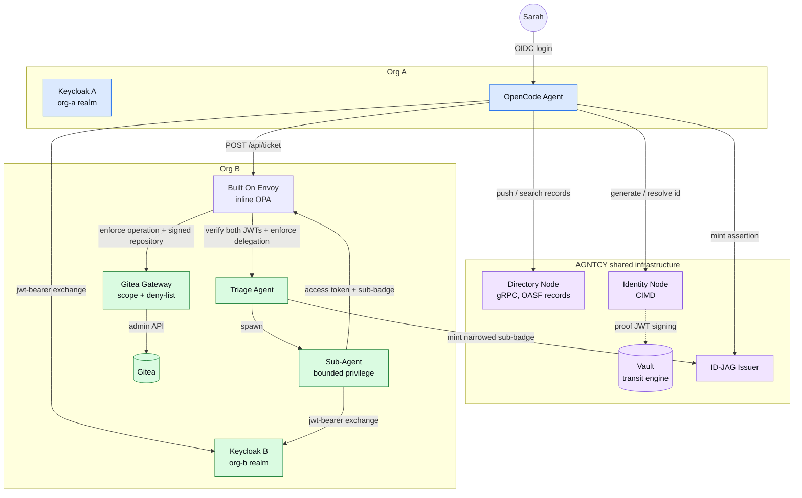

# Cross-Domain AI Agent Remediation Demo (ID-JAG + VC)

A cross-domain agent delegation scenario: **Sarah** (an engineer at **Org A**)
asks **OpenCode** (her Org A AI agent) to fix a CVE found in a repo owned by
**Org B**. Org B has its own Keycloak realm and access control, so OpenCode
can't act there directly — it asserts Sarah's delegation cross-domain using
**ID-JAG** (Identity Assertion JWT Authorization Grant), then Triage further
delegates a *narrowed* privilege to a bounded Sub-Agent that actually opens
the pull request.

It also wires in two AGNTCY components for real:

- **AGNTCY Directory Node** — every remediation turn is pushed as a
  content-addressed OASF record (immutable audit trail); agents are
  discoverable by name.
- **AGNTCY Identity Node (CIMD)** — Org A is registered as a real,
  **Vault-backed local trust authority**; agent identities are minted and
  resolved through identity-node's actual cryptographic proof-of-ownership
  flow, not a mock.

## What's real vs. mocked

| Step(s) | What | Real or mocked |
|---|---|---|
| 1 | Sarah's OIDC login at Keycloak A | **Real** |
| 2 | CVE scan | Mocked (no scanner integration) |
| 3–4 | AGNTCY Directory push + search (gRPC) | **Real** |
| 5–6 | CIMD generate/resolve id (Vault-signed proof JWT → identity-node) | **Real** |
| 7 | RFC 8693 token exchange at Keycloak A | Mocked |
| 8–9 | ID-JAG mint + Keycloak B `jwt-bearer` redemption | **Real** |
| 10–13 | Envoy ingress, ticket creation, OPA check, plan, sub-badge mint | **Real** two-token JWT verification + inline delegation-aware OPA policy |
| 14 | Sub-Agent spawned with the narrowed badge | **Real** |
| 15–18 | Sub-Agent `jwt-bearer` exchange, Envoy resource enforcement, push file, open PR | **Real** |
| 19 | Resource-boundary OPA decision | **Real** two-token JWT verification + repository-bound policy |
| 20 | PR created, causal act-chain audit | **Real** |

Milestone 1 provisioned the Built On Envoy gateway and inline OPA module.
Milestone 2 protects ticket ingress by verifying the Keycloak B access token
and the original ID-JAG actor token, then enforcing signed scope, delegation
chain, intent, and repository constraints. Milestone 3 protects the resource
path: the narrowed sub-badge is signed for one repository, Sub-Agent sends it
with its access token through listener `10001`, and inline OPA allows only the
specific push and pull-request operations.

## Architecture



21 services on one Docker network (`cd-net`):

| Service | Image | Host port(s) | Purpose |
|---|---|---|---|
| `keycloak-a` | `quay.io/keycloak/keycloak:26.7` | `8082` | Org A IdP (`org-a` realm), authenticates Sarah |
| `kc-a-init` | `quay.io/keycloak/keycloak:26.7` | _(one-shot)_ | Registers `triage:create` optional scope |
| `keycloak-b` | `quay.io/keycloak/keycloak:26.7` | `8083` | Org B IdP (`org-b` realm), redeems ID-JAG assertions |
| `kc-b-init` | `quay.io/keycloak/keycloak:26.7` | _(one-shot)_ | Registers `triage:create`/`gitea:*` optional scopes |
| `idjag-issuer` | built from `../archive/single-org-id-jag-app-access/idjag-issuer` | `9002` | Mints ID-JAG assertions (stand-in issuer) |
| `identity-postgres` | `postgres:16` | _(internal)_ | DB for identity-node |
| `identity-vault` | `hashicorp/vault:1.17` | _(internal)_ | Holds the org-a trust-authority signing key (Transit engine) |
| `identity-node` | `ghcr.io/agntcy/identity/node:0.0.23` | `4005` (REST), `4006` (gRPC) | AGNTCY identity node — CIMD id generate/resolve |
| `identity-node-init` | `python:3.12-slim` | _(one-shot)_ | Bootstraps Vault Transit + registers org-a as trust authority |
| `dir-postgres` | `postgres:16` | _(internal)_ | Search index DB for the Directory |
| `dir-zot` | `ghcr.io/project-zot/zot:v2.1.17` | `5556` | OCI registry backing the Directory's content-addressed storage |
| `dir-apiserver` | `ghcr.io/agntcy/dir-apiserver:v1.6.0` | `8888` | AGNTCY Directory Node (gRPC only) |
| `agent-dir-init` | built from `./agent-dir-init` | _(one-shot)_ | Pushes static OASF records for all 3 demo agents |
| `gitea` | `gitea/gitea:1.22` | `3002` (HTTP), `2223` (SSH) | Protected resource (repo server) |
| `gitea-init` | `gitea/gitea:1.22` | _(one-shot)_ | Seeds the Gitea admin + demo repo |
| `gitea-gateway` | built from `../archive/single-org-id-jag-app-access/gitea-gateway` | _(internal only)_ | Requires Envoy policy metadata, then rechecks token scope before using Gitea admin credentials |
| `envoy-org-b` | built from `./envoy` (Envoy + Built On Envoy Composer) | `10000`, `10001`; admin `127.0.0.1:9901` | Org B gateway; separate ticket-ingress and resource-access JWT + inline OPA policies |
| `opencode-agent` | built from `./opencode-agent` | `8101` | Org A mock agent (Phase A/B driver) |
| `triage-agent` | built from `./triage-agent` | _(internal only)_ | Org B mock agent; reachable from outside `cd-net` only through Envoy |
| `sub-agent` | built from `./sub-agent` | `8300` | Org B bounded-privilege mock agent (push + PR) |
| `webapp` | built from `./webapp` | `8090` | Animated sequence-diagram demo UI |

## Sequence flow

Every hop below actually happens against the real services in this stack
(Keycloak, Vault, identity-node, dir-apiserver, Gitea). Only the CVE scan and
RFC 8693 exchange at Keycloak A are mocked. Both Envoy enforcement points are
real. This is the same flow the webapp's UI animates step by step.

```mermaid
sequenceDiagram
    autonumber
    actor Sarah
    participant OC as OpenCode (Org A)
    participant KCA as Keycloak A
    participant Dir as AGNTCY Directory
    participant IdNode as Identity Node
    participant Vault
    participant IDJAG as ID-JAG Issuer
    participant KCB as Keycloak B
    participant Envoy as Built On Envoy + OPA
    participant Triage as Triage (Org B)
    participant Sub as Sub-Agent (Org B)
    participant GW as Gitea Gateway
    participant Gitea

    Sarah->>OC: "Fix the CVE in the Org B repo"
    OC->>KCA: OIDC password grant
    KCA-->>OC: access token
    Note over OC: mock CVE scan → HIGH severity (mocked)

    OC->>Dir: push turn record (OASF)
    Dir-->>OC: CID
    OC->>Dir: search "triage-agent"
    Dir-->>OC: agent record

    OC->>Vault: sign proof JWT (transit/sign)
    Vault-->>OC: RS256 signature — private key never leaves Vault
    OC->>IdNode: generate id (proof JWT)
    IdNode-->>OC: id = AGNTCY-triage-agent
    OC->>IdNode: resolve id
    IdNode-->>OC: ResolverMetadata + public key

    Note over OC,KCA: RFC 8693 token exchange (mocked)
    OC->>IDJAG: mint assertion (sub=Sarah, scope=triage:create, intent=create-pr-fix)
    IDJAG-->>OC: signed assertion (RS256)
    OC->>KCB: jwt-bearer grant
    KCB-->>OC: scoped access token

    OC->>Envoy: POST /api/ticket (access token + actor token)
    Envoy->>KCB: fetch/cached JWKS
    Envoy->>IDJAG: fetch/cached JWKS
    Note over Envoy: verify both JWTs; enforce scope, chain, signed intent, repo
    Envoy->>Triage: ALLOW + policy decision headers
    Triage->>IDJAG: mint sub-badge (gitea:write/pr, resource=target repo)
    IDJAG-->>Triage: sub-badge (act_chain: Sarah→OpenCode→Triage→Sub-Agent)
    Triage->>Sub: spawn with sub-badge

    Sub->>KCB: jwt-bearer exchange
    KCB-->>Sub: scoped token (gitea:write, gitea:pr)
    Sub->>Envoy: push fix (access token + signed sub-badge)
    Note over Envoy: verify both JWTs; enforce chain, scope, intent, operation, repo
    Envoy->>GW: ALLOW push + policy decision headers
    GW->>Gitea: create branch + commit
    Gitea-->>GW: ok
    GW-->>Sub: branch created
    Sub->>Envoy: open PR (access token + signed sub-badge)
    Envoy->>GW: ALLOW PR + policy decision headers
    GW->>Gitea: create PR
    Gitea-->>GW: ok
    GW-->>Sub: PR created ✓

    Sub->>Envoy: open PR on demo-protected (same token, same scope)
    Envoy--xSub: 403 policy_deny — outside signed resource

    Note over Sub,Triage: resource OPA decision is real and inline
    Sub-->>Triage: PR link + denied-attempt result
    Triage-->>OC: ticket complete
    OC-->>Sarah: PR ready — full act-chain audit trail
```

## Quick start

```bash
cd cross-domain-id-jag-vc
cp .env.example .env
# SARAH_PASSWORD / OPENCODE_CLIENT_SECRET / TRIAGE_CLIENT_SECRET /
# SUB_AGENT_CLIENT_SECRET must stay as the .env.example defaults (or be
# changed to match keycloak-a/org-a-realm.json + keycloak-b/org-b-realm.json)
# — everything else can be freely changed.

docker compose up -d --build
```

The first build pulls the pinned Envoy base image and Built On Envoy Composer
artifact. To deliberately refresh those pinned inputs:

```bash
docker compose build --pull envoy-org-b
docker compose up -d envoy-org-b
```

First boot takes ~3–5 minutes (Keycloak + identity-node + Directory cold
start). Watch it settle:

```bash
docker compose logs -f
```

Wait until these one-shot containers exit 0: `kc-a-init`, `kc-b-init`,
`gitea-init`, `identity-node-init`, `agent-dir-init`.

## Testing

### Envoy Milestones 2–3 reviewer verification

This procedure is self-contained. It verifies both Rego policies, the
digest-pinned image, both listeners, successful ticket and resource
delegations, independent resource-denial cases, metrics, and non-bypassable
service exposure. Run it from the repository root with Docker, Docker Compose,
`curl`, and `jq`.

1. Run the two policy suites independently:

   ```bash
   docker run --rm \
     -v "$PWD/cross-domain-id-jag-vc/envoy/policies:/policies:ro" \
     openpolicyagent/opa:1.8.0 \
     test /policies/ticket-ingress.rego \
          /policies/ticket-ingress_test.rego -v

   docker run --rm \
     -v "$PWD/cross-domain-id-jag-vc/envoy/policies:/policies:ro" \
     openpolicyagent/opa:1.8.0 \
     test /policies/resource-access.rego \
          /policies/resource-access_test.rego -v

   docker run --rm -e PYTHONDONTWRITEBYTECODE=1 \
     -v "$PWD/archive/single-org-id-jag-app-access/gitea-gateway:/src" \
     -w /src python:3.12-slim sh -c \
     'pip install -q -r requirements-dev.txt &&
      pytest -q -p no:cacheprovider'

   docker run --rm -e PYTHONDONTWRITEBYTECODE=1 \
     -v "$PWD/archive/single-org-id-jag-app-access/idjag-issuer:/src" \
     -w /src python:3.12-slim sh -c \
     'pip install -q -r requirements-dev.txt &&
      pytest -q -p no:cacheprovider'
   ```

   Expected: ticket ingress passes 9/9, resource access passes 13/13, Gitea
   Gateway passes 15 tests, and the ID-JAG issuer passes 10 tests.

2. Create the environment file, validate Compose, build the gateway, validate
   its bootstrap, and start the stack:

   ```bash
   cd cross-domain-id-jag-vc
   test -f .env || cp .env.example .env
   docker compose config --quiet
   docker compose build --pull envoy-org-b
   docker run --rm cd-envoy-boe:milestone3 \
     envoy --mode validate -c /etc/envoy/envoy.yaml
   docker compose up -d --build
   ```

   If this Compose project was started before and its demo data does not need
   to be preserved, run `docker compose down --volumes` before
   `docker compose up`. The identity demo stores generated proof material in
   volumes; reusing it with rebuilt issuer containers can produce a stale
   `ERROR_REASON_INVALID_PROOF` at the unrelated CIMD step.

3. Allow 3–5 minutes for a cold start, then inspect service state and both
   listeners:

   ```bash
   docker compose ps -a
   curl --fail --silent --show-error http://localhost:10000/health | jq .
   curl --fail --silent --show-error http://localhost:10001/healthz | jq .
   curl --fail --silent --show-error http://127.0.0.1:9901/ready
   docker compose ps gitea-gateway
   if docker compose exec -T sub-agent python -c \
     'import socket; socket.gethostbyname("gitea-gateway")' 2>/dev/null; then
     echo "ERROR: Sub-Agent can bypass Envoy"
     exit 1
   else
     echo "OK: Gitea Gateway is isolated behind Envoy"
   fi
   ```

   Long-running services should be healthy and all five one-shot services
   should exit 0. Both listener requests return 200, readiness prints `LIVE`.
   The Gitea Gateway row shows only `9100/tcp`, with no host address or
   published port. The final check confirms the Sub-Agent cannot resolve the
   gateway on its network; Envoy reaches it through the isolated resource
   network instead.

4. Run the complete sequence and retain the narrowed resource credentials:

   ```bash
   RUN_OUTPUT="$(mktemp)"
   curl --fail --silent --show-error \
     -X POST http://localhost:8090/api/run \
     -H 'Content-Type: application/json' \
     -d '{"cve":"CVE-2024-12345","repo":"demo-admin/payments-service"}' \
     -o "$RUN_OUTPUT"

   jq '{
     ok,
     failed_steps: [.steps[] | select(.status == "error") | .id],
     ticket_policy: [first(.steps[] | select(.id == "opa-ingress")) |
       .result | {decision, rule, delegation_depth}],
     resource_policy: [first(.steps[] | select(.id == "opa-egress")) |
       .result | {decision, rule, action, repository, delegation_depth}],
     protected_repo: [first(.steps[] |
       select(.id == "denied-pr-attempt")) | {status, result}]
   }' "$RUN_OUTPUT"

   SUB_ACCESS_TOKEN="$(jq -r 'last([.steps[] |
     select(.id == "kc-b-exchange")]) | .token' "$RUN_OUTPUT")"
   SUB_BADGE="$(jq -r 'first(.steps[] |
     select(.id == "mint-sub-badge")) | .token' "$RUN_OUTPUT")"
   ```

   Expected: `ok=true`, no failed steps, both policy decisions are `ALLOW`,
   the resource rule is `org-b-resource-delegation`, the signed repository is
   `demo-admin/payments-service`, delegation depth is 2, and the protected
   repository attempt has status `denied`.

5. Prove that changing the requested intent is denied before Gitea Gateway:

   ```bash
   curl --silent --show-error --include \
     -X POST http://localhost:10001/api/gitea/push/demo-admin/payments-service \
     -H "Authorization: Bearer $SUB_ACCESS_TOKEN" \
     -H "X-AGNTCY-Actor-Token: Bearer $SUB_BADGE" \
     -H 'Content-Type: application/json' \
     -d '{"intent":"delete-repository",
          "act_chain":["opencode-agent","triage-agent","sub-agent"],
          "ticket_id":"TRIAGE-2024-12345"}'
   ```

   Expected: HTTP 403 with `error=policy_denied`.

6. Prove that the signed sub-badge and signed repository restriction are both
   mandatory:

   ```bash
   curl --silent --show-error --include \
     -X POST http://localhost:10001/api/gitea/push/demo-admin/payments-service \
     -H "Authorization: Bearer $SUB_ACCESS_TOKEN" \
     -H 'Content-Type: application/json' \
     -d '{"intent":"create-pr-fix",
          "act_chain":["opencode-agent","triage-agent","sub-agent"],
          "ticket_id":"TRIAGE-2024-12345"}'

   curl --silent --show-error --include \
     -X POST http://localhost:10001/api/gitea/push/demo-admin/other-service \
     -H "Authorization: Bearer $SUB_ACCESS_TOKEN" \
     -H "X-AGNTCY-Actor-Token: Bearer $SUB_BADGE" \
     -H 'Content-Type: application/json' \
     -d '{"intent":"create-pr-fix",
          "act_chain":["opencode-agent","triage-agent","sub-agent"],
          "ticket_id":"TRIAGE-2024-12345"}'
   ```

   Expected: the missing sub-badge returns HTTP 401; the repository outside
   the signed `resource` claim returns HTTP 403.

7. Prove that administrative operations are outside the policy:

   ```bash
   curl --silent --show-error --include \
     -X POST http://localhost:10001/api/gitea/repos \
     -H "Authorization: Bearer $SUB_ACCESS_TOKEN" \
     -H "X-AGNTCY-Actor-Token: Bearer $SUB_BADGE" \
     -H 'Content-Type: application/json' \
     -d '{"name":"not-allowed"}'
   ```

   Expected: HTTP 403. Only `push` and `pulls` routes are eligible for allow.

8. Confirm metrics and access logs:

   ```bash
   curl --fail --silent --show-error \
     'http://127.0.0.1:9901/stats?filter=opa_requests_total'
   curl --fail --silent --show-error \
     'http://127.0.0.1:9901/stats?filter=jwt_authn'
   docker compose logs --since=5m envoy-org-b | grep gitea_gateway
   rm "$RUN_OUTPUT"
   ```

   OPA and JWT counters should include allowed and denied decisions. Successful
   push and PR requests have `gitea_gateway` as the upstream cluster; policy
   denials do not. Credential and verified-payload headers are excluded from
   access logs.

If a port is allocated, change the corresponding `ENVOY_*_PORT` value in
`.env`. For startup failures, inspect `docker compose logs envoy-org-b` and
`docker compose logs triage-agent sub-agent gitea-gateway`.

When finished, `docker compose down` preserves demo data. Use
`docker compose down -v` only when intentionally deleting all demo data.

### Via the webapp (recommended)

Open **http://localhost:8090**. Click **Run (animated)** to watch all 20
steps execute with live sequence-diagram highlighting and a step-by-step
explainer toast, or **Next step ▶** to step through manually.

### Via the API directly

```bash
# Full sequence
curl -s -X POST http://localhost:8090/api/run \
  -H 'Content-Type: application/json' \
  -d '{"cve":"CVE-2024-12345","repo":"demo-admin/payments-service"}' | jq .

curl -s http://localhost:8090/api/health
curl -s http://localhost:8090/api/config | jq .

# Individual steps (step-through mode)
curl -s -X POST http://localhost:8090/api/step/cimd-generate-id \
  -H 'Content-Type: application/json' -d '{"sub":"triage-agent"}' | jq .
```

You can re-run `/api/run` repeatedly — every push branch is randomized
server-side, so repeat runs don't collide with a prior run's branch/PR.

### Spot-checking individual services

```bash
curl http://localhost:8082/realms/org-a/.well-known/openid-configuration | jq .issuer
curl http://localhost:8083/realms/org-b/.well-known/openid-configuration | jq .issuer
curl http://localhost:9002/jwks | jq .
curl http://localhost:4005/v1alpha1/issuer/org-a/.well-known/jwks.json | jq .
curl http://localhost:10000/health
curl http://localhost:10001/healthz
curl http://127.0.0.1:9901/ready
curl 'http://127.0.0.1:9901/stats?filter=opa_requests_total'
grpcurl -plaintext localhost:8888 list   # Directory gRPC services (needs `brew install grpcurl`)
```

## How CIMD actually works (the identity-node "gotcha")

identity-node's real REST API has **no** `/apps` or `/badges` endpoints — it
needs a **self-issued proof JWT** to call `/v1alpha1/id/generate` or
`/v1alpha1/id/resolve`:

1. `identity-node-init` creates an RSA-2048 key in Vault's **Transit** engine
   (`org-a-issuer`) — the private key never leaves Vault.
2. It reads back the public key, builds a JWK (parsing the PEM by hand — no
   crypto library needed since Vault does the signing), and self-signs a
   proof JWT (`iss=agntcy:org-a`, a `sub_jwk` claim carrying that public key)
   via Vault's `/transit/sign` API.
3. It registers **org-a** as a local trust authority with that proof
   (`POST /v1alpha1/issuer/register`).
4. Every subsequent CIMD call — including the ones the webapp makes live —
   signs a **fresh** proof JWT the same way to mint (`AGNTCY-<agent>`) or
   resolve an id under org-a's authority.

Two non-obvious requirements if you're extending this: identity-node
validates the submitted public key on registration (`ValidatePubKey`), and
`jws.Verify` requires a matching `kid` on both the JWK and the JWS header —
omit either and you'll get an opaque failure with no useful error message.

## Troubleshooting

- **`dir-zot` / `dir-apiserver` show no healthcheck / stay "starting"** — both
  images are distroless (no shell, no `nc`, no `wget`). Their `depends_on`
  conditions are `service_started`, not `service_healthy`, by design.
- **`gitea-init` fails with "not supposed to be run as root"** — make sure
  `user: git` is set on the `gitea-init` service (already in the compose
  file); Gitea refuses to run its CLI as root otherwise.
- **`identity-node-init` loops on HTTP 404** — this is expected during
  startup; the probe just checks the REST gateway is routing at all (any
  structured response, even 404, means it's up).
- **CIMD steps return `ERROR_REASON_INVALID_PROOF` / `INVALID_ISSUER`** — the
  proof JWT's `iss` common name must exactly match a *registered* issuer's
  common name, and the JWK must include a `kid` (see above).
  If this appears after recreating containers while retaining old volumes,
  the persisted identity-node registration may refer to the previous
  ephemeral Vault key. Intentionally reset the demo with
  `docker compose down -v`, then start it again. This deletes all local demo
  data, including seeded Gitea state.
- **Directory push fails with an OASF schema validation error** — the real
  `schema.oasf.agntcy.org` may not resolve from your network; the compose
  file points `DIRECTORY_SERVER_OASF_API_VALIDATION_SCHEMA_URL` at
  `https://schema.oasf.outshift.com` instead. Skill/domain names must be
  real OASF taxonomy entries (e.g. `software_engineering/code_quality/code_review`),
  not made-up strings.
- **Repeat `/api/run` calls fail at push-file/open-pr with "branch already
  exists"** — `gitea-gateway` (shared with the archived `single-org-id-jag-app-access`
  demo) now randomizes the branch name per push; if you're on an older image,
  rebuild it (`docker compose build gitea-gateway`).
- **Port already in use** — this stack's default ports are chosen to avoid
  colliding with `single-org-id-jag-app-access`'s defaults; if something else
  on your machine still collides, override the `*_PORT` variables in `.env`.

## Repo layout

```
cross-domain-id-jag-vc/
├── docker-compose.yaml        # the 21-service stack (source of truth)
├── .env.example
├── envoy/                     # Built On Envoy image, JWT filters, and Rego policies/tests
├── identity-node-init.py      # Vault Transit bootstrap + org-a issuer registration
├── keycloak-a/, keycloak-b/   # realm import JSON + scope bootstrap scripts
├── gitea/                     # Gitea admin/repo seed script
├── dir/                       # Zot OCI registry config
├── agent-dir-init/            # one-shot: pushes static OASF records for all agents
├── opencode-agent/            # Org A mock agent (Phase A/B)
├── triage-agent/              # Org B mock agent (ticket → sub-badge → spawn)
├── sub-agent/                 # Org B bounded-privilege mock agent
└── webapp/                    # animated sequence-diagram demo UI (FastAPI + vanilla JS)
```
