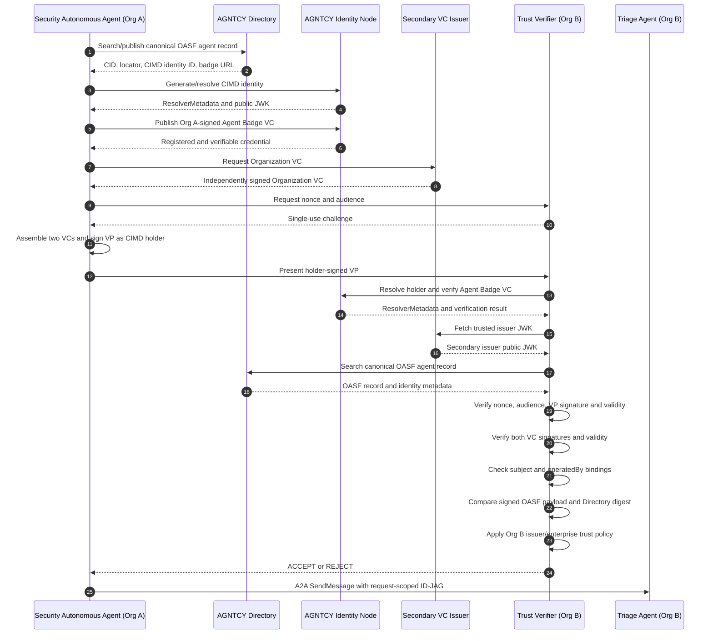

# AGNTCY Identity Node, Directory, and Trust Verifier

## Purpose

This proof of concept separates three concerns that are easy to conflate:

| Component | Question it answers | Security role |
|---|---|---|
| AGNTCY Directory | What agents exist, what can they do, and where are they? | Discovery and content-addressed audit records |
| AGNTCY Identity Node | What cryptographic identity and signed credentials are registered for this agent? | CIMD resolution and Agent Badge VC publication/verification |
| Trust Verifier | Should Org B accept this agent and its presented evidence for this interaction? | Relying-party verification and trust-policy enforcement |

The Directory is not an authorization service, and the Identity Node does not make Org B's final acceptance decision. The Trust Verifier joins evidence from both services and applies Org B's policy.

## Component ownership

The Trust Verifier logically belongs to **Org B**, because Org B owns the protected repository and is the relying party accepting the Security Autonomous Agent.

```text
Org A                                             Org B
┌─────────────────────────────┐                  ┌──────────────────────────────┐
│ Security Autonomous Agent   │  VP with 2 VCs  │ Trust Verifier               │
│                             │ ───────────────> │                              │
│ Agent Badge VC              │                  │ Verify evidence              │
│ Organization VC             │                  │ Apply Org B trust policy     │
│ Holder-signed VP            │                  │ Return ACCEPT or REJECT      │
└─────────────────────────────┘                  └──────────────────────────────┘
```

Org A can perform preflight verification to detect malformed evidence, but it cannot make the authoritative acceptance decision for Org B.

## AGNTCY Directory

The Directory stores the canonical OASF agent description used for discovery:

```json
{
  "name": "security-autonomous-agent",
  "description": "Security Autonomous Agent",
  "skills": [
    {"name": "dependency_security"},
    {"name": "code_review"}
  ],
  "domains": [
    {"name": "technology/security"}
  ],
  "locators": [{
    "type": "url",
    "urls": [
      "http://security-autonomous-agent:8100",
      "http://security-autonomous-agent:8100/.well-known/agent-card.json"
    ]
  }],
  "annotations": {
    "record_type": "agent",
    "identity_id": "AGNTCY-security-autonomous-agent",
    "badge_url": "http://identity-node:4000/v1alpha1/vc/AGNTCY-security-autonomous-agent/.well-known/vcs.json"
  }
}
```

It also stores separate, immutable OASF audit records for workflow events. Each pushed record receives a content identifier (CID). Canonical agent records are used for discovery; runtime audit records describe what happened during a task.

Directory records are searchable metadata, not trusted credentials. Publishing a Directory record does not grant repository access or delegation authority.

## AGNTCY Identity Node

The Identity Node manages the agent's CIMD identity and published Agent Badge VCs.

The agent registers and resolves an identity through:

```http
POST /v1alpha1/id/generate
POST /v1alpha1/id/resolve
```

Resolution returns `ResolverMetadata` and a public verification JWK. The organization's private key remains in Vault Transit.

Agent Badge VCs use:

```http
POST /v1alpha1/vc/publish
GET  /v1alpha1/vc/{identity-id}/.well-known/vcs.json
POST /v1alpha1/vc/verify
```

In this PoC, the Identity Node does not issue the Agent Badge. Org A constructs and signs the VC using its Vault-held issuer key. The Identity Node registers, serves, resolves, and verifies that credential.

## Binding the Directory record to the Agent Badge

The Directory record and Agent Badge share the same OASF payload, but remain separate security artifacts:

```text
OASF agent definition = description
Agent Badge VC        = signed proof about that description
Directory record      = searchable, catalogued copy
```

The Agent Badge contains:

```json
{
  "credentialSubject": {
    "id": "AGNTCY-security-autonomous-agent",
    "operatedBy": "urn:agntcy:organization:org-a",
    "badge": {"name": "security-autonomous-agent"},
    "relatedResource": [{
      "digestAlgorithm": "sha-256",
      "digest": "<digest-of-canonical-directory-oasf-record>"
    }]
  }
}
```

The verifier requires both relationships:

```text
AgentBadge.credentialSubject.badge
    == Directory canonical OASF record

AgentBadge.credentialSubject.relatedResource.digest
    == SHA-256(Directory canonical OASF record)
```

This detects a Directory entry that advertises different capabilities, endpoints, or identity metadata from the description signed by the Agent Badge issuer.

## Why the Trust Verifier is a standalone service in the PoC

The verifier is standalone to make the cross-enterprise trust decision explicit and observable. It demonstrates that the VP is only a holder-signed presentation of evidence; it is not itself a trust anchor.

The service exposes the complete relying-party decision as one visible operation:

1. Issue a single-use challenge and expected audience.
2. Decode the VP and require exactly one Agent Badge VC and one Organization VC.
3. Resolve the VP holder's CIMD identity through the Identity Node.
4. Verify the VP signature with the CIMD-resolved public key.
5. Verify the Agent Badge signature, issuer, subject, and validity.
6. Verify the independently issued Organization VC and its validity.
7. Require `AgentBadge.credentialSubject.operatedBy == OrganizationVC.credentialSubject.id`.
8. Apply Org B's allow-list binding between the trusted badge issuer and trusted enterprise.
9. Fetch the canonical OASF record from the Directory.
10. Compare the signed OASF payload and `relatedResource` digest with the Directory record.
11. Return `accepted=true` only when every check passes.

Keeping this logic separate in the PoC provides several benefits:

- The trust boundary is visible: Org B verifies Org A's evidence rather than trusting Org A's result.
- Every trust anchor and failed check is inspectable in the UI.
- Identity resolution, credential verification, Directory consistency, and policy evaluation can be tested independently.
- The demo avoids implying that the Directory or Identity Node automatically authorizes access.
- The verifier's nonce prevents VP replay, while its audience check prevents reuse at a different relying party.
- Org B can change its trusted issuers and enterprise bindings without changing Org A's agent.

The standalone deployment is a PoC architecture choice, not a requirement of AGNTCY. In production the same verifier logic could be embedded in Org B's API gateway, Envoy external-authorization service, enterprise identity service, or Triage Agent. Regardless of placement, Org B must own the policy and the final allow/deny decision.

## Complete flow



## Authorization remains separate

Successful VP verification establishes that Org B accepts the presented agent and organization evidence. It does not authorize an arbitrary operation.

The request-specific ID-JAG carries the permitted scope, resource, intent, and delegation chain. Envoy and OPA apply authorization policy at each boundary:

```text
Directory record  -> discover the agent
A2A Agent Card    -> determine how to communicate with it
CIMD identity     -> resolve its cryptographic identity
Agent Badge VC    -> verify signed claims about the agent
Organization VC   -> verify the operating enterprise
VP                -> prove holder control and present both credentials
Trust Verifier    -> apply Org B's acceptance policy
ID-JAG + OPA      -> authorize the particular operation
```

## PoC deployment

The standalone implementation is in `trust-verifier/app.py`. Its configured trust policy includes:

- trusted Agent Badge issuer: `agntcy:org-a`
- trusted Organization VC issuer: `agntcy:secondary-vc-issuer`
- trusted organization: `urn:agntcy:organization:org-a`
- trusted agent: `security-autonomous-agent`
- CIMD resolver: AGNTCY Identity Node
- canonical metadata source: AGNTCY Directory

Live views:

- Demo: <https://agent-identity-demo.outshift.io/#live-demo>
- Architecture explanation: <https://agent-identity-demo.outshift.io/#how-it-works>
