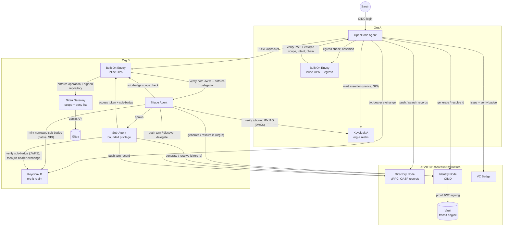

# Architecture

23 services on one Docker network (`cd-net`). The identity, authorization, and audit path is real: Keycloak, Vault, identity-node, Gitea, Directory, and two Built On Envoy inline OPA boundaries.

A hop-by-hop sequence, including the policy-gated source read, is on the [sequence](sequence.md) page. The demo also keeps a styled sequence diagram at [`cross-domain-id-jag-vc/docs/architecture.md`](https://github.com/agntcy/agent-identity-demos/blob/main/cross-domain-id-jag-vc/docs/architecture.md).

## Services

| Service | Image | Host port(s) | Purpose |
|---|---|---|---|
| `keycloak-a` | built from `./keycloak-a` (`quay.io/keycloak/keycloak:26.7` + `keycloak-idjag-spi`) | `8082` | Org A IdP (`org-a` realm), authenticates Sarah, natively mints ID-JAG assertions via a custom token-exchange SPI |
| `kc-a-init` | `quay.io/keycloak/keycloak:26.7` | _(one-shot)_ | Registers `triage:create` optional scope |
| `keycloak-b` | built from `./keycloak-b` (`quay.io/keycloak/keycloak:26.7` + `keycloak-idjag-spi`) | `8083` | Org B IdP (`org-b` realm), redeems ID-JAG assertions, natively mints Triage's narrowed sub-badge |
| `kc-b-init` | `quay.io/keycloak/keycloak:26.7` | _(one-shot)_ | Registers `triage:create`/`gitea:*` optional scopes |
| `identity-postgres` | `postgres:16` | _(internal)_ | DB for identity-node |
| `identity-vault` | `hashicorp/vault:1.17` | _(internal)_ | Holds the org-a and org-b trust-authority signing keys (Transit engine) |
| `identity-node` | `ghcr.io/agntcy/identity/node:0.0.23` | `4005` (REST), `4006` (gRPC) | AGNTCY identity node — CIMD id generate/resolve |
| `identity-node-init` | `python:3.12-slim` | _(one-shot)_ | Bootstraps Vault Transit + registers org-a AND org-b as trust authorities |
| `dir-postgres` | `postgres:16` | _(internal)_ | Search index DB for the Directory |
| `dir-zot` | `ghcr.io/project-zot/zot:v2.1.17` | `5556` | OCI registry backing the Directory's content-addressed storage |
| `dir-apiserver` | `ghcr.io/agntcy/dir-apiserver:v1.6.0` | `8888` | AGNTCY Directory Node (gRPC only) |
| `agent-dir-init` | built from `./agent-dir-init` | _(one-shot)_ | Pushes static OASF records for all 3 demo agents |
| `gitea` | `gitea/gitea:1.22` | `3002` (HTTP), `2223` (SSH) | Protected resource (repo server) |
| `gitea-init` | `gitea/gitea:1.22` | _(one-shot)_ | Seeds the Gitea admin + demo repo |
| `gitea-gateway` | built from `./gitea-gateway` | _(internal only)_ | Requires Envoy policy metadata, then rechecks token scope before using Gitea admin credentials |
| `envoy-org-a` | built from `./envoy-org-a` (Envoy + Built On Envoy Composer) | `12000`; admin `127.0.0.1:9902` | Org A gateway; badge-scope PDP (KC-A JWT) + egress JWT + inline OPA policies |
| `envoy-org-b` | built from `./envoy` (Envoy + Built On Envoy Composer) | `10000`, `10001`; admin `127.0.0.1:9901` | Org B gateway; separate ticket-ingress and resource-access JWT + inline OPA policies |
| `opencode-server` | built from `./opencode-server` | _(internal `:4096`)_ | **Real OpenCode agent** (opencode-ai@1.18.7, headless; Ollama/Anthropic provider) |
| `opencode-agent` | built from `./opencode-agent` | `8100` | Org A identity harness driving the real OpenCode (task lifecycle) |
| `triage-agent` | built from `./triage-agent` | _(internal only)_ | Org B remediation agent; reachable from outside `cd-net` only through Envoy |
| `sub-agent` | built from `./sub-agent` | `8300` | Org B bounded-privilege agent |
| `webapp` | built from `./webapp` | `8090` | Animated sequence-diagram demo UI |
| `jaeger` | `jaegertracing/all-in-one:1.65.0` | `16686` | OpenTelemetry trace backend — collector (OTLP) + UI + storage |

Compose file: [`cross-domain-id-jag-vc/docker-compose.yaml`](https://github.com/agntcy/agent-identity-demos/blob/main/cross-domain-id-jag-vc/docker-compose.yaml).
