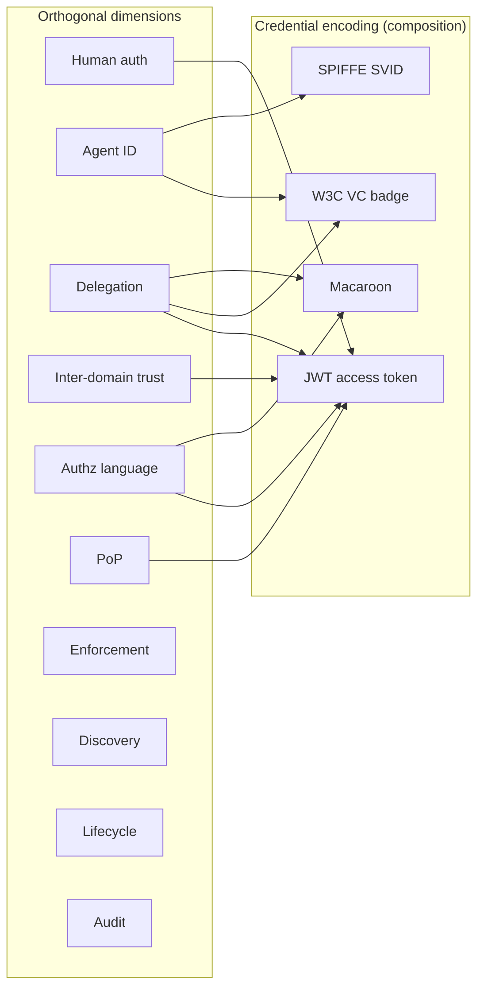

# Composition Layer & Coupling Edges

Not every design choice is an orthogonal dimension. This page covers **packaging
decisions** and **documented couplings** where swapping one mechanism forces
changes in another.

## Credential encoding (not a dimension)

Credential format is how multiple dimensions are **bundled into one artifact**.

| Format | Typical bundle |
|--------|----------------|
| OAuth access token (JWT) | Authorization (#5) + sometimes `act` (#3) + optional `cnf` (#6) |
| ID-JAG assertion | Delegation (#3) + cross-domain trust (#4) + authorization (#5) |
| W3C Verifiable Credential | Agent ID (#2) + capabilities (#5) + act-chain (#3) |
| SPIFFE SVID | Agent ID (#2) + inter-domain trust (#4) via trust domain |
| Macaroon | Delegation (#3) + authorization (#5) via embedded caveats |

**Survey treatment:** dedicate a subsection in Background (§II) explaining that
encoding choices trade composability for convenience. Include a "decomposed vs
bundled" comparison table in Related Work (§VI).

## Scenario taxonomy (use cases, not dimensions)

Scenarios **compose** dimensions. They belong in the introduction's running
example and in an appendix, not as rows in the dimension table.

| Scenario | Dimensions primarily exercised |
|----------|-------------------------------|
| Single-org cross-app access (ID-JAG) | 1, 3, 5, 7 |
| Cross-org agent remediation | 1–5, 7, 8, 10 |
| Agent-to-agent tool invocation (MCP) | 2, 5, 6, 8 |
| Enterprise multi-tenant XAA | 4, 5, 9 |
| Workload-to-workload (no human) | 2, 5, 6, 9 |

Runnable instances: [cross-domain demo](../cross-domain/overview.md).

## Documented coupling edges

Acknowledge these in §V so the framework is honest about limits.

### Authorization language ↔ delegation model

**Coupling:** Macaroons embed attenuation in the credential; OAuth keeps
attenuation in the IdP or PDP.

**Implication:** Swapping macaroons for OAuth scopes changes *where* downscoping
happens, not just *how* permissions are spelled.

### Agent identification ↔ inter-domain trust

**Coupling:** CIMD-style local trust authorities register org identity and
issuer keys together. SPIFFE separates workload identity from federation trust
bundles more cleanly.

**Implication:** "Swap SPIFFE for CIMD" may force redesign of trust bootstrapping.

### Lifecycle ↔ proof of possession

**Coupling:** Short-lived tokens reduce stolen-bearer impact; long-lived tokens
increase need for sender binding.

**Implication:** Strategic tradeoff, not structural — document as design guidance.

### Audit semantics ↔ delegation model

**Coupling:** Act-chain log format depends on how delegation is encoded.

**Implication:** Log *transport* (OTel, syslog) remains swappable; log *schema*
is not.

## Composition diagram

## Design patterns for practitioners

| Pattern | Description |
|---------|-------------|
| **Decomposed** | Separate artifacts per dimension (human OIDC token + agent VC + ID-JAG assertion + DPoP). Maximum swap flexibility; more round-trips. |
| **Bundled** | Single VC or assertion carries identity + delegation + caps. Fewer artifacts; tighter coupling. |
| **Hybrid** | Agent VC for identity (#2); OAuth token for authorization (#5); DPoP for binding (#6). Common in AGNTCY-style stacks. |
