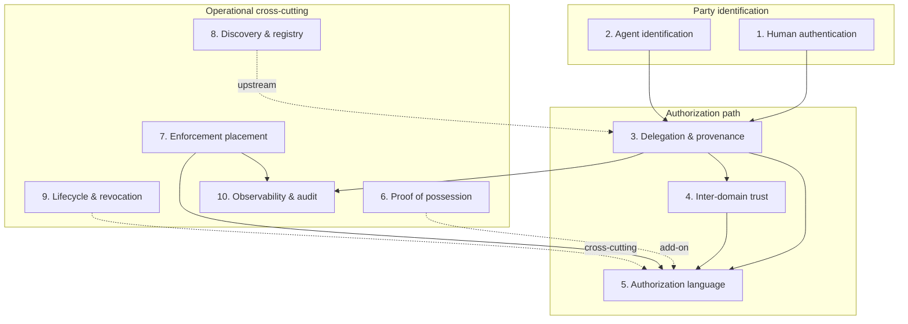

# Methodology: Orthogonal Dimensions

## The swap test

We treat two concerns as **orthogonal dimensions** when a practitioner can replace
the mechanism in one without redesigning the others — analogous to swapping car
tires without changing the wipers.

**Pass example:** Add DPoP sender binding to an existing OAuth + SPIFFE stack.
PoP is an add-on; agent identification and scope language stay the same.

**Fail example:** Replace OAuth scopes with macaroon attenuation. Downscoping
moves from the IdP/PDP into the credential itself — delegation model and
authorization language change together.

## Starting point

An initial brainstorm from agent-identity demos and standards yielded **fifteen**
candidate dimensions. Applying the swap test showed several were **refinements,
requirements, or use-case contexts** rather than independent axes.

## Critique of the fifteen-dimension split

| Original dimension | Verdict | Rationale |
|--------------------|---------|-----------|
| Human principal authentication | **Keep** | OIDC/WebAuthn vs agent ID are different party types and mechanisms |
| Workload & agent identification | **Keep** | SPIFFE/CIMD/DID are swappable independently of how humans log in |
| Subject–actor separation | **Merge → delegation** | Representation of one hop (`sub` vs `act`); not separable from chain model |
| Delegation chain provenance | **Keep (expanded)** | Absorbs subject–actor and progressive reduction as properties |
| Cross-trust-zone authorization | **Merge → inter-domain trust** | Cross-zone access *is* federated trust + foreign credential acceptance |
| Credential type & expressiveness | **Demote** | Packaging layer; often bundles identity + authz + delegation |
| Proof of possession / sender binding | **Keep** | DPoP/mTLS/cnf largely pluggable across stacks |
| Authorization model & scope language | **Keep (expanded)** | Absorbs intent/task binding as richer vocabulary |
| Progressive privilege reduction | **Merge → delegation or authz** | Constraint ("each hop ⊆ parent"), not a mechanism family |
| Intent & task binding | **Merge → authorization language** | Same problem as scopes — richer constraint expression |
| Trust establishment & issuer verification | **Merge → inter-domain trust** | Bootstrapping trust for foreign issuers |
| Discovery & directory | **Keep** | Pluggable registries independent of token format |
| Policy enforcement topology | **Keep** | Gateway vs sidecar vs resource server is deployment choice |
| Audit & provenance | **Keep (scoped)** | Log *transport* is orthogonal; log *semantics* follows delegation |
| Lifecycle, revocation & freshness | **Keep** | TTL, rotation, revocation largely independent |

## Resulting framework: ten dimensions

Solid arrows: primary information flow. Dotted: mostly independent add-ons.

## What is *not* a dimension

These belong elsewhere in the survey:

| Concept | Treatment |
|---------|-----------|
| **Credential encoding** (JWT, VC, SVID, macaroon) | [Composition layer](composition.md) |
| **Cross-org remediation scenario** | Running example / scenario taxonomy |
| **Least-privilege principle** | Requirement enforced via dimensions 3 and 5 |
| **Confused deputy** | Threat ([Threat model](threats.md)), not a dimension |

## How to use this framework in the paper

1. **Section IV** — one subsection per dimension; same template for each
2. **Related work table** — score each system: full / partial / none per dimension
3. **Designer checklist** — for a target scenario, which dimensions must be solved?
4. **Coupling callouts** — explicitly flag where swapping one dimension forces another to change
