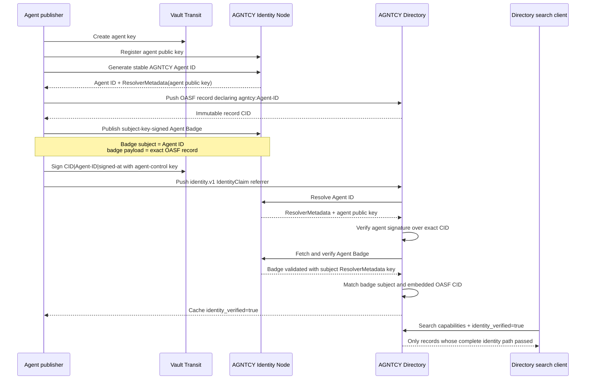

# Agent Badge-backed Directory IdentityClaim PoC

This is an alternative to treating an Agent Badge as an arbitrary supplementary OCI attestation. It uses the native identity architecture proposed in [AGNTCY Directory PR #2125](https://github.com/agntcy/dir/pull/2125):

- the OASF record declares a stable `agntcy:` Agent ID;
- the agent signs a CID-bound `IdentityClaim` with its own key;
- Directory resolves that key from AGNTCY Identity `ResolverMetadata`;
- Directory separately asks the configured Identity Node to validate an Agent Badge under the Identity Node's current verification semantics;
- the badge subject must equal the Agent ID, and its embedded OASF definition must hash to the same Directory CID;
- only after all checks pass does Directory report and search the record as `identity_verified=true`.

The Agent Badge is therefore **resolver evidence**, not a substitute for the agent's proof of possession.

## Why both artifacts are required

| Artifact | Signed by | Proves |
|---|---|---|
| Directory `IdentityClaim` | Agent key | The presenting agent controls the resolved Agent ID key and approved this exact Directory CID. |
| AGNTCY Agent Badge in Identity v0.0.26 | Credential subject's resolved key | The badge proof is valid for that Agent ID and its embedded agent definition. |

A badge alone does not bind the current Directory CID to an agent-controlled signature. An `IdentityClaim` alone proves control of a resolved key, but does not establish that the badge payload describes the same OASF record. This profile requires both.

An important result of this PoC is that Identity Node v0.0.26 verifies a published VC with the key in the **credential subject's** `ResolverMetadata`; it does not independently resolve the VC `issuer` and verify a separate issuer key. Therefore this implementation validates subject-key-backed Agent Badges. A future profile that requires an independent badge authority must add issuer-resolution and issuer-policy semantics to AGNTCY Identity rather than claiming that v0.0.26 already provides them.

## End-to-end flow



## What the Directory patch adds

The patch is intentionally narrow and applies to the exact head tested from PR #2125, commit `08c86a4b39c554a0f2eacb7391684fff6f0bd002`:

1. Recognize `agntcy:` as an identity subject scheme.
2. Add an AGNTCY resolver configured with a trusted Identity Node URL.
3. Resolve the agent control key from `ResolverMetadata`.
4. Verify the existing detached, CID-bound `IdentityClaim` JWS.
5. Fetch and validate the Agent Badge through AGNTCY Identity's current subject-key verification path.
6. Require badge subject and embedded OASF content to match the claim and CID.
7. Register the same resolver for periodic identity reconciliation.
8. Admit identity and ownership claim referrers through Directory autosync.

No new OASF field is introduced. The proposed `agntcy.dir/identity` annotation from PR #2125 carries the identity subject, and the existing `IdentityClaim` remains the native Directory proof object.

## Trust boundary

The configured Identity Node is a relying-party policy choice. This PoC does **not** claim that every Identity Node or every Agent Badge issuer is globally trusted. A production profile still needs configuration for accepted Identity Nodes, badge issuers, credential status/revocation behavior, and re-verification intervals.

The agent RSA key is held by Vault Transit. Private key material never enters the validation script or Directory.

## Run

Prerequisites: Docker, `grpcurl`, Python 3, OpenSSL, and network access to clone/build the pinned Directory commit.

```bash
./scripts/run.sh
```

The run builds two images from the same proposed Directory commit:

- **stock PR #2125**: accepts `IdentityClaim`, but cannot resolve an `agntcy:` subject;
- **patched alternative**: resolves AGNTCY Identity and requires the matching Agent Badge.

It then verifies:

- stock PR #2125 does not verify the AGNTCY identity;
- the patched server verifies and returns the Agent ID;
- `identity_verified=true` search returns the valid record;
- identity-subject search returns both advertised versions;
- replaying the first record's claim on a different CID fails;
- the agent private key remains in Vault Transit.

The machine-readable result is written to `validation-report.json`, which is ignored by Git because it contains run-specific identifiers.

## Files

- [`patches/directory-pr2125-agntcy-identity.patch`](patches/directory-pr2125-agntcy-identity.patch): minimal Directory source patch.
- [`scripts/validate.py`](scripts/validate.py): end-to-end issuance, claim, resolution, verification, replay, and search checks.
- [`docker-compose.yml`](docker-compose.yml): isolated stock/patched Directory, Identity Node, Vault, Zot, and PostgreSQL services.
- [`FINDINGS.md`](FINDINGS.md): validated conclusions and limitations.

## Relationship to the generic OCI-attestation PoC

The sibling [`oci-typed-artifacts-poc`](../oci-typed-artifacts-poc/) tests generic supplementary credentials such as a legal-entity VC. This alternative answers a narrower, stronger question: **does the Directory record represent the AGNTCY Agent ID controlled by this agent?**

The two approaches can coexist without conflating their status:

- use native `identity.v1` verification for Agent ID control and `identity_verified` search;
- use typed supplementary attestations for legal-entity, enrollment, compliance, or other evidence that does not itself establish control of the agent identity.
