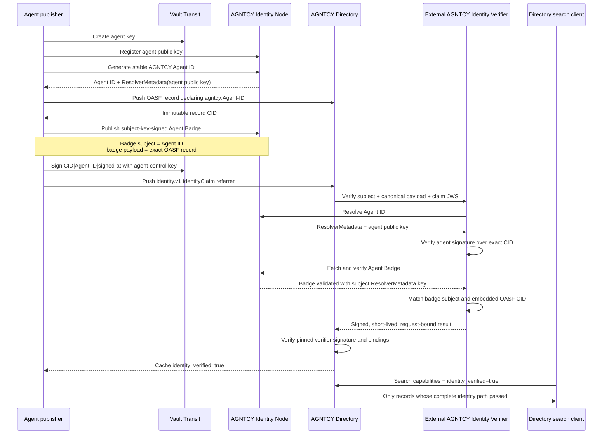

# Agent Badge-backed Directory IdentityClaim PoC

This is an alternative to treating an Agent Badge as an arbitrary supplementary OCI attestation. It uses the native identity architecture proposed in [AGNTCY Directory PR #2125](https://github.com/agntcy/dir/pull/2125), with credential-specific verification outside Directory:

- the OASF record declares a stable `agntcy:` Agent ID;
- the agent signs a CID-bound `IdentityClaim` with its own key;
- Directory sends the canonical claim to a separately deployed AGNTCY Identity Verifier;
- the verifier resolves the key from AGNTCY Identity `ResolverMetadata`, verifies proof of control, and validates the Agent Badge;
- the verifier requires the badge subject to equal the Agent ID and its embedded OASF definition to hash to the same Directory CID;
- the verifier returns a short-lived, signed result bound to the complete request;
- Directory validates that result using a pinned verifier public key before reporting or searching the record as `identity_verified=true`.

The Agent Badge is therefore **resolver evidence**, not a substitute for the agent's proof of possession. Directory does not act as the AGNTCY Identity resolver or implement Agent Badge verification.

## Why the three signed artifacts are required

| Artifact | Signed by | Proves |
|---|---|---|
| Directory `IdentityClaim` | Agent key | The agent controls the resolved Agent ID key and approved this exact Directory CID. |
| AGNTCY Agent Badge in Identity v0.0.26 | Credential subject's resolved key | The badge proof is valid for that Agent ID and its embedded agent definition. |
| Verification result | External verifier key | A configured verifier evaluated this exact subject, CID, canonical payload, and claim signature under `agntcy-agent-badge.v1`. |

A badge alone does not bind the current Directory CID to an agent-controlled signature. An `IdentityClaim` alone proves control of a resolved key, but does not establish that the badge payload describes the same OASF record. An unsigned verifier response would leave Directory trusting only an HTTP response. This profile requires all three bindings.

An important result of this PoC is that Identity Node v0.0.26 verifies a published VC with the key in the **credential subject's** `ResolverMetadata`; it does not independently resolve the VC `issuer` and verify a separate issuer key. This implementation therefore validates subject-key-backed Agent Badges. A future profile requiring an independent badge authority must add issuer-resolution and issuer-policy semantics rather than claiming that v0.0.26 already provides them.

## End-to-end flow



## What the Directory patch adds

The patch is intentionally narrow and applies to the exact head tested from PR #2125, commit `08c86a4b39c554a0f2eacb7391684fff6f0bd002`:

1. Recognize `agntcy:` as an identity subject scheme.
2. Add a thin `agntcy:` adapter configured with an external verifier URL and pinned result-signing public key.
3. Send the existing subject, detached claim JWS, and canonical CID-bound payload to that verifier.
4. Verify the signed result, protocol/profile, freshness, subject, record CID, and digest over the complete request.
5. Register the same adapter for periodic identity reconciliation.
6. Admit identity and ownership claim referrers through Directory autosync.

The separately built verifier process owns the AGNTCY-specific work: Identity Node resolution, claim-JWS verification, Agent Badge retrieval and verification, badge-subject matching, and OASF-to-CID comparison. Directory never receives an Identity Node URL and does not implement Agent Badge semantics.

No new OASF field is introduced. The proposed `agntcy.dir/identity` annotation from PR #2125 carries the identity subject, and the existing `IdentityClaim` remains the native Directory proof object.

## Trust boundary

The configured external verifier and its pinned result-signing key are Directory's immediate trust anchor. The verifier, in turn, is configured with an Identity Node and applies the `agntcy-agent-badge.v1` profile. This PoC does **not** claim that every verifier, Identity Node, or Agent Badge issuer is globally trusted.

The agent RSA key is held by Vault Transit. Private key material never enters the validation script, verifier, or Directory. The PoC generates a separate ephemeral RSA key at startup for verifier-result signing; Directory mounts only its public key. A production verifier should protect that signing key with a KMS, HSM, or workload-bound signing service.

## Run

Prerequisites: Docker, `grpcurl`, Python 3, OpenSSL, and network access to clone/build the pinned Directory commit.

```bash
./scripts/run.sh
```

The run builds three images from the same proposed Directory commit:

- **stock PR #2125**: accepts `IdentityClaim`, but cannot verify an `agntcy:` subject;
- **patched Directory**: delegates to the external verifier and validates its signed result;
- **external AGNTCY verifier**: performs identity resolution, proof-of-control verification, and Agent Badge checks.

It verifies that:

- stock PR #2125 does not verify the AGNTCY identity;
- the external verifier resolves AGNTCY Identity, verifies proof of control and the matching Agent Badge, and returns a signed result;
- the patched server validates the signed result and returns the Agent ID;
- `identity_verified=true` search returns the valid record;
- identity-subject search returns both advertised versions;
- replaying the first record's claim on a different CID fails;
- the signed result is bound to the complete request, subject, and Directory CID;
- the agent private key remains in Vault Transit.

The machine-readable result is written to `validation-report.json`, which is ignored by Git because it contains run-specific identifiers.

## Files

- [`patches/directory-pr2125-agntcy-identity.patch`](patches/directory-pr2125-agntcy-identity.patch): minimal Directory and verifier source patch.
- [`verifier/Dockerfile`](verifier/Dockerfile): builds the standalone verifier binary as a separate image/process.
- [`scripts/validate.py`](scripts/validate.py): end-to-end issuance, claim, external verification, replay, and search checks.
- [`docker-compose.yml`](docker-compose.yml): isolated stock/patched Directory, external verifier, Identity Node, Vault, Zot, and PostgreSQL services.
- [`FINDINGS.md`](FINDINGS.md): validated conclusions and limitations.

## Relationship to the generic OCI-attestation PoC

The sibling [`oci-typed-artifacts-poc`](../oci-typed-artifacts-poc/) tests generic supplementary credentials such as a legal-entity VC. This alternative answers a narrower, stronger question: **does the Directory record represent the AGNTCY Agent ID controlled by this agent?**

The two approaches can coexist without conflating their status:

- use native `identity.v1` verification for Agent ID control and `identity_verified` search;
- use typed supplementary attestations for legal-entity, enrollment, compliance, or other evidence that does not itself establish control of the agent identity.
