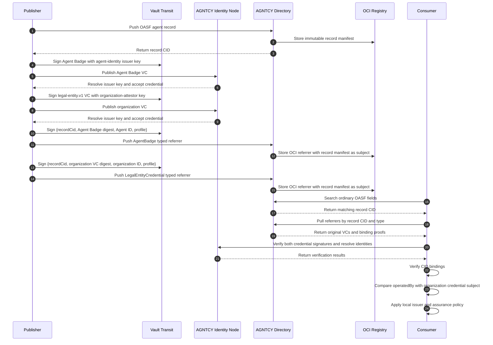

# Draft response to the Directory maintainer

> Status: internal discussion draft. This text is not posted to GitHub.

Thanks, Luca. I implemented a small PoC to test the Sigstore/OCI-referrer framing directly rather than proposing another trust container. The results support your suggested architecture, while identifying a few concrete implementation boundaries in the current Directory release.

The prototype is published here:

- Branch: https://github.com/agntcy/agent-identity-demos/tree/feature/oci-typed-artifact-validation/oci-typed-artifacts-poc
- Validated commit: https://github.com/agntcy/agent-identity-demos/commit/091f4546b35389bf0bfec0c33ffd15a7c7386e13
- Detailed findings: https://github.com/agntcy/agent-identity-demos/blob/feature/oci-typed-artifact-validation/oci-typed-artifacts-poc/FINDINGS.md
- Directory patch used by the experiment: https://github.com/agntcy/agent-identity-demos/blob/feature/oci-typed-artifact-validation/oci-typed-artifacts-poc/patches/directory-v1.7.1-agent-badge.patch

## What I tested

I used Directory `v1.7.1`, Identity Node `v0.0.26`, Zot, and two separate RSA keys held by Vault Transit. The private keys never leave Vault.

One OASF agent record has two independently issued credentials:

1. An AGNTCY Agent Badge whose subject is the AGNTCY Agent ID and whose `operatedBy` value identifies the operating organization.
2. An illustrative, provider-neutral organization credential using a `legal-entity.v1` assurance profile. This models the role that a provider such as D&B could play; it is not intended to define or claim a D&B schema.

Both credentials remain outside the OASF record. Each is preserved as a JOSE VC and attached to the exact Directory record manifest as a distinct OCI referrer. The consumer verifies this relationship:

```text
AgentBadge.credentialSubject.operatedBy
    ==
LegalEntityCredential.credentialSubject.id
```

The end-to-end sequence exercised by the PoC is:



## Representative artifacts

The organization credential is deliberately generic:

```json
{
  "type": ["VerifiableCredential", "LegalEntityCredential"],
  "issuer": "example-organization-attestor",
  "credentialSubject": {
    "id": "AGNTCY-verified-operating-organization",
    "legalName": "Verified Operating Organization",
    "registrationAuthority": "Example Organization Attestor",
    "registrationNumber": "EXAMPLE-000001",
    "assuranceProfile": "legal-entity.v1"
  }
}
```

The Agent Badge independently identifies the agent and links it to that organization:

```json
{
  "type": ["VerifiableCredential", "AgentBadge"],
  "issuer": "agent-identity-authority",
  "credentialSubject": {
    "id": "AGNTCY-security-autonomous-agent",
    "operatedBy": "AGNTCY-verified-operating-organization",
    "badge": { "...": "exact OASF record" }
  }
}
```

The client sends the organization VC as a typed referrer rather than copying it into OASF:

```json
{
  "recordRef": {
    "cid": "baeareidnijvv6lst2sw4v6lzfxdemd6cbo75hqtnxpwkvg2czqgs2dazma"
  },
  "type": "agntcy.trust.v1.LegalEntityCredential",
  "annotations": {
    "content-type": "application/vc+jose",
    "profile": "legal-entity.v1"
  },
  "data": {
    "credential": "<original JOSE VC>",
    "credentialDigest": "sha256:<digest>",
    "subjectId": "AGNTCY-verified-operating-organization",
    "identityNode": "http://identity-node:4000",
    "bindingProof": "<issuer-signed CID-binding JWS>"
  }
}
```

For the experiment, the binding JWS signs the association explicitly:

```json
{
  "recordCid": "<Directory record CID>",
  "credentialDigest": "sha256:<credential digest>",
  "subjectId": "<credential subject>",
  "profile": "legal-entity.v1",
  "iat": "<issued-at Unix time>"
}
```

That extra proof is important for credentials such as a legal-entity VC that identify an organization but do not inherently mention a particular agent record. The OCI `subject` creates an immutable storage relationship, but by itself it does not prove that the credential issuer approved associating its credential with that record. A Sigstore attestation envelope whose signed statement covers both digests could provide the same property; the PoC uses a compact JWS to isolate and demonstrate the requirement.

## Minimal Directory patch needed by the PoC

`PushReferrerRequest` is structurally generic, but `v1.7.1` validates `type` against a fixed list. Stock Directory rejected both experimental types with:

```text
Code: InvalidArgument
Message: validation error: type: value must be a valid referrer type
```

The PoC therefore added the two types at the API boundary:

```diff
- expression: "this in ['agntcy.dir.sign.v1.PublicKey',
-                        'agntcy.dir.sign.v1.Signature',
-                        'agntcy.dir.security.v1.ScanReport']"
+ expression: "this in ['agntcy.dir.sign.v1.PublicKey',
+                        'agntcy.dir.sign.v1.Signature',
+                        'agntcy.dir.security.v1.ScanReport',
+                        'agntcy.identity.v1.AgentBadge',
+                        'agntcy.trust.v1.LegalEntityCredential']"
```

Autosync has a separate deny-by-default list, so it required the same admission:

```go
var allowedReferrerTypes = map[string]struct{}{
    corev1.SignatureReferrerType:             {},
    corev1.PublicKeyReferrerType:             {},
    corev1.ScanReportReferrerType:            {},
    corev1.AgentBadgeReferrerType:            {},
    corev1.LegalEntityCredentialReferrerType: {},
}
```

I also mapped each API type to a distinct OCI media type:

```go
const (
    AgentBadgeArtifactMediaType =
        "application/vnd.agntcy.identity.agent-badge.v1+json"
    LegalEntityCredentialArtifactMediaType =
        "application/vnd.agntcy.trust.legal-entity.v1+json"
)

func apiToOCIType(apiType string) string {
    switch apiType {
    case corev1.AgentBadgeReferrerType:
        return AgentBadgeArtifactMediaType
    case corev1.LegalEntityCredentialReferrerType:
        return LegalEntityCredentialArtifactMediaType
    // existing cases omitted
    }
}
```

Finally, the current `PackManifest` call supplies the generic OCI image-manifest media type as the artifact type. The PoC passes the mapped type so the top-level OCI descriptor remains typed:

```diff
- oras.PackManifest(ctx, repo, oras.PackManifestVersion1_1,
-     ocispec.MediaTypeImageManifest, options)
+ oras.PackManifest(ctx, repo, oras.PackManifestVersion1_1,
+     ociArtifactType, options)
```

After the patch, Zot reported both the top-level `artifactType` and layer media type correctly, with the same record-manifest digest as their OCI subject:

```text
application/vnd.agntcy.identity.agent-badge.v1+json
application/vnd.agntcy.trust.legal-entity.v1+json
subject = sha256:02db2d1d...c9fb8304
```

## Observed results

| Check | Result |
|---|---|
| Stock Directory accepts arbitrary `AgentBadge` referrer type | No; rejected by the fixed type validation |
| Stock Directory accepts arbitrary `LegalEntityCredential` type | No; rejected by the same validation |
| Patched Directory stores both as distinct OCI artifacts | Yes |
| OCI subject equals the exact OASF record-manifest digest | Yes |
| Pulling by known record CID and referrer type returns the original VC bytes | Yes |
| AGNTCY Identity publishes and verifies both independently issued VCs | Yes |
| Agent Badge `operatedBy` matches the legal-entity credential subject | Yes |
| Vault private keys remain inside Transit | Yes |
| Directory validates VC signatures or profile semantics while storing | No |
| Directory rejects a deliberately tampered Agent Badge during `PushReferrer` | No; it stores it because referrer storage is not credential verification |
| Existing OASF name search finds the record | Yes |
| `RecordQueryType` can search across records by referrer type or profile | No |

The full machine-generated result is reproducible with `./scripts/run.sh`; every expected boolean check passed. Focused `server/store/oci` Go tests also pass.

## How this changes my proposal

I agree that I do not need to propose a second `TrustEvidenceReference` container if the signed OCI-referrer model is the canonical attachment mechanism. I also agree that Directory should not define a universal list of trusted providers and should not turn an attached credential into a global trust verdict. Issuer acceptance remains consumer or node policy, including the content-policy direction in #2205.

The PoC narrows the remaining work to the following points:

1. **Type admission and interpretation.** Directory `v1.7.1` does not currently admit arbitrary attestation referrer types end to end. I believe the options are registered types, a safely extensible media-type mechanism, or a standard generic attestation type with a versioned envelope/profile. Hard-coding every future issuer is not desirable.

2. **Association authorization.** The attestation must cryptographically cover the record digest, or Directory must have an equally strong rule proving that the authorized publisher/issuer approved attaching it. OCI subject binding alone says that one stored object refers to another; it does not establish who was authorized to make that statement.

3. **Credential verification remains outside generic storage.** Directory correctly did not validate the Agent Badge or organization VC merely because it stored the referrer. AGNTCY Identity or another profile-aware verifier checks issuer signatures, validity, status/revocation, and credential-specific semantics. Directory/content policy can then decide what verified signer or attestation state it requires.

4. **Search semantics are a product choice, not necessarily a blocker.** The existing and simplest flow works: search OASF fields, obtain a CID, pull its referrers, and inspect/verify them. No signer index is required for that model. As you noted, if an immutable record carries an advertised marker in a field, module, or annotation, that marker is searchable today. What is not available is a generic query over the attached referrers themselves, such as “find all records carrying `legal-entity.v1`.” If pre-filtering by advertised evidence is not a requirement, no search change is necessary. If it is required, the choices are:
   - place a clearly labelled **advertised evidence** marker in the signed record/annotation, understanding that changing it creates a new CID; or
   - add a derived attachment index, clearly separated from verified/trusted status.

5. **Lifecycle remains verifier/policy work.** VC expiration, revocation, issuer-key rotation, and re-verification must not be inferred from the continued presence of an immutable OCI artifact. A credential may remain retrievable after it stops satisfying policy.

6. **Runtime identity remains separate.** This PoC does not place SPIFFE/SVID workload identity into the immutable OASF record. It tests long-lived attestations about an agent and its operating organization. Runtime workload identity should continue through the runtime/`identity.v1` path described in your comment.

In short, the experiment validates the high-level recommendation: **use signed, digest-bound OCI referrers for Agent Badges and organization attestations; search the OASF record first; retrieve and verify attestations afterward; and keep trust policy with the relying party or Directory operator.** The concrete gaps are extensible referrer admission/type preservation and a standardized signed statement that binds the attestation to the record digest—not a new mandatory OASF trust schema.
