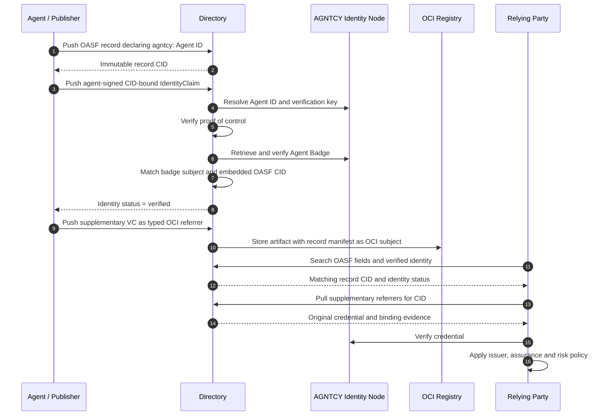

# Draft response to the Directory maintainer

> Status: internal discussion draft. This has not been posted to GitHub.

Thanks, Luca. I prototyped both integration paths so that the discussion can be based on observed Directory behavior rather than only a proposed model:

- **Typed OCI referrers:** [branch](https://github.com/agntcy/agent-identity-demos/tree/feature/oci-typed-artifact-validation/oci-typed-artifacts-poc), using Directory `v1.7.1` and AGNTCY Identity `v0.0.26`.
- **Agent Badge-backed `identity.v1`:** [branch](https://github.com/agntcy/agent-identity-demos/tree/feature/identity-claim-agent-badge-poc/identity-claim-agent-badge-poc), commit [`44f90bc`](https://github.com/agntcy/agent-identity-demos/commit/44f90bc586586b7e3c4ffd827510fa4dd53aa179), using the proposed Directory `identity.v1` implementation from [PR #2125](https://github.com/agntcy/dir/pull/2125) at commit `08c86a4b39c554a0f2eacb7391684fff6f0bd002`.

The two mechanisms overlap in transport, but they answer different trust questions and should not be treated as interchangeable.

| Mechanism | Question answered |
|---|---|
| `identity.v1` `IdentityClaim` | Does the publisher control the declared agent identity, and did it bind that identity to this exact Directory CID? |
| Typed OCI referrer | What additional signed evidence has been attached to this record, and where can a consumer retrieve it? |

## What the prototypes validated

### 1. Agent Badge as resolver evidence for an `IdentityClaim`

The Directory record declares an AGNTCY Agent ID:

```text
agntcy.dir/identity = agntcy:AGNTCY-security-autonomous-agent
```

The agent signs Directory's canonical `IdentityClaim` payload for the exact record CID. The PoC adds an `agntcy:` resolver to the resolver registry introduced by PR #2125. The resolver:

1. Resolves the Agent ID through the configured AGNTCY Identity Node.
2. Obtains the agent's public verification key from `ResolverMetadata`.
3. Verifies the detached JWS over the CID-bound `IdentityClaim`.
4. Retrieves the Agent Badge from the Identity Node.
5. Requires the Identity Node to verify the badge.
6. Requires `credentialSubject.id` to equal the declared Agent ID.
7. Recomputes the Directory CID from `credentialSubject.badge` and requires it to equal the claimed record CID.

The patched Directory reports:

```json
{
  "identity": {
    "subject": "agntcy:AGNTCY-security-autonomous-agent",
    "verified": true
  }
}
```

It also returns the record through the native `identity_verified=true` query. Replaying the same claim against a different record CID fails signature verification.

The stock PR #2125 implementation accepts the `IdentityClaim` referrer type but has no `agntcy:` resolver, so the subject falls through to DNS resolution and remains unverified. The PoC patch is therefore an additional resolver implementation, not a replacement for `identity.v1`.

### 2. Agent Badge and organization credential as typed OCI referrers

The second PoC preserves each VC as its original JOSE bytes and attaches it to the immutable OASF record manifest as an OCI referrer. It tests two distinct types:

```text
agntcy.identity.v1.AgentBadge
agntcy.trust.v1.LegalEntityCredential
```

Each referrer has the record manifest as its OCI `subject`, a distinct artifact/media type, the credential digest, and a signed binding statement covering the record CID and credential digest.

The stock Directory `v1.7.1` `PushReferrer` API is structurally generic, but its CEL validation and autosync allow-list reject unregistered referrer types. The PoC patch:

- admits the two types at the API boundary;
- maps each API type to a distinct OCI artifact/media type;
- preserves that type in the top-level OCI manifest; and
- adds the types to autosync's allow-list.

After the patch, Directory stores and retrieves both artifacts by record CID and referrer type, and Zot reports the exact record-manifest digest as each artifact's OCI subject.

Directory does not validate the VC signature or profile semantics during `PushReferrer`. This is appropriate for generic artifact storage, but it means the presence of the referrer is not a verified identity or assurance result. A deliberately tampered credential can still be stored. A relying party must retrieve the artifact and invoke AGNTCY Identity or another profile-aware verifier.

Directory also does not currently support a cross-record query such as “find records with a `legal-entity.v1` referrer.” Existing search first finds OASF records and then retrieves their referrers. Supporting attestation-aware pre-filtering would require either a signed advertised marker in the record or a derived referrer index with explicit provenance.

## Combined architecture



## Recommendation

I do not think Directory needs to choose one mechanism for every form of evidence.

1. Use `identity.v1` for first-class identity and ownership claims. An Agent Badge can be resolver evidence for an AGNTCY Agent ID, but the agent must still sign the CID-bound `IdentityClaim` to prove current control of the resolved key.
2. Use typed OCI referrers for supplementary evidence that does not itself prove control of the Directory record, such as legal-entity credentials, enterprise enrollment credentials, audit evidence, or scan reports.
3. Keep the status namespaces separate. A stored referrer means “attached evidence is available”; `identity_verified=true` means the native identity resolver completed its defined verification procedure.
4. Keep issuer acceptance outside the OASF record. Directory operators and relying organizations configure the Identity Nodes, transparency logs, certificate authorities, issuers, and assurance profiles they accept.
5. Do not require a new OASF core field for either path. The identity subject uses the existing/proposed identity annotation, while supplementary evidence remains attached to the CID.
6. Treat referrer search as a separate product decision. Retrieval by known CID and type works after type admission. Cross-record filtering by attached evidence requires new indexing semantics and must distinguish advertised evidence from a verifier observation.

For an AGNTCY integration, the smallest coherent Directory change is therefore an `agntcy:` resolver under PR #2125's registry plus a provider-neutral way to admit and preserve supplementary OCI artifact types. The resolver establishes native identity status; typed referrers make additional evidence retrievable without turning Directory into a universal credential verifier.

## Qualification discovered during validation

AGNTCY Identity Node `v0.0.26` verifies the tested Agent Badge using the credential subject's `ResolverMetadata` key. It does not independently resolve and validate a different VC issuer key. The PoC therefore demonstrates a subject-key-backed Agent Badge. Supporting an independently signed badge authority requires issuer resolution and trust policy in AGNTCY Identity; Directory should not infer that issuer trust from successful subject-key resolution.

I reviewed the proposed ANS resolver in [Directory issue #2138](https://github.com/agntcy/dir/issues/2138). It follows the same `identity.v1` extension pattern but uses an `ans://` subject, an X.509 identity certificate, DNS discovery, a status token, a SCITT receipt, and pinned transparency-log keys. ANS was not run as part of either prototype, so this draft does not claim ANS interoperability testing.
