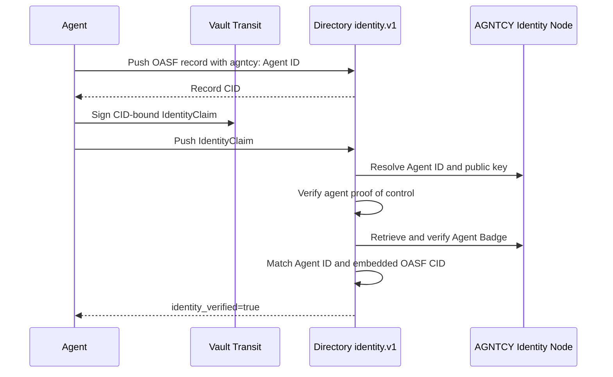
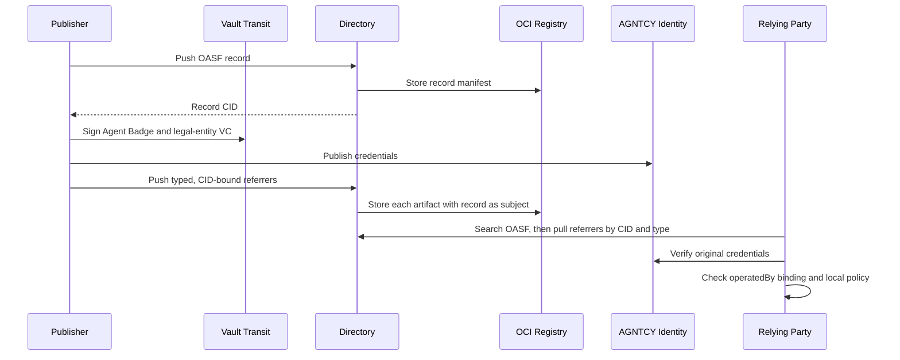

# Discussion draft: AGNTCY Identity and legal-entity evidence in Directory

> Status: draft for technical discussion. This has not been posted to GitHub.

I would like feedback on how Directory should distinguish native identity verification from supplementary trust evidence. To make the design discussion concrete, I implemented and validated two independent PoCs:

| PoC | Branch | Directory baseline | Primary question |
|---|---|---|---|
| Agent Badge-backed `IdentityClaim` | [`feature/identity-claim-agent-badge-poc`](https://github.com/agntcy/agent-identity-demos/tree/feature/identity-claim-agent-badge-poc/identity-claim-agent-badge-poc), commit [`44f90bc`](https://github.com/agntcy/agent-identity-demos/commit/44f90bc586586b7e3c4ffd827510fa4dd53aa179) | Proposed [PR #2125](https://github.com/agntcy/dir/pull/2125), pinned at `08c86a4b39c554a0f2eacb7391684fff6f0bd002` | Can an AGNTCY Agent ID become a native Directory identity with proof of key control? |
| Typed OCI referrers | [`feature/oci-typed-artifact-validation`](https://github.com/agntcy/agent-identity-demos/tree/feature/oci-typed-artifact-validation/oci-typed-artifacts-poc), validated in [`091f454`](https://github.com/agntcy/agent-identity-demos/commit/091f4546b35389bf0bfec0c33ffd15a7c7386e13) | Directory `v1.7.1` | Can Directory attach and retrieve an Agent Badge and legal-entity credential without changing OASF? |

Both environments use AGNTCY Identity Node `v0.0.26`, Zot, PostgreSQL, and HashiCorp Vault `1.17` Transit. The scripts generate ephemeral service secrets at runtime. Signing operations occur through Vault Transit, and private key material is never exported to the client, Directory, or the repository.

## PoC 1: Agent Badge-backed `identity.v1`

### Implementation

The OASF record declares:

```text
agntcy.dir/identity = agntcy:AGNTCY-security-autonomous-agent
```

The agent signs Directory's canonical `IdentityClaim` payload for the exact record CID using its Vault Transit key. The patch adds an `agntcy:` resolver to PR #2125's resolver registry. The resolver:

1. Resolves the Agent ID through a configured AGNTCY Identity Node.
2. obtains the agent public key from `ResolverMetadata`;
3. verifies the detached JWS over the CID-bound `IdentityClaim`;
4. retrieves and verifies the Agent Badge through AGNTCY Identity;
5. requires the badge subject to equal the declared Agent ID; and
6. recomputes the CID of `credentialSubject.badge` and requires it to equal the Directory record CID.

The implementation registers the same resolver in ingest and periodic reconciliation. The stock PR #2125 server accepts the claim type but cannot resolve an `agntcy:` subject; the patched server reports the record as `identity_verified=true`. Replaying the claim against another CID fails.



### Missing for production integration

- PR #2125 is proposed code, not a released Directory API.
- The `agntcy:` subject syntax, resolver contract, timeout behavior, egress controls, and error taxonomy need a normative profile.
- Directory operators need policy for accepted Identity Nodes; successful resolution must not imply that every Identity Node is trusted.
- Identity Node `v0.0.26` verifies the tested badge with the credential subject's `ResolverMetadata` key. It does not independently resolve a different VC issuer key. Independent Agent Badge issuers require issuer-key resolution, issuer authorization, status/revocation, and trust-policy support in AGNTCY Identity.
- Cache expiry and reconciliation must follow credential expiration, revocation, Identity Node availability, and key rotation.
- This PoC does not compose a legal-entity credential into `identity_verified`. A legal-entity VC identifies or qualifies an organization; by itself it does not prove that the agent controls its Agent ID or that the organization approved this Directory CID.

A legal-entity credential could participate in native Directory ownership verification only if the organization has a resolvable key and signs a CID-bound `OwnershipClaim`. The legal-entity VC could then be resolver evidence for that organization subject. Otherwise it remains supplementary evidence and must not change native identity or ownership status.

## PoC 2: typed OCI referrers

### Implementation

This PoC leaves both credentials outside OASF:

```text
agntcy.identity.v1.AgentBadge
agntcy.trust.v1.LegalEntityCredential
```

Each JOSE VC is stored unchanged in a distinct OCI referrer whose `subject` is the exact OASF record manifest. Each referrer also carries a signing-key-bound statement over the record CID, credential digest, subject, and assurance profile. Two independent RSA-2048 keys in Vault Transit sign the Agent Badge and illustrative `legal-entity.v1` credential.

For compatibility with Identity Node `v0.0.26`, each signing key is also registered as the corresponding credential subject's resolver key. This validates the transport, byte preservation, subject binding, and Identity Node's current verification behavior; it does not demonstrate independent issuer-key resolution.

The consumer retrieves both artifacts and verifies:

```text
AgentBadge.credentialSubject.operatedBy
    == LegalEntityCredential.credentialSubject.id
```

The stock `v1.7.1` API rejects both new types because CEL validation and autosync use fixed allow-lists. The patch admits the two API types, maps each to a distinct OCI artifact/media type, preserves the type in the top-level OCI manifest, and adds autosync admission. Retrieval by known CID and referrer type succeeds.



### Missing for production integration

- Directory needs either registered referrer types, an extensible media-type mechanism, or a single generic attestation envelope with versioned profiles. Hard-coding every issuer or credential type will not scale.
- OCI subject binding proves an immutable storage relationship, not that the credential issuer or authorized record owner approved the association. The signed envelope must cover both the record digest and evidence digest, or Directory must enforce an equivalent authenticated attachment rule.
- `PushReferrer` stores bytes; it does not invoke AGNTCY Identity, validate the VC issuer, evaluate `legal-entity.v1`, check revocation, or verify the cross-credential relationship. A tampered credential is still accepted as storage.
- AGNTCY Identity integration therefore needs either an external relying-party verification step, as demonstrated, or a defined verifier/content-policy hook that records verifier identity, profile version, checked-at time, result, expiration, and provenance.
- Independent Agent Badge and legal-entity issuers require AGNTCY Identity to resolve and authorize the VC issuer separately from the credential subject. The current PoC intentionally does not claim that `v0.0.26` provides this issuer trust.
- The illustrative `legal-entity.v1` profile is not a standard. Production use requires a defined schema/profile, issuer-key discovery, status/revocation, subject identifiers, and relying-party policy. A provider such as D&B can supply this evidence without Directory hard-coding D&B as globally trusted.
- Directory can retrieve referrers by known record CID and type, but `RecordQueryType` cannot search across records by attached type, profile, issuer, or verification result. Evidence-aware pre-filtering requires a new index or an explicitly advertised record marker. Advertised evidence and verified evidence must remain separate query states.
- Immutable artifacts remain retrievable after credentials expire or are revoked; any derived verification state requires invalidation and reconciliation.

## Relationship to the proposed ANS resolver

The proposed ANS work in [#2138](https://github.com/agntcy/dir/issues/2138) uses the same architectural seam as the first PoC: an `ans://` subject, a CID-bound `IdentityClaim`, proof of possession with an X.509 identity-certificate key, and a scheme-specific resolver that validates DNS discovery, certificate binding, status tokens, SCITT receipts, and pinned transparency-log keys.

That resolver framework can and should be extensible to other identity systems, including AGNTCY Identity. The resolver contract should define the invariant rather than prescribe one credential technology:

```text
verified identity =
    declared stable subject
    + proof of control over the exact Directory CID
    + authoritative key resolution
    + subject/evidence binding
    + accepted trust anchor
    + current lifecycle status
```

An `agntcy:` resolver can satisfy that contract with `ResolverMetadata` and an Agent Badge, just as an `ans://` resolver can satisfy it with an identity certificate and transparency-log evidence. Other schemes could use DID documents, PKI, or SPIFFE trust bundles.

The extension point should not classify every attestation as an identity claim. A legal-entity credential that only states “this organization exists” provides assurance evidence, not proof that a key holder controls an agent identity or approved a specific CID. It becomes suitable resolver evidence for an `OwnershipClaim` only when the organization subject has a resolvable key and proves possession over that claim. Otherwise the typed OCI-referrer path is the appropriate representation.

## Recommendation

1. Land and stabilize the `identity.v1` resolver registry and reconciliation model from PR #2125.
2. Define a provider-neutral resolver contract and implement both `ans://` and `agntcy:` as scheme-specific resolvers under it.
3. Use native `IdentityClaim` and `OwnershipClaim` status only for CID-bound proof of control. Keep `identity_verified` and `owner_verified` distinct.
4. Use typed OCI referrers for supplementary credentials, including legal-entity, enrollment, compliance, and audit evidence.
5. Add a generic verification-observation model only if Directory is expected to expose verified supplementary assurance. It must record verifier, profile, result, provenance, checked-at time, and expiry rather than converting evidence presence into a trust verdict.
6. Add attachment-aware indexing only if cross-record evidence discovery is a requirement. Index each evidence item atomically so fields from separate credentials cannot satisfy one query.
7. Do not require a new OASF core field for either PoC. The proposed identity annotation carries the stable identity subject; supplementary evidence remains attached to the immutable CID.

This separation gives Directory one extensible identity architecture while allowing multiple credential and attestation ecosystems. It also lets ANS, AGNTCY Identity, and legal-entity providers integrate without assigning Directory the role of universal issuer or global trust authority.

## Feedback requested

- Is PR #2125's resolver registry intended to be the common extension point for both `ans://` and `agntcy:` identities?
- Should supplementary credential types be registered explicitly, or should Directory admit a generic signed-attestation media type with profile identifiers?
- Does the working group require cross-record search by evidence type/profile, or is search-then-retrieve sufficient?
- Should verified supplementary evidence be evaluated by Directory content policy, by an external verifier, or only by the relying client?
- Would the maintainers accept a follow-up PoC that implements the AGNTCY resolver and legal-entity ownership profile against the final `identity.v1` API?
