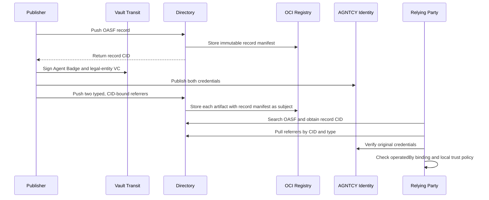
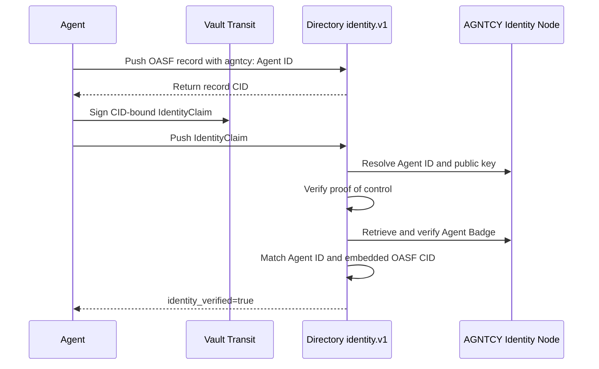

# Discussion draft: AGNTCY Identity and legal-entity evidence in Directory

> Status: draft for technical discussion. This has not been posted to GitHub.

## Context and question for the working group

An OASF record is the discoverable description of an agent: its name, capabilities, endpoints, domains, and other catalog metadata. Directory stores that record as immutable, content-addressed data and returns a CID. Credentials have a different lifecycle: they are signed by issuers, expire or are revoked, and may be evaluated differently by each relying organization.

The question is therefore not whether a Verifiable Credential should be copied into OASF. The question is how Directory should:

1. associate external evidence with an exact OASF record CID;
2. preserve the evidence's native cryptographic proof;
3. distinguish evidence presence from verified identity or assurance;
4. make the evidence retrievable or searchable; and
5. integrate identity systems such as AGNTCY Identity without making Directory a universal credential issuer or global trust authority.

To make this concrete, I implemented and validated two independent PoCs. PoC 1 starts with Directory's existing OCI-referrer mechanism. PoC 2 tests whether an Agent Badge can instead participate in the native `identity.v1` architecture proposed in [PR #2125](https://github.com/agntcy/dir/pull/2125).

| PoC | Branch | Directory baseline | Primary question |
|---|---|---|---|
| Typed OCI referrers | [`feature/oci-typed-artifact-validation`](https://github.com/agntcy/agent-identity-demos/tree/feature/oci-typed-artifact-validation/oci-typed-artifacts-poc), validated in [`091f454`](https://github.com/agntcy/agent-identity-demos/commit/091f4546b35389bf0bfec0c33ffd15a7c7386e13) | Directory `v1.7.1` | Can Directory attach and retrieve an Agent Badge and legal-entity credential without changing OASF? |
| Agent Badge-backed `IdentityClaim` | [`feature/identity-claim-agent-badge-poc`](https://github.com/agntcy/agent-identity-demos/tree/feature/identity-claim-agent-badge-poc/identity-claim-agent-badge-poc), commit [`44f90bc`](https://github.com/agntcy/agent-identity-demos/commit/44f90bc586586b7e3c4ffd827510fa4dd53aa179) | Proposed PR #2125, pinned at `08c86a4b39c554a0f2eacb7391684fff6f0bd002` | Can an AGNTCY Agent ID become a native Directory identity with proof of key control? |

Both environments use AGNTCY Identity Node `v0.0.26`, Zot, PostgreSQL, and HashiCorp Vault `1.17` Transit. The scripts generate ephemeral service secrets at runtime. Signing operations occur through Vault Transit, and private key material is never exported to the client, Directory, or the repository.

## PoC 1: typed OCI referrers

### What this PoC is doing

Directory already stores records in an OCI registry and supports referrers for artifacts such as signatures and scan reports. An OCI referrer is a separate artifact whose `subject` points to the digest of another OCI manifest. In this experiment, the subject is the exact manifest containing the OASF record.

The PoC keeps the two VCs outside OASF and attaches each one independently:

```text
OASF agent record (immutable CID)
    ├── agntcy.identity.v1.AgentBadge referrer
    └── agntcy.trust.v1.LegalEntityCredential referrer
```

These strings are **experimental Directory referrer type identifiers**:

- `agntcy.identity.v1.AgentBadge` means that the referrer's payload is expected to contain an AGNTCY Agent Badge using version 1 of this experimental attachment contract.
- `agntcy.trust.v1.LegalEntityCredential` means that the payload is expected to contain a legal-entity credential using version 1 of the experimental trust-evidence contract.

The identifiers are not OASF fields, VC types, issuer names, assurance results, or statements that AGNTCY trusts the evidence. They tell Directory and clients how to store, retrieve, and interpret the attached bytes. Each API identifier maps to a distinct OCI `artifactType` and layer media type. The `legal-entity.v1` profile is intentionally provider-neutral and illustrative; it is not a D&B schema or an adopted AGNTCY standard.

Each referrer preserves the original JOSE VC bytes and contains:

- the credential digest;
- its subject identifier and profile;
- the Directory record CID;
- the Identity Node location used by the PoC; and
- a signing-key-bound statement over the record CID, credential digest, subject, profile, and issuance time.

The OCI subject relationship binds storage objects immutably. The signed statement separately demonstrates that the signing key approved the association with that record CID.

Two independent RSA-2048 keys in Vault Transit sign the Agent Badge and illustrative legal-entity credential. For compatibility with Identity Node `v0.0.26`, each signing key is also registered as the corresponding credential subject's resolver key. This validates the transport, byte preservation, subject binding, and Identity Node's current verification behavior; it does not demonstrate independent issuer-key resolution.

The consumer retrieves both artifacts and evaluates the cross-credential relationship:

```text
AgentBadge.credentialSubject.operatedBy
    == LegalEntityCredential.credentialSubject.id
```



### What was validated

#### 1. Stock type admission

The PoC called `agntcy.dir.store.v1.StoreService/PushReferrer` on an unmodified Directory `v1.7.1` server with each experimental `type`. Both requests failed before reaching OCI storage:

```text
Code: InvalidArgument
Message: validation error: type: value must be a valid referrer type
```

The failure comes from `proto/agntcy/dir/core/v1/rules.proto`, whose CEL rule admits only:

```text
agntcy.dir.sign.v1.PublicKey
agntcy.dir.sign.v1.Signature
agntcy.dir.security.v1.ScanReport
```

Autosync independently enforces the same closed set in `server/routing/autosync/autosync.go`. Therefore, the API message is generic in shape, but arbitrary referrer types are not accepted end to end.

#### 2. Exact Directory patch

The experimental patch makes five bounded changes:

| File | Change |
|---|---|
| `api/core/v1/referrer_types.go` | Defines `AgentBadgeReferrerType` and `LegalEntityCredentialReferrerType`. |
| `proto/agntcy/dir/core/v1/rules.proto` | Adds both strings to the API validation rule. |
| `server/routing/autosync/autosync.go` | Adds both types to autosync admission. |
| `server/store/oci/types.go` | Adds reversible API-type ↔ OCI-media-type mappings. |
| `server/store/oci/referrers.go` | Passes the mapped media type to `oras.PackManifest` as the top-level `artifactType` instead of always using the generic OCI image-manifest type. |

The mappings tested are:

```text
agntcy.identity.v1.AgentBadge
  ↔ application/vnd.agntcy.identity.agent-badge.v1+json

agntcy.trust.v1.LegalEntityCredential
  ↔ application/vnd.agntcy.trust.legal-entity.v1+json
```

Focused unit tests verify both mapping directions.

#### 3. OCI subject binding and type preservation

In the recorded successful run, Directory returned this OASF record CID:

```text
baeareidnijvv6lst2sw4v6lzfxdemd6cbo75hqtnxpwkvg2czqgs2dazma
```

Its OCI record-manifest digest was:

```text
sha256:02db2d1df2b894ca5894dd009202709b9e386831a7b55a36611d3e63c9fb8304
```

Direct inspection of Zot's OCI manifests produced:

| Referrer | Top-level `artifactType` | Layer media type | OCI `subject.digest` |
|---|---|---|---|
| Agent Badge | `application/vnd.agntcy.identity.agent-badge.v1+json` | Same | `sha256:02db2d1d...c9fb8304` |
| Legal entity | `application/vnd.agntcy.trust.legal-entity.v1+json` | Same | `sha256:02db2d1d...c9fb8304` |

The artifacts have different manifest digests and referrer CIDs, but both point to the same record-manifest digest. This verifies that they are independent attachments to the exact OASF record, rather than fields copied into that record.

#### 4. Retrieval and byte preservation

The client called `StoreService/PullReferrer` twice:

```json
{
  "recordRef": {"cid": "<record CID>"},
  "referrerType": "agntcy.identity.v1.AgentBadge"
}
```

and then repeated the request with `agntcy.trust.v1.LegalEntityCredential`. For both responses, the test compared the returned `data.credential` string with the original compact JOSE VC and required exact equality. Directory therefore preserved the issuer's original signed bytes; it did not decode and reserialize the credential.

#### 5. Credential verification boundary

The client submitted each retrieved JOSE VC to AGNTCY Identity's `POST /v1alpha1/vc/verify` endpoint. Both returned `status: true` under Identity Node `v0.0.26` subject-key semantics.

This proves that the retrieved bytes remain verifiable with the keys registered for their credential subjects. It does not prove that Directory performed the verification, that Directory trusts the issuer, or that Identity Node independently resolved a separate issuer key.

#### 6. CID-binding and cross-credential checks

For each referrer, the PoC independently verifies an RSA signature over:

```json
{
  "recordCid": "<Directory record CID>",
  "credentialDigest": "sha256:<digest of compact JOSE VC>",
  "subjectId": "<credential subject>",
  "profile": "<profile identifier>",
  "iat": "<issued-at time>"
}
```

The validation requires the signed `recordCid` and `credentialDigest` to match the retrieved record and credential. It then checks:

```text
AgentBadge.credentialSubject.operatedBy
    == LegalEntityCredential.credentialSubject.id
```

These are client-side verification steps. Directory stores and returns the envelope but does not evaluate either relationship.

#### 7. Negative tampering test

The PoC changed the Agent Badge's `credentialSubject.id` while retaining its original JOSE signature. AGNTCY Identity rejected the modified credential because the signature no longer matched the payload. The same tampered credential was then submitted to patched Directory as an `AgentBadge` referrer, and `PushReferrer` succeeded and returned a new referrer CID.

This is the concrete evidence for the statement that generic referrer storage is not credential verification. Directory validates the request shape and admitted type; it does not validate the enclosed VC signature or Agent Badge semantics.

#### 8. Search behavior

The existing `SearchService/SearchCIDs` request using:

```json
{
  "queries": [{
    "type": "RECORD_QUERY_TYPE_NAME",
    "value": "security_autonomous_agent"
  }]
}
```

returned the expected OASF record CID. However, the `RecordQueryType` API exposes no referrer, attestation, or evidence predicate. Consequently:

- a client can search ordinary OASF fields, obtain a CID, and then call `PullReferrer`;
- a client cannot ask Directory to find every record with an `AgentBadge` attachment;
- a client cannot filter records by `legal-entity.v1`, credential issuer, or verification result; and
- adding the two storage types does not create a cross-record evidence index.

Adding the experimental types therefore produces this search-and-retrieval flow:

```text
1. SearchCIDs(name | skill | domain | other existing OASF predicate)
                         │
                         ▼
                 matching record CID(s)
                         │
              ┌──────────┴──────────┐
              ▼                     ▼
2a. PullReferrer(             2b. PullReferrer(
      record CID,                   record CID,
      AgentBadge type)              LegalEntityCredential type)
              │                     │
              └──────────┬──────────┘
                         ▼
3. Verify the VCs, CID bindings, operatedBy relationship,
   issuer policy, validity and status outside generic Directory storage
```

For example, after `SearchCIDs` returns a CID, the client performs these exact type-scoped lookups:

```json
{
  "recordRef": {"cid": "<record CID>"},
  "referrerType": "agntcy.identity.v1.AgentBadge"
}
```

```json
{
  "recordRef": {"cid": "<record CID>"},
  "referrerType": "agntcy.trust.v1.LegalEntityCredential"
}
```

The `referrerType` value is a filter within the known record's referrer set; it is not a global search predicate. Directory does not automatically join the two referrers or evaluate their relationship.

This model is sufficient when a consumer first discovers candidates by OASF capabilities and evaluates trust afterward. It is less efficient when the initial requirement is “find every agent with evidence profile X,” because the client must inspect referrers for every candidate CID. Supporting that query would require separate work:

- a publisher-declared, searchable evidence marker in the immutable OASF record, which represents advertised—not verified—evidence and changes the record CID when updated; or
- a Directory-maintained referrer index keyed by record CID and evidence item, with fields such as type, profile, issuer observation, verification result, verifier, checked-at time and expiry.

The PoC implements neither option. It validates the existing search-then-retrieve path and identifies attachment-aware indexing as an independent feature.

### Missing for production integration

- Directory needs registered referrer types, an extensible media-type mechanism, or a generic signed-attestation envelope with versioned profiles. Hard-coding every issuer or credential type will not scale.
- OCI subject binding proves a storage relationship, not that an issuer or authorized record owner approved it. The signed envelope must bind both digests, or Directory must enforce an equivalent authenticated attachment rule.
- `PushReferrer` does not invoke AGNTCY Identity, validate the VC issuer, evaluate legal-entity semantics, check revocation, or verify the cross-credential relationship.
- AGNTCY Identity integration therefore needs an external relying-party verification step, as demonstrated, or a verifier/content-policy hook that records verifier identity, profile version, result, provenance, checked-at time, and expiry.
- Independent Agent Badge and legal-entity issuers require AGNTCY Identity to resolve and authorize the VC issuer separately from the credential subject. The PoC does not claim that `v0.0.26` provides this issuer trust.
- A production legal-entity profile requires a defined schema, stable organization identifiers, issuer-key discovery, status/revocation, assurance semantics, and relying-party policy. A provider such as D&B can supply this evidence without Directory hard-coding D&B as globally trusted.
- `RecordQueryType` cannot filter records by attached type, profile, issuer, or verification result. Evidence-aware pre-filtering requires a new index or an explicitly advertised marker. Advertised evidence and verifier-observed evidence must remain distinct.
- Immutable artifacts remain retrievable after credentials expire or are revoked; any derived verification state requires invalidation and reconciliation.

## PoC 2: Agent Badge-backed `identity.v1`

### What this PoC is doing

This alternative asks a narrower and stronger question: does the publisher control the AGNTCY Agent ID declared by this exact Directory record?

The OASF record declares:

```text
agntcy.dir/identity = agntcy:AGNTCY-security-autonomous-agent
```

The agent signs Directory's canonical `IdentityClaim` payload for the exact record CID using its Vault Transit key. The patch adds an `agntcy:` resolver to PR #2125's resolver registry. The resolver:

1. resolves the Agent ID through a configured AGNTCY Identity Node;
2. obtains the agent public key from `ResolverMetadata`;
3. verifies the detached JWS over the CID-bound `IdentityClaim`;
4. retrieves and verifies the Agent Badge through AGNTCY Identity;
5. requires the badge subject to equal the declared Agent ID; and
6. recomputes the CID of `credentialSubject.badge` and requires it to equal the Directory record CID.

The Agent Badge is resolver evidence; it does not replace proof of possession. The `IdentityClaim` proves that the agent-controlled key approved this exact CID.



### What was validated

- The stock PR #2125 server accepts the `IdentityClaim` type but cannot resolve an `agntcy:` subject.
- The patched server resolves the agent key, verifies the claim and badge bindings, and reports `identity_verified=true`.
- Native identity-subject and verified-identity searches return the expected records.
- Replaying the same claim against a different record CID fails.
- The resolver is registered for ingest and periodic reconciliation.
- The agent's RSA private key remains inside Vault Transit.

### Missing for production integration

- PR #2125 is proposed code, not a released Directory API.
- The `agntcy:` syntax, resolver contract, timeout behavior, egress controls, error taxonomy, and assurance profile need normative definitions.
- Directory operators need policy for accepted Identity Nodes; successful resolution must not make every Identity Node globally trusted.
- Identity Node `v0.0.26` verifies the tested badge with the credential subject's `ResolverMetadata` key. Independent badge issuers require issuer-key resolution, authorization, status/revocation, and trust policy in AGNTCY Identity.
- Reconciliation must account for credential expiration, revocation, Identity Node availability, stale verification state, and key rotation.
- The PoC does not compose a legal-entity credential into `identity_verified`. A legal-entity VC does not itself prove that the agent controls its Agent ID or that the organization approved the CID.

A legal-entity credential could participate in native Directory ownership verification if the organization has a resolvable key and signs a CID-bound `OwnershipClaim`. The credential could then be resolver evidence for that organization subject. Otherwise it remains supplementary evidence under PoC 1.

## Final recommendation

1. Land and stabilize PR #2125's `identity.v1` resolver registry and reconciliation model.
2. Define a provider-neutral resolver contract and implement both `ans://` and `agntcy:` as scheme-specific resolvers under it.
3. Use native `IdentityClaim` and `OwnershipClaim` status only for CID-bound proof of control. Keep `identity_verified` and `owner_verified` distinct.
4. Use typed OCI referrers for supplementary legal-entity, enrollment, compliance, audit, and other assurance evidence.
5. Add a generic verification-observation model only if Directory must expose verified supplementary assurance. Record verifier, profile, result, provenance, checked-at time, and expiry; do not convert evidence presence into a trust verdict.
6. Add attachment-aware indexing only if cross-record evidence discovery is required. Index each evidence item atomically so fields from different credentials cannot satisfy one query.
7. Do not require a new OASF core field. The proposed identity annotation carries the stable identity subject, while supplementary evidence remains attached to the immutable CID.
8. Avoid storing the same Agent Badge through both paths unless there is a concrete retrieval requirement. When the badge is resolver evidence for `identity.v1`, OCI referrers should primarily carry supplementary evidence such as legal-entity credentials.

This gives Directory one extensible identity-verification architecture and one generic evidence-attachment architecture. ANS, AGNTCY Identity, and legal-entity providers can integrate without assigning Directory the role of universal credential issuer or global trust authority.

## Feedback requested

- Is PR #2125's resolver registry intended to be the common extension point for both `ans://` and `agntcy:` identities?
- Should supplementary credential types be registered explicitly, or should Directory admit a generic signed-attestation media type with profile identifiers?
- Does the working group require cross-record search by evidence type/profile, or is search-then-retrieve sufficient?
- Should verified supplementary evidence be evaluated by Directory content policy, by an external verifier, or only by the relying client?
- Would the maintainers accept a follow-up PoC that implements the AGNTCY resolver and a legal-entity ownership profile against the final `identity.v1` API?
