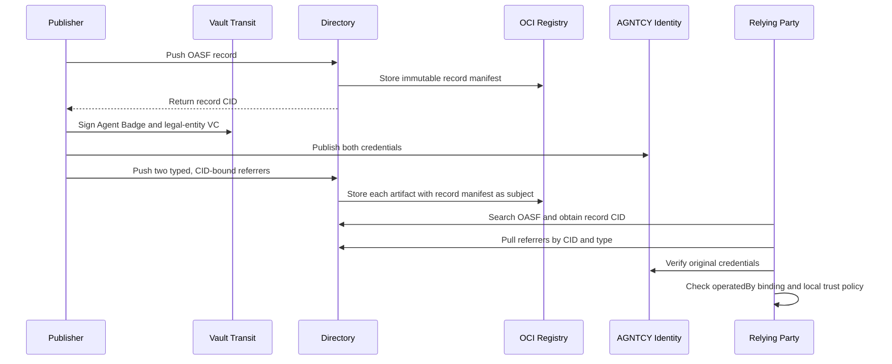
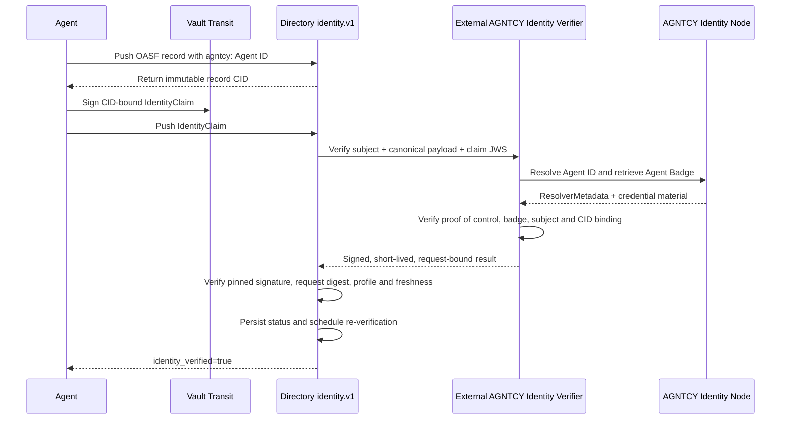

# AGNTCY Identity and legal-entity evidence in Directory

This discussion follows from [agntcy/dir#2233](https://github.com/agntcy/dir/issues/2233) and its maintainer feedback. It records two working PoCs and frames the remaining architecture questions for Directory, AGNTCY Identity, and legal-entity evidence providers.

## Context and question for the working group

An OASF record is the discoverable description of an agent: its name, capabilities, endpoints, domains, and other catalog metadata. Directory stores that record as immutable, content-addressed data and returns a CID. Credentials have a different lifecycle: they are signed by issuers, expire or are revoked, and may be evaluated differently by each relying organization.

The question is therefore not whether a Verifiable Credential should be copied into OASF. The question is how Directory should:

1. associate external evidence with an exact OASF record CID;
2. preserve the evidence's native cryptographic proof;
3. distinguish evidence presence from verified identity or assurance;
4. make the evidence retrievable or searchable; and
5. integrate identity systems such as AGNTCY Identity without making Directory a universal credential issuer or global trust authority.

To make this concrete, I implemented and validated two independent PoCs. PoC 1 starts with Directory's existing OCI-referrer mechanism. PoC 2 tests whether an Agent Badge can instead participate in the native `identity.v1` architecture proposed in [PR #2125](https://github.com/agntcy/dir/pull/2125).

| PoC | Branch | Directory baseline | Primary question |
|---|---|---|---|
| Typed OCI referrers | [`feature/oci-typed-artifact-validation`](https://github.com/agntcy/agent-identity-demos/tree/feature/oci-typed-artifact-validation/oci-typed-artifacts-poc), validated in [`091f454`](https://github.com/agntcy/agent-identity-demos/commit/091f4546b35389bf0bfec0c33ffd15a7c7386e13) | Directory `v1.7.1` | Can Directory attach and retrieve an Agent Badge and legal-entity credential without changing OASF? |
| Agent Badge-backed `IdentityClaim` | [`feature/identity-claim-agent-badge-poc`](https://github.com/agntcy/agent-identity-demos/tree/feature/identity-claim-agent-badge-poc/identity-claim-agent-badge-poc), commit [`2c89148`](https://github.com/agntcy/agent-identity-demos/commit/2c891480a8afe7fdba2e22955e1c9f4d3fcd69ed) | Proposed PR #2125, pinned at `08c86a4b39c554a0f2eacb7391684fff6f0bd002` | Can an AGNTCY Agent ID become a native Directory identity with proof of key control while AGNTCY-specific verification remains outside Directory? |

Both environments use AGNTCY Identity Node `v0.0.26`, Zot, PostgreSQL, and HashiCorp Vault `1.17` Transit. The scripts generate ephemeral service secrets at runtime. Agent and credential signing operations occur through Vault Transit, and that private key material is never exported to the client, Directory, or repository. PoC 2 separately generates an ephemeral verifier-result signing key at runtime and exposes only its public key to Directory; production deployments should protect that key with a KMS, HSM, or workload-bound signing service.

## PoC 1: typed OCI referrers

### What this PoC is doing

Directory already stores records in an OCI registry and supports referrers for artifacts such as signatures and scan reports. An OCI referrer is a separate artifact whose `subject` points to the digest of another OCI manifest. In this experiment, the subject is the exact manifest containing the OASF record.

The PoC keeps the two VCs outside OASF and attaches each one independently:

```text
OASF agent record (immutable CID)
    ├── agntcy.identity.v1.AgentBadge referrer
    └── agntcy.trust.v1.LegalEntityCredential referrer
```

These strings are **experimental Directory referrer type identifiers**:

- `agntcy.identity.v1.AgentBadge` means that the referrer's payload is expected to contain an AGNTCY Agent Badge using version 1 of this experimental attachment contract.
- `agntcy.trust.v1.LegalEntityCredential` means that the payload is expected to contain a legal-entity credential using version 1 of the experimental trust-evidence contract.

The identifiers are not OASF fields, VC types, issuer names, assurance results, or statements that AGNTCY trusts the evidence. They tell Directory and clients how to store, retrieve, and interpret the attached bytes. Each API identifier maps to a distinct OCI `artifactType` and layer media type. The `legal-entity.v1` profile is intentionally provider-neutral and illustrative; it is not a D&B schema or an adopted AGNTCY standard.

Each referrer preserves the original JOSE VC bytes and contains:

- the credential digest;
- its subject identifier and profile;
- the Directory record CID;
- the Identity Node location used by the PoC; and
- a signing-key-bound statement over the record CID, credential digest, subject, profile, and issuance time.

The OCI subject relationship binds storage objects immutably. The signed statement separately demonstrates that the signing key approved the association with that record CID.

Two independent RSA-2048 keys in Vault Transit sign the Agent Badge and illustrative legal-entity credential. For compatibility with Identity Node `v0.0.26`, each signing key is also registered as the corresponding credential subject's resolver key. This validates the transport, byte preservation, subject binding, and Identity Node's current verification behavior; it does not demonstrate independent issuer-key resolution.

The consumer retrieves both artifacts and evaluates the cross-credential relationship:

```text
AgentBadge.credentialSubject.operatedBy
    == LegalEntityCredential.credentialSubject.id
```



### What was validated

#### 1. Stock type admission

The PoC called `agntcy.dir.store.v1.StoreService/PushReferrer` on an unmodified Directory `v1.7.1` server with each experimental `type`. Both requests failed before reaching OCI storage:

```text
Code: InvalidArgument
Message: validation error: type: value must be a valid referrer type
```

The failure comes from `proto/agntcy/dir/core/v1/rules.proto`, whose CEL rule admits only:

```text
agntcy.dir.sign.v1.PublicKey
agntcy.dir.sign.v1.Signature
agntcy.dir.security.v1.ScanReport
```

Autosync independently enforces the same closed set in `server/routing/autosync/autosync.go`. Therefore, the API message is generic in shape, but arbitrary referrer types are not accepted end to end.

#### 2. Exact Directory patch

The experimental patch makes five bounded changes:

| File | Change |
|---|---|
| `api/core/v1/referrer_types.go` | Defines `AgentBadgeReferrerType` and `LegalEntityCredentialReferrerType`. |
| `proto/agntcy/dir/core/v1/rules.proto` | Adds both strings to the API validation rule. |
| `server/routing/autosync/autosync.go` | Adds both types to autosync admission. |
| `server/store/oci/types.go` | Adds reversible API-type ↔ OCI-media-type mappings. |
| `server/store/oci/referrers.go` | Passes the mapped media type to `oras.PackManifest` as the top-level `artifactType` instead of always using the generic OCI image-manifest type. |

The mappings tested are:

```text
agntcy.identity.v1.AgentBadge
  ↔ application/vnd.agntcy.identity.agent-badge.v1+json

agntcy.trust.v1.LegalEntityCredential
  ↔ application/vnd.agntcy.trust.legal-entity.v1+json
```

Focused unit tests verify both mapping directions.

#### 3. OCI subject binding and type preservation

In the recorded successful run, Directory returned this OASF record CID:

```text
baearei…dazma  (masked record CID)
```

Its OCI record-manifest digest was:

```text
sha256:02db2d1d…c9fb8304  (masked record-manifest digest)
```

Direct inspection of Zot's OCI manifests produced:

| Referrer | Top-level `artifactType` | Layer media type | OCI `subject.digest` |
|---|---|---|---|
| Agent Badge | `application/vnd.agntcy.identity.agent-badge.v1+json` | Same | `sha256:02db2d1d...c9fb8304` |
| Legal entity | `application/vnd.agntcy.trust.legal-entity.v1+json` | Same | `sha256:02db2d1d...c9fb8304` |

The artifacts have different manifest digests and referrer CIDs, but both point to the same record-manifest digest. This verifies that they are independent attachments to the exact OASF record, rather than fields copied into that record.

#### 4. Retrieval and byte preservation

The client called `StoreService/PullReferrer` twice:

```json
{
  "recordRef": {"cid": "<record CID>"},
  "referrerType": "agntcy.identity.v1.AgentBadge"
}
```

and then repeated the request with `agntcy.trust.v1.LegalEntityCredential`. For both responses, the test compared the returned `data.credential` string with the original compact JOSE VC and required exact equality. Directory therefore preserved the issuer's original signed bytes; it did not decode and reserialize the credential.

#### 5. Credential verification boundary

The client submitted each retrieved JOSE VC to AGNTCY Identity's `POST /v1alpha1/vc/verify` endpoint. Both returned `status: true` under Identity Node `v0.0.26` subject-key semantics.

This proves that the retrieved bytes remain verifiable with the keys registered for their credential subjects. It does not prove that Directory performed the verification, that Directory trusts the issuer, or that Identity Node independently resolved a separate issuer key.

#### 6. CID-binding and cross-credential checks

For each referrer, the PoC independently verifies an RSA signature over:

```json
{
  "recordCid": "<Directory record CID>",
  "credentialDigest": "sha256:<digest of compact JOSE VC>",
  "subjectId": "<credential subject>",
  "profile": "<profile identifier>",
  "iat": "<issued-at time>"
}
```

The validation requires the signed `recordCid` and `credentialDigest` to match the retrieved record and credential. It then checks:

```text
AgentBadge.credentialSubject.operatedBy
    == LegalEntityCredential.credentialSubject.id
```

These are client-side verification steps. Directory stores and returns the envelope but does not evaluate either relationship.

#### 7. Negative tampering test

The PoC changed the Agent Badge's `credentialSubject.id` while retaining its original JOSE signature. AGNTCY Identity rejected the modified credential because the signature no longer matched the payload. The same tampered credential was then submitted to patched Directory as an `AgentBadge` referrer, and `PushReferrer` succeeded and returned a new referrer CID.

This is the concrete evidence for the statement that generic referrer storage is not credential verification. Directory validates the request shape and admitted type; it does not validate the enclosed VC signature or Agent Badge semantics.

#### 8. Search behavior

The existing `SearchService/SearchCIDs` request using:

```json
{
  "queries": [{
    "type": "RECORD_QUERY_TYPE_NAME",
    "value": "security_autonomous_agent"
  }]
}
```

returned the expected OASF record CID. However, the `RecordQueryType` API exposes no referrer, attestation, or evidence predicate. Consequently:

- a client can search ordinary OASF fields, obtain a CID, and then call `PullReferrer`;
- a client cannot ask Directory to find every record with an `AgentBadge` attachment;
- a client cannot filter records by `legal-entity.v1`, credential issuer, or verification result; and
- adding the two storage types does not create a cross-record evidence index.

Adding the experimental types therefore produces this search-and-retrieval flow:

```text
1. SearchCIDs(name | skill | domain | other existing OASF predicate)
                         │
                         ▼
                 matching record CID(s)
                         │
              ┌──────────┴──────────┐
              ▼                     ▼
2a. PullReferrer(             2b. PullReferrer(
      record CID,                   record CID,
      AgentBadge type)              LegalEntityCredential type)
              │                     │
              └──────────┬──────────┘
                         ▼
3. Verify the VCs, CID bindings, operatedBy relationship,
   issuer policy, validity and status outside generic Directory storage
```

For example, after `SearchCIDs` returns a CID, the client performs these exact type-scoped lookups:

```json
{
  "recordRef": {"cid": "<record CID>"},
  "referrerType": "agntcy.identity.v1.AgentBadge"
}
```

```json
{
  "recordRef": {"cid": "<record CID>"},
  "referrerType": "agntcy.trust.v1.LegalEntityCredential"
}
```

The `referrerType` value is a filter within the known record's referrer set; it is not a global search predicate. Directory does not automatically join the two referrers or evaluate their relationship.

This model is sufficient when a consumer first discovers candidates by OASF capabilities and evaluates trust afterward. It is less efficient when the initial requirement is “find every agent with evidence profile X,” because the client must inspect referrers for every candidate CID. Supporting that query would require separate work:

- a publisher-declared, searchable evidence marker in the immutable OASF record, which represents advertised—not verified—evidence and changes the record CID when updated; or
- a Directory-maintained referrer index keyed by record CID and evidence item, with fields such as type, profile, issuer observation, verification result, verifier, checked-at time and expiry.

The PoC implements neither option. It validates the existing search-then-retrieve path and identifies attachment-aware indexing as an independent feature.

### Missing for production integration

- Directory needs registered referrer types, an extensible media-type mechanism, or a generic signed-attestation envelope with versioned profiles. Hard-coding every issuer or credential type will not scale.
- OCI subject binding proves a storage relationship, not that an issuer or authorized record owner approved it. The signed envelope must bind both digests, or Directory must enforce an equivalent authenticated attachment rule.
- `PushReferrer` does not invoke AGNTCY Identity, validate the VC issuer, evaluate legal-entity semantics, check revocation, or verify the cross-credential relationship.
- AGNTCY Identity integration therefore needs an external relying-party verification step, as demonstrated, or a verifier/content-policy hook that records verifier identity, profile version, result, provenance, checked-at time, and expiry.
- Independent Agent Badge and legal-entity issuers require AGNTCY Identity to resolve and authorize the VC issuer separately from the credential subject. The PoC does not claim that `v0.0.26` provides this issuer trust.
- A production legal-entity profile requires a defined schema, stable organization identifiers, issuer-key discovery, status/revocation, assurance semantics, and relying-party policy. A provider such as D&B can supply this evidence without Directory hard-coding D&B as globally trusted.
- `RecordQueryType` cannot filter records by attached type, profile, issuer, or verification result. Evidence-aware pre-filtering requires a new index or an explicitly advertised marker. Advertised evidence and verifier-observed evidence must remain distinct.
- Immutable artifacts remain retrievable after credentials expire or are revoked; any derived verification state requires invalidation and reconciliation.

## PoC 2: Agent Badge-backed `identity.v1`

### What this PoC is doing

This alternative asks a narrower and stronger question: does the publisher control the AGNTCY Agent ID declared by this exact Directory record?

The OASF record declares:

```text
agntcy.dir/identity = agntcy:AGNTCY-security-autonomous-agent
```

The agent signs Directory's canonical `IdentityClaim` payload for the exact record CID using its Vault Transit key. The implementation now keeps AGNTCY-specific verification outside Directory:

1. Directory's thin `agntcy:` adapter sends the subject, detached claim JWS, and canonical CID-bound payload to a separately deployed AGNTCY Identity Verifier.
2. The external verifier resolves the Agent ID through the configured AGNTCY Identity Node and obtains the public key from `ResolverMetadata`.
3. The verifier checks the detached JWS over the exact `IdentityClaim` payload.
4. The verifier retrieves and verifies the Agent Badge through AGNTCY Identity.
5. The verifier requires the badge subject to equal the Agent ID and recomputes the CID of `credentialSubject.badge`.
6. The verifier returns a short-lived signed result bound to the complete request, subject, Directory CID, profile, checked-at time, and expiry.
7. Directory verifies that result using an administrator-pinned verifier public key before persisting `identity_verified=true`.

The Agent Badge is resolver evidence; it does not replace proof of possession. The `IdentityClaim` proves that the agent-controlled key approved this exact CID. The signed verifier result lets Directory rely on that external evaluation without implementing AGNTCY key resolution or Agent Badge semantics itself.

### Implemented verification boundary



Under this separation:

- **Directory** owns the record, canonical CID-bound request, trusted-verifier configuration, result-signature validation, status persistence, search filters, and reconciliation scheduling.
- **The external AGNTCY verifier** owns Agent ID resolution, proof-of-control cryptography, Agent Badge semantics, issuer and status policy, key-rotation handling, and evidence-specific error details.
- **The Identity Node** remains the source of `ResolverMetadata` and credentials; it is not automatically trusted merely because it is reachable.

The PoC's verification-result contract is `agntcy.identity-verification.v1` with profile `agntcy-agent-badge.v1`. These are experimental identifiers used to validate the boundary, not adopted AGNTCY standards.

### What was validated

- The stock PR #2125 server accepts the `IdentityClaim` type but cannot verify an `agntcy:` subject.
- The patched Directory is configured only with the external verifier URL and pinned result-signing public key; it has no Identity Node URL.
- Only the external verifier resolves the Agent ID, verifies the claim JWS, retrieves and verifies the Agent Badge, and checks the embedded OASF CID.
- Directory validates the verifier's signed result and requires it to match the complete request digest, subject, record CID, profile, and validity window.
- Native identity-subject and `identity_verified=true` searches return the expected records.
- Replaying the same claim against a different record CID fails.
- The same external-verifier adapter is registered for ingest and periodic reconciliation.
- The agent's RSA private key remains inside Vault Transit.

The implementation and reproducible validation are in [`feature/identity-claim-agent-badge-poc`](https://github.com/agntcy/agent-identity-demos/tree/feature/identity-claim-agent-badge-poc/identity-claim-agent-badge-poc) at commit [`2c89148`](https://github.com/agntcy/agent-identity-demos/commit/2c891480a8afe7fdba2e22955e1c9f4d3fcd69ed).

### How search works in PoC 2

PoC 2 does not scan `IdentityClaim` referrers or invoke the external verifier during every search. When a claim is ingested, Directory verifies it through the configured external-verifier adapter and persists the declared subject and verification status in its search index. Periodic reconciliation is responsible for refreshing that status as the underlying evidence changes.

The successful PoC query combines an ordinary OASF predicate with native identity status:

```json
{
  "queries": [
    {
      "type": "RECORD_QUERY_TYPE_NAME",
      "value": "security_autonomous_agent"
    },
    {
      "type": "RECORD_QUERY_TYPE_IDENTITY_VERIFIED",
      "value": "true"
    }
  ]
}
```

This returns the Security Autonomous Agent only after the `IdentityClaim`, proof of control, Agent Badge, subject binding, embedded OASF CID, and signed verifier result have passed the configured verification path.

Directory can also search for the stable identity declared by the record:

```json
{
  "queries": [{
    "type": "RECORD_QUERY_TYPE_IDENTITY",
    "value": "agntcy:AGNTCY-security-autonomous-agent"
  }]
}
```

That predicate searches the record's declared identity; it does not assert that a valid claim exists. The PoC demonstrates the distinction: identity-subject search returns both record versions that declare the Agent ID, including the replay-test record, while `RECORD_QUERY_TYPE_IDENTITY_VERIFIED=true` returns only the record whose CID-bound claim verifies.

The identity-related predicates in the pinned PR #2125 implementation are:

- `RECORD_QUERY_TYPE_IDENTITY`;
- `RECORD_QUERY_TYPE_IDENTITY_VERIFIED`;
- `RECORD_QUERY_TYPE_OWNER`; and
- `RECORD_QUERY_TYPE_OWNER_VERIFIED`.

There is no `RECORD_QUERY_TYPE_CLAIM_TYPE` or generic `RECORD_QUERY_TYPE_REFERRER_TYPE`. Directory therefore cannot currently ask for every record containing an `agntcy.dir.identity.v1.IdentityClaim` referrer, nor can it filter by verifier profile such as `agntcy-agent-badge.v1`, Identity Node, badge issuer, or detailed verification outcome. The current model exposes semantic results instead: a successfully verified `IdentityClaim` produces `identity_verified=true`, while a successfully verified `OwnershipClaim` produces `owner_verified=true`.

For authorization and trust decisions, verified status is stronger than claim presence: the existence of a referrer says that a claim was attached, whereas verified status says that the configured verification path accepted it. If consumers also need to distinguish mechanisms, Directory would require a claim/referrer index or a new query predicate. A profile-aware design could index claim type, subject scheme, verifier profile, verifier identity, result, checked-at time, and expiry as one atomic observation so fields from different claims cannot satisfy a single query.

### Missing for production integration

- PR #2125 remains proposed code rather than a released Directory API.
- The verifier request/result protocol, `agntcy:` subject syntax, assurance profile, timeout behavior, error taxonomy, and reconciliation semantics require normative definitions.
- Production deployments need authenticated and encrypted Directory-to-verifier transport, verifier authorization, replay controls, availability policy, and bounded request sizes.
- Directory operators need explicit policy and key-rotation procedures for accepted external verifiers. The PoC pins an ephemeral verifier public key; production signing should use a KMS, HSM, or workload-bound signing service.
- Verifier operators need policy for accepted Identity Nodes and Agent Badge issuers. Successful resolution must not make every reachable Identity Node globally trusted.
- Identity Node `v0.0.26` verifies the tested badge with the credential subject's `ResolverMetadata` key. Independent badge issuers require issuer-key resolution, authorization, status/revocation, and trust policy in AGNTCY Identity.
- Reconciliation must account for credential expiration, revocation, Identity Node and verifier availability, stale verification state, verifier-key rotation, and agent-key rotation.
- The PoC does not compose a legal-entity credential into `identity_verified`. A legal-entity VC does not itself prove that the agent controls its Agent ID or that the organization approved the CID.

A legal-entity credential could participate in native Directory ownership verification if the organization has a resolvable key and signs a CID-bound `OwnershipClaim`. The credential could then be resolver evidence for that organization subject. Otherwise it remains supplementary evidence under PoC 1.

## Questions for maintainer feedback

1. Should PR #2125's `identity.v1` claim, status, search, and reconciliation model be the foundation for this integration, and what must be stabilized before another identity scheme depends on it?
2. Should the resolver registry contain trusted clients for independently operated external verifiers, with AGNTCY-specific key resolution, credential semantics, and proof verification kept outside the Directory process?
3. Should native `IdentityClaim` and `OwnershipClaim` status be limited to CID-bound proof of control, with `identity_verified` and `owner_verified` remaining distinct?
4. Should supplementary legal-entity, enrollment, compliance, audit, and other assurance evidence use typed OCI referrers rather than native identity status?
5. Should supplementary credential types be registered explicitly, or should Directory admit a generic signed-attestation media type with versioned profile identifiers?
6. If Directory needs to expose verified supplementary assurance, should it introduce a generic verification-observation model containing the verifier, profile, result, provenance, checked-at time, and expiry while keeping evidence presence separate from a trust verdict?
7. Is cross-record discovery by evidence type or profile required, or is search-then-retrieve sufficient? If an attachment index is required, should each evidence item be indexed atomically so a query cannot combine fields from different credentials?
8. Can the integration avoid a new OASF core field by using the proposed identity annotation for the stable identity subject and attaching supplementary evidence to the immutable CID?
9. When an Agent Badge is already resolver evidence for `identity.v1`, is there a concrete retrieval requirement for also storing it as an OCI referrer, or should OCI referrers primarily carry supplementary evidence such as legal-entity credentials?
10. Does this separation provide an appropriate common architecture for AGNTCY Identity and legal-entity providers without making Directory an identity resolver, universal credential issuer, or global trust authority?

## Addendum: `IdentityClaim` referrers and supplementary credential referrers

Both PoCs use OCI referrers as the storage relationship, but they assign different contracts and processing semantics to those artifacts.

| Aspect | PoC 2: `IdentityClaim` referrer | PoC 1: typed supplementary referrer |
|---|---|---|
| Primary question | Does the agent control the identity declared by this exact Directory record? | What additional evidence is associated with this record? |
| Example type | `agntcy.dir.identity.v1.IdentityClaim` | `agntcy.identity.v1.AgentBadge`, `agntcy.trust.v1.LegalEntityCredential` |
| Payload | Identity subject, timestamps, and a signature over the record CID | Original VC bytes plus profile, digest, subject, CID binding, and related metadata |
| Directory behavior | Invokes the configured verification path and derives native identity status | Stores and returns the artifact without validating its credential semantics |
| Search result | `identity`, `identity_verified`, `owner`, or `owner_verified` | Search OASF first, then retrieve a known referrer type by record CID |
| Lifecycle | Identity reconciliation can re-evaluate derived status | No automatic VC status, revocation, or expiry reconciliation in PoC 1 |
| Agent Badge role | Resolver evidence fetched and evaluated by the external AGNTCY verifier | A supplementary artifact directly retrievable from Directory |

An `IdentityClaim` signs Directory's canonical binding:

```text
record CID | identity subject | signedAt
```

Its purpose is proof of control. A successful verification enters Directory's native identity-status pipeline. A PoC 1 referrer instead advertises or carries evidence for a relying party to evaluate. Its presence does not produce an identity or trust verdict.

### Why PoC 1 stored the original VC

Yes: PoC 1 stores the original compact JOSE Agent Badge or legal-entity VC as the payload of a supplementary OCI artifact attached to the OASF record. The experiment did this to validate that Directory could:

- preserve the issuer's exact signed bytes without decoding and reserializing them;
- attach those bytes immutably to one record version;
- assign the credential artifact its own digest and referrer CID;
- replicate or retrieve the evidence with the record; and
- allow a relying party to verify the original proof independently.

This can be useful for portable evidence bundles, offline or federated retrieval, reproducible audits, and protection against a mutable credential URL returning different bytes later. It does **not** mean that Directory issued, verified, endorsed, or currently trusts the credential. The tampering test demonstrated this boundary: Directory stored a modified VC, while AGNTCY Identity rejected its signature.

Storing the complete VC is also not always the appropriate production choice. A credential may contain sensitive information, be too large, require access control, or have a lifecycle managed by an Identity Node or issuer. Immutable storage also means an expired or revoked credential remains retrievable even though it must no longer satisfy current policy.

A production supplementary-evidence profile should therefore support a deliberate choice between:

1. **Embedded evidence:** the referrer contains the original signed VC bytes and their digest. This favors portability and reproducibility.
2. **Referenced evidence:** the referrer contains an authorized retrieval URI, expected digest when available, profile, subject, and CID-bound publisher approval, while the credential remains at the Identity Node or issuer. This favors privacy, access control, and issuer-managed lifecycle.

In either mode, a consumer must validate the credential proof, issuer authority, subject and record bindings, validity period, status or revocation, and its own acceptance policy. Directory storage alone must not be interpreted as successful verification.

For Agent Badges specifically, duplication should be driven by a concrete retrieval requirement. If PoC 2's external verifier can resolve and retrieve the authoritative badge from AGNTCY Identity, Directory does not need another copy merely to establish `identity_verified`. Storing the same badge as a supplementary referrer is justified only when consumers also require a portable, immutable, independently retrievable snapshot. Legal-entity, enrollment, compliance, and audit credentials remain clearer examples of PoC 1 supplementary evidence.
