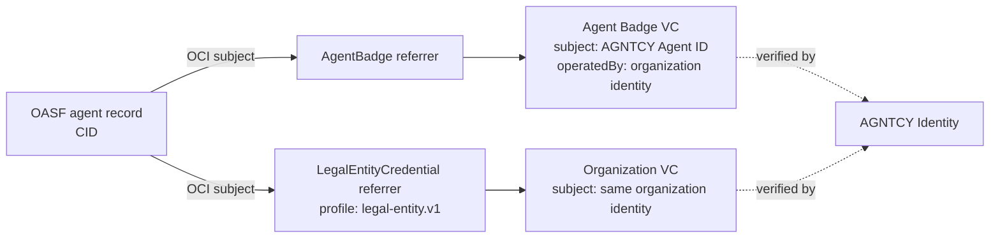

# Findings for the Directory typed-attestation discussion

## Executive summary

The Sigstore/OCI-referrer direction is the lowest-friction foundation, and the
prototype confirms that it can represent both an AGNTCY Agent Badge and an
independently issued organization credential without changing OASF. The current
Directory release does not, however, support arbitrary typed attestations end to
end. Directory `v1.7.1` admits only a fixed list of referrer types, and its search
API cannot find records by an attached referrer's type or profile.

This distinction matters for the discussion: **OCI provides attachment and
integrity structure; it does not by itself provide credential semantics,
authorization to make the attachment, verification, or cross-record search.**

## What the experiment implements

One OASF agent record has two independently signed credentials attached to its
CID as distinct OCI referrers:

The credentials are signed by different Vault Transit keys and published through
AGNTCY Identity. Each referrer preserves the original JOSE VC bytes and includes
a separate issuer-signed binding over the Directory record CID, credential
digest, subject, and profile. This makes the approval of the record association
testable instead of treating OCI co-location as issuer consent.

`legal-entity.v1` is intentionally an illustrative assurance profile. A D&B
credential could exercise this role, but the prototype does not invent or claim
a D&B format. Directory remains issuer-neutral.

## Observed behavior

| Question | Observed result |
|---|---|
| Can OCI represent both credentials as separate artifacts referring to the exact record manifest? | Yes. |
| Does stock Directory `v1.7.1` accept either new type? | No. Protovalidate rejects both because referrer types are allow-listed. |
| Does a small Directory patch admit and preserve both distinct types? | Yes. |
| Can a client pull each artifact by known record CID and type? | Yes. |
| Can AGNTCY Identity verify both JOSE credentials? | Yes, after registering each issuer and public key. |
| Can the client match Agent Badge `operatedBy` to the organization VC subject? | Yes. That is client/verifier logic, not Directory behavior. |
| Does Directory validate credential signatures or the cross-credential relationship? | No. The generic store also accepts a deliberately tampered Agent Badge. |
| Can Directory search all records for either attached type or `legal-entity.v1` profile? | No. Search has no referrer, attestation, or evidence predicate. |

## Proposed response to Luca

I agree that the Sigstore/OCI-referrer model is the least-friction foundation and
that signer acceptance should remain relying-party policy. We tested that model
with two examples on Directory `v1.7.1`: an AGNTCY Agent Badge and an independently
issued organization credential using an illustrative `legal-entity.v1` profile.

The experiment validates the architectural direction: both credentials can remain
outside the OASF payload, be attached to the exact record manifest as separate OCI
referrers, preserve their native JOSE proofs, and be retrieved after an ordinary
OASF search. AGNTCY Identity can then verify the credentials, and a consumer can
check that the Agent Badge's `operatedBy` value equals the organization credential's
subject before applying its own issuer and assurance policy.

It also identified two current implementation boundaries. First, the public
`PushReferrer` API is not arbitrary in `v1.7.1`: protovalidate and autosync use a
fixed allow-list containing public keys, signatures, and scan reports. Both new
credential types were rejected by the stock server and required a small type and
media-type admission patch. Second, `PullReferrer` works for a known record CID,
but `RecordQueryType` has no generic referrer or attestation predicate. Therefore,
the supported model today is **search the OASF record, then inspect its referrers**;
it is not **search the Directory for every record advertising a legal-entity
credential or Agent Badge**.

The PoC also confirms that OCI subject binding is an immutable storage relationship,
not proof that a credential issuer approved attaching its credential to that
record. We added a separate issuer-signed binding over the record CID and credential
digest to demonstrate one possible solution. Directory itself still does not
validate the VC signature, status, assurance profile, or relationship between the
two credentials; those checks belong to AGNTCY Identity or another profile-aware
verifier unless Directory explicitly takes on that responsibility.

Based on these results, a minimal next step would be to define an extensible type
admission/media-type mechanism and the authorization or signed-envelope rules for
attaching credentials. No OASF core change is required for storage and retrieval.
If the working group requires discovery by evidence type or profile before
retrieving individual records, that is separate attachment-aware search/index work;
otherwise the existing search-then-inspect flow is sufficient.
