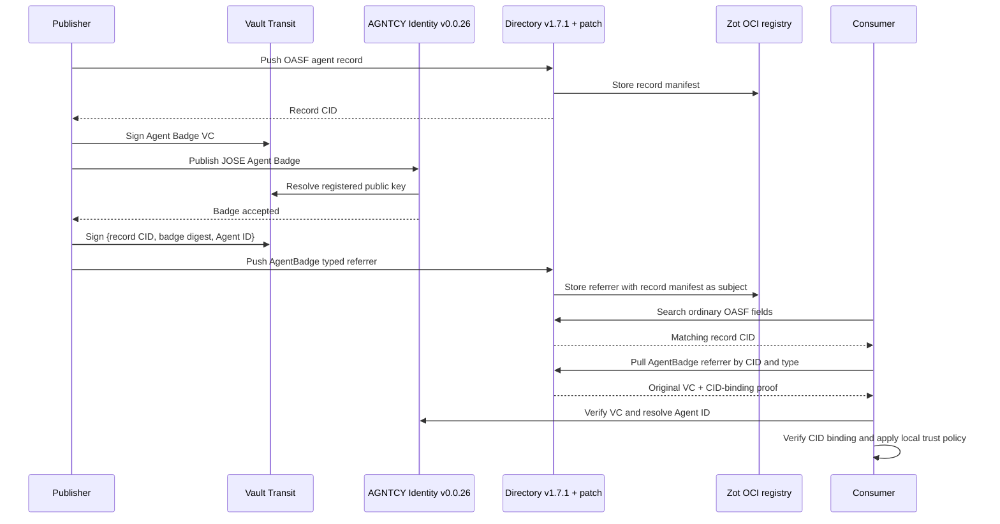

# AGNTCY Directory + Identity typed-artifact validation

This is a deliberately small interoperability prototype. It tests whether the
OCI-referrer model already present in AGNTCY Directory can carry an AGNTCY
Identity Agent Badge without copying the badge into the OASF record or adding a
new OASF core field.

The prototype uses:

- AGNTCY Directory `v1.7.1`, both unmodified and with a minimal typed-referrer patch
- AGNTCY Identity Node `v0.0.26`
- HashiCorp Vault Transit with an RSA-2048 issuer key; private key material never leaves Vault
- Zot as the OCI registry used by Directory
- A real OASF `1.1.0` agent record and a JOSE-enveloped Agent Badge VC

It is validation code, not a production trust profile. Authentication is disabled
on the local Directory instances so the experiment can isolate storage,
retrieval, identity verification, and search behavior.

## What is being tested



The security artifacts remain separate:

| Artifact | Purpose | Stored by |
|---|---|---|
| OASF record | Discoverable agent description | Directory/OCI registry |
| Agent Badge VC | Issuer-signed statement about the agent description and Agent ID | Identity Node; unchanged copy referenced by Directory |
| OCI referrer manifest | Immutable attachment relationship to the exact record manifest | Directory/OCI registry |
| CID-binding JWS | Proof that the issuer approved the association among the record CID, badge digest, and Agent ID | Inside the typed referrer; signed by Vault Transit |

## Minimal Directory change under test

Directory `v1.7.1` has a generic `PushReferrerRequest`, but the public API rejects
types outside a fixed allow-list. The patch in
[`patches/directory-v1.7.1-agent-badge.patch`](patches/directory-v1.7.1-agent-badge.patch)
does four things:

1. admits `agntcy.identity.v1.AgentBadge` at the API boundary;
2. assigns it a distinct OCI manifest `artifactType` and layer media type;
3. permits the type in Directory autosync; and
4. adds a mapping unit test.

It does not add an OASF field, a provider allow-list, a credential verifier, or a
new search index.

## Run locally

Prerequisites are Docker, `grpcurl`, Python 3, OpenSSL, and Git.

```bash
./scripts/run.sh
```

The script generates ephemeral database, Vault, and encryption secrets in process
memory. It does not write them to the repository. It builds the patched Directory
from the `v1.7.1` tag, starts both stock and patched Directory servers against the
same local backing services, starts Identity Node `v0.0.26`, and writes the test
result to the ignored `validation-report.json` file.

To stop the environment and delete its local volumes:

```bash
docker compose down -v
```

## Expected conclusions

The tests intentionally separate four claims that are easy to conflate:

| Claim | Expected result |
|---|---|
| Directory's OCI storage can represent a referrer whose subject is the exact OASF record manifest | Validated |
| Stock Directory `v1.7.1` accepts any arbitrary typed referrer | Invalidated: the API has a fixed type allow-list |
| A consumer can search an OASF record, pull the attached VC, and verify it with AGNTCY Identity | Validated after the minimal type-admission patch |
| Directory search can directly filter records by arbitrary attached-referrer type | Invalidated: `RecordQueryType` has no referrer/attestation/evidence predicate |
| Storing an Agent Badge referrer means Directory validates that VC | Invalidated: the generic store accepts a deliberately tampered VC payload |
| OCI subject binding alone proves that the credential issuer approved the record association | Qualified: it binds storage objects, but an authenticated publisher or signed association envelope is still needed |

This supports a **search, then inspect and verify** integration today: search the
OASF record using existing Directory fields, pull its referrers, and ask AGNTCY
Identity to verify the Agent Badge. It does not support cross-record
attestation-aware filtering unless a searchable marker is placed in the record or
Directory adds an attachment-aware index.

## Production questions left open

- Whether Agent Badge should become a generally extensible media-type registry
  entry rather than another hard-coded allow-list constant.
- Whether publisher authentication is sufficient for attachment authorization,
  or a standardized CID-binding signature envelope is required.
- Whether Directory should verify only attachment integrity or also execute
  credential-profile verifiers.
- Whether a future search index exposes advertised evidence, verified evidence,
  or both; those states must not be presented as equivalent.
- How revocation and re-verification update any derived search state.
